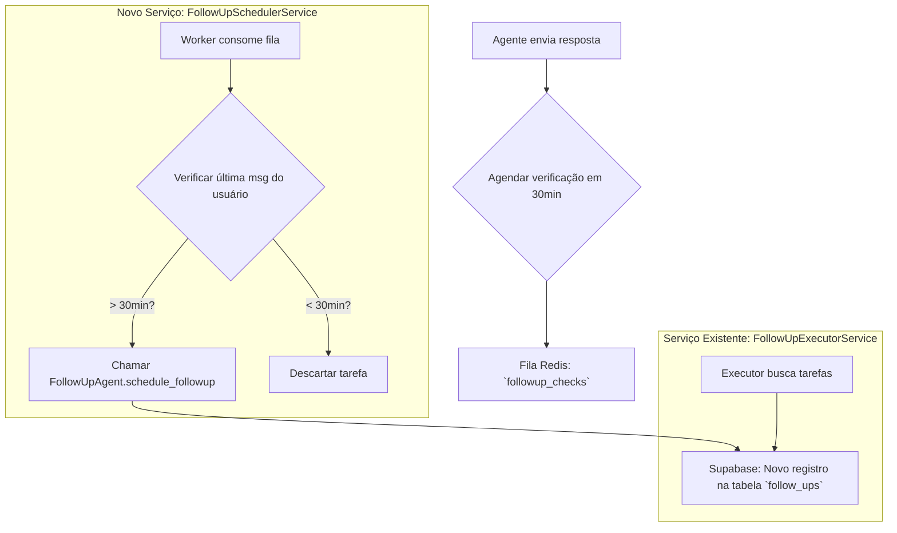

# 🕵️‍♂️ Análise Completa e Verificação do Sistema de Follow-up

**Documento:** `ANALISE_COMPLETA_FOLLOWUP.md`  
**Versão:** 1.0  
**Data:** 04/08/2025  
**Autor:** Engenharia Sênior

---

## 1. Resumo Executivo

Esta análise verifica a funcionalidade e a robustez do sistema de follow-up, que é dividido em duas categorias principais:

1.  **Follow-up de Reengajamento:** Acionado quando um lead para de responder.
2.  **Lembretes de Reunião:** Acionado após o agendamento de uma reunião no Google Calendar.

O sistema foi projetado para ser desacoplado, com a lógica de **agendamento** separada da lógica de **execução**, o que é uma excelente prática de engenharia. O `FollowUpExecutorService` atua como um worker de backend que processa tarefas de forma assíncrona, garantindo que a API principal não seja bloqueada.

**Veredito Geral:**

-   **Lembretes de Reunião (24h e 2h):** O sistema está **funcional e robusto**. A lógica está bem implementada, buscando eventos diretamente do Google Calendar e cruzando com a base de dados para garantir o envio correto.
-   **Follow-up por Falta de Resposta (30min e 24h):** Este fluxo **NÃO está implementado** no código. Embora o `prompt-agente.md` descreva essa funcionalidade, não há nenhuma lógica nos webhooks ou agentes que detecte a inatividade do usuário e agende esses follow-ups específicos. Esta é uma **lacuna crítica** entre a especificação (prompt) e a implementação.

---

## 2. Análise do Follow-up de Lembretes de Reunião (24h e 2h)

**Status:** ✅ **Funcional e Correto**

### 2.1. Fluxo de Funcionamento

O sistema de lembretes de reunião é orquestrado pelo `FollowUpExecutorService` e não depende de agendamentos manuais pelo agente, o que o torna muito confiável.

```mermaid
graph TD
    subgraph "Serviço de Backend (FollowUpExecutorService)"
        A[Loop Principal] -- A cada 5 minutos --> B{Processar Lembretes};
        B --> C{Busca eventos no Google Calendar para as próximas 24h e 2h};
    end

    subgraph "Integrações"
        C --> D[Google Calendar API: list_events];
        E[Supabase DB] --> F{Busca lead pelo google_event_id};
    end

    subgraph "Lógica de Envio"
        C --> F;
        F --> G{Verifica se lembrete já foi enviado (flag no DB)};
        G --Não--> H[Prepara Mensagem Personalizada];
        H --> I[Envia via Evolution API];
        I --> J[Atualiza flag `reminder_sent` no Supabase];
    end
```

### 2.2. Verificação de Pontos-Chave

-   **Gatilho (`FollowUpExecutorService`):** O método `process_meeting_reminders` é executado em um loop a cada 5 minutos. Ele busca proativamente por eventos no Google Calendar que ocorrerão em janelas de tempo específicas (23:55-24:05 e 1:55-2:05 a partir de agora). **Isto é robusto e não depende de webhooks ou agendamentos manuais.**

-   **Fonte da Verdade (Google Calendar):** O sistema usa o Google Calendar como a fonte primária da verdade para os horários das reuniões, o que é correto. Ele busca os eventos e, a partir do `google_event_id`, encontra o lead correspondente na tabela `leads_qualifications`.

-   **Prevenção de Duplicidade:** O sistema utiliza as colunas `reminder_24h_sent` e `reminder_2h_sent` na tabela `leads_qualifications` para garantir que cada lembrete seja enviado apenas uma vez. Após o envio, a flag é marcada como `True`.

-   **Personalização da Mensagem:** O método `_send_meeting_reminder_v2` monta a mensagem de forma personalizada, incluindo o nome do lead, data e hora da reunião, e o link do Google Meet, se disponível.

-   **Tratamento de Erros:** A lógica está dentro de blocos `try...except`, garantindo que uma falha no envio de um lembrete não interrompa o serviço.

### 2.3. Conclusão sobre Lembretes

O sistema de lembretes de reunião está bem implementado, é resiliente e funciona conforme o esperado. A abordagem de usar um worker de backend para consultar proativamente o calendário é excelente e evita muitos dos problemas comuns em sistemas baseados em webhooks.

---

## 3. Análise do Follow-up por Falta de Resposta (30min e 24h)

**Status:** ❌ **Não Implementado**

### 3.1. O que Diz o Prompt

O arquivo `prompt-agente.md` descreve claramente a funcionalidade:

> **Seção 4.2: Reengajamento por Não Resposta**
> -   **after_30min:** Gatilho de 30 minutos sem resposta do lead.
> -   **after_24h:** Gatilho se continuar sem resposta.

O prompt sugere que o `FollowUpAgent` seria acionado para agendar essas tarefas.

### 3.2. Análise do Código

Uma busca minuciosa no código-fonte revela que **não há nenhuma implementação** para este fluxo:

1.  **`app/api/webhooks.py`:** O webhook que processa novas mensagens (`process_new_message`) não possui nenhuma lógica para agendar um follow-up de 30 minutos. Ele simplesmente processa a mensagem atual.

2.  **`app/agents/agentic_sdr.py`:** O agente principal não possui nenhum mecanismo para detectar a ausência de resposta. Ele é reativo e só atua quando uma nova mensagem chega.

3.  **`app/teams/agents/followup.py`:** O `FollowUpAgent` possui a *ferramenta* `schedule_followup`, mas essa ferramenta **nunca é chamada** no contexto de "não resposta".

4.  **`app/services/followup_executor_service.py`:** Este serviço apenas *executa* follow-ups que já estão na tabela `follow_ups`. Ele não tem a lógica para *criar* follow-ups baseados em inatividade.

### 3.3. Como Deveria Funcionar (Sugestão de Implementação)

Para que esta funcionalidade opere corretamente, seria necessário implementar o seguinte fluxo:

1.  **No `webhook` (`process_message_with_agent`):**
    -   Após o agente enviar uma resposta, ele deveria agendar uma tarefa de verificação para dali a 30 minutos. Essa tarefa poderia ser colocada em uma fila do Redis ou em uma nova tabela no Supabase (ex: `pending_followup_checks`). "Já existe uma tabela chamada follow_ups no supabase, está em @sqls/tabela-follow_ups.sql."

2.  **Um Novo Serviço Worker (`FollowUpSchedulerService`):**
    -   Este novo serviço consumiria a fila do Redis.
    -   Ao processar uma tarefa, ele verificaria a hora da última mensagem do *usuário* na conversa.
    -   Se o tempo decorrido for maior que 30 minutos, ele chamaria o `FollowUpAgent.schedule_followup` para criar o registro na tabela `follow_ups`.
    -   Isso desacoplaria a verificação do agendamento, tornando o sistema mais escalável.



### 3.4. Conclusão sobre Follow-up de Não Resposta

A funcionalidade de follow-up por falta de resposta, embora crucial para a proatividade do SDR, **é inexistente na implementação atual**. A documentação no prompt está em desacordo com o código. Esta é a lacuna funcional mais crítica encontrada na análise.

---

## 4. Veredito Final e Recomendações

-   **Sistema de Lembretes de Reunião:** ⭐️ **5/5** - Robusto, confiável e bem implementado.
-   **Sistema de Follow-up por Inatividade:** ⭐️ **0/5** - Funcionalidade ausente. Requer implementação completa.

**Recomendação Crítica:**

É **urgente** implementar o fluxo de follow-up por falta de resposta para alinhar o comportamento do sistema com a estratégia de vendas descrita no prompt. A sugestão de implementação usando uma fila no Redis e um novo serviço de agendamento (`FollowUpSchedulerService`) é a abordagem mais robusta e escalável para resolver essa lacuna.