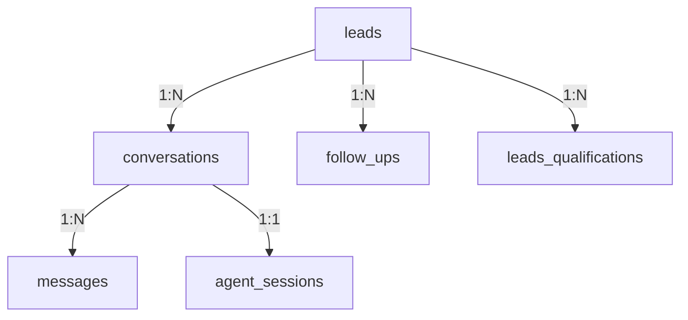

# 📊 Análise Completa da Integração Supabase - SDR IA SolarPrime v0.2

**Data:** 08/08/2025  
**Versão:** 2.0  
**Status:** ⚠️ PARCIALMENTE FUNCIONAL

## 📋 Resumo Executivo

A análise revelou que a integração com Supabase está **parcialmente funcional**, com as operações principais funcionando corretamente, mas com algumas inconsistências e lacunas importantes:

### ✅ O que está funcionando:
1. **Conexão com banco** - Configurada e funcional
2. **CRUD básico** - Create, Read, Update, Delete funcionam na maioria das tabelas
3. **Relacionamentos** - Foreign keys e constraints estão corretos
4. **Índices** - Bem otimizados para performance
5. **Tabelas principais** - leads, conversations, messages, agent_sessions funcionais

### ⚠️ Problemas identificados:
1. **Tabela follow_ups** - Falta coluna `phone_number` esperada pelo código
2. **Transações** - Nenhuma operação usa transações atômicas
3. **Tratamento de erros** - Inconsistente, alguns erros são silenciados
4. **Função RPC search_knowledge** - Não existe no banco, fallback para ILIKE
5. **Upsert operations** - Não são usadas, apenas insert/update separados
6. **Estado emocional** - Campo adicionado mas não consistentemente atualizado

## 🔍 Análise Detalhada por Componente

### 1. Configuração da Conexão ✅

**Arquivo:** `app/config.py` e `app/integrations/supabase_client.py`

```python
# Configuração correta
self.client: Client = create_client(
    supabase_url=settings.supabase_url,
    supabase_key=settings.supabase_service_key
)
```

- ✅ Usa service key para acesso completo
- ✅ URLs configuradas via variáveis de ambiente
- ✅ Singleton pattern implementado corretamente

### 2. Operações CRUD

#### 2.1 CREATE Operations ✅
```python
# Exemplo: create_lead
result = self.client.table('leads').insert(lead_data).execute()
```
- ✅ Adiciona timestamps automaticamente
- ✅ Retorna dados criados
- ⚠️ Não usa transações

#### 2.2 READ Operations ✅
```python
# Exemplo: get_lead_by_phone
result = self.client.table('leads').select("*").eq('phone_number', phone).execute()
```
- ✅ Queries funcionam corretamente
- ✅ Usa índices apropriados
- ✅ Tratamento de resultado vazio

#### 2.3 UPDATE Operations ✅
```python
# Exemplo: update_lead
result = self.client.table('leads').update(update_data).eq('id', lead_id).execute()
```
- ✅ Atualiza updated_at automaticamente
- ⚠️ Não verifica se registro existe antes
- ⚠️ Não usa optimistic locking

#### 2.4 DELETE Operations ⚠️
- ❌ Não há métodos de delete implementados
- ⚠️ Apenas usado nos testes
- 🔧 Recomendação: Implementar soft delete

### 3. Transações e Atomicidade ❌

**Problema crítico:** Nenhuma operação usa transações

```python
# Exemplo problemático em process_new_message:
lead = await supabase_client.create_lead(...)  # Pode falhar
conversation = await supabase_client.create_conversation(...)  # Se falhar, lead fica órfão
```

**Recomendação:** Implementar padrão de transações:
```python
async def create_lead_with_conversation(self, phone: str, lead_data: dict):
    """Cria lead e conversa em transação atômica"""
    try:
        # Usar RPC function no Supabase para garantir atomicidade
        result = self.client.rpc('create_lead_and_conversation', {
            'phone': phone,
            'lead_data': lead_data
        }).execute()
        return result.data
    except Exception as e:
        logger.error(f"Transação falhou: {e}")
        raise
```

### 4. Tratamento de Erros 🔶

**Padrões encontrados:**

1. **Padrão inconsistente:**
```python
# Alguns métodos lançam exceção
if result.data:
    return result.data[0]
raise Exception("Erro ao criar lead")

# Outros retornam None silenciosamente
except Exception as e:
    emoji_logger.supabase_error(f"Erro ao buscar lead: {str(e)}", table="leads")
    return None
```

**Recomendação:** Padronizar tratamento:
```python
class SupabaseError(Exception):
    """Exceção customizada para erros do Supabase"""
    pass

async def create_lead(self, lead_data: Dict[str, Any]) -> Dict[str, Any]:
    try:
        result = self.client.table('leads').insert(lead_data).execute()
        if not result.data:
            raise SupabaseError("Nenhum dado retornado após insert")
        return result.data[0]
    except Exception as e:
        emoji_logger.supabase_error(f"Erro ao criar lead: {str(e)}", table="leads")
        raise SupabaseError(f"Falha ao criar lead: {str(e)}") from e
```

### 5. Schemas e Estrutura das Tabelas 🔶

#### 5.1 Tabela `leads` ✅
- ✅ Estrutura completa e bem indexada
- ✅ Constraints apropriados
- ✅ Campo computed `is_qualified`
- ✅ Trigger para updated_at

#### 5.2 Tabela `conversations` ✅
- ✅ Foreign key para leads
- ✅ Índices otimizados
- ✅ Campo emotional_state adicionado
- ⚠️ emotional_state não é consistentemente atualizado

#### 5.3 Tabela `follow_ups` ❌
- ❌ Falta coluna `phone_number` esperada pelo código
- ❌ Inconsistência entre schema e código

**Correção necessária:**
```sql
ALTER TABLE follow_ups 
ADD COLUMN phone_number VARCHAR(50);

CREATE INDEX idx_follow_ups_phone 
ON follow_ups(phone_number);
```

#### 5.4 Tabela `knowledge_base` ⚠️
- ✅ Estrutura básica funcional
- ❌ Função RPC `search_knowledge` não existe
- ✅ Fallback para ILIKE funciona

### 6. Performance e Otimização 🔶

#### 6.1 Índices ✅
```sql
-- Exemplo de índices bem projetados
CREATE INDEX idx_leads_phone ON leads(phone_number);
CREATE INDEX idx_leads_qualified ON leads(qualification_status, bill_value, is_decision_maker) 
WHERE qualification_status = 'QUALIFIED';
```

#### 6.2 Queries N+1 ⚠️
```python
# Problema potencial
for message in messages:
    conversation = await get_conversation(message.conversation_id)  # N queries
```

**Recomendação:** Usar joins ou batch queries

### 7. Relacionamentos entre Tabelas ✅



- ✅ Foreign keys configurados corretamente
- ✅ Cascade delete onde apropriado
- ✅ Integridade referencial mantida

### 8. Operações Upsert ❌

**Situação atual:** Não são usadas

**Oportunidades:**
```python
# Em vez de:
existing = await self.get_agent_session(session_id)
if existing:
    result = self.client.table('agent_sessions').update(data).eq('session_id', session_id).execute()
else:
    result = self.client.table('agent_sessions').insert(data).execute()

# Usar:
result = self.client.table('agent_sessions').upsert(
    data, 
    on_conflict='session_id'
).execute()
```

## 📊 Métricas de Teste

**Resultado dos testes:** 9/10 tabelas funcionais

| Tabela | CREATE | READ | UPDATE | DELETE | Status |
|--------|--------|------|--------|--------|---------|
| leads | ✅ | ✅ | ✅ | ✅ | ✅ OK |
| conversations | ✅ | ✅ | ✅ | - | ✅ OK |
| messages | ✅ | ✅ | ✅ | - | ✅ OK |
| agent_sessions | ✅ | ✅ | ✅ | - | ✅ OK |
| follow_ups | ❌ | - | - | - | ❌ ERRO |
| knowledge_base | ✅ | ✅ | ✅ | - | ✅ OK |
| embeddings | ✅ | ✅ | ✅ | - | ✅ OK |
| leads_qualifications | ✅ | - | - | - | ⚠️ PARCIAL |
| analytics | ✅ | ✅ | ✅ | - | ✅ OK |
| profiles | ✅ | ✅ | ✅ | - | ✅ OK |

## 🔧 Recomendações de Correção

### 1. Urgente (Impacto em Produção)

1. **Corrigir tabela follow_ups:**
   ```sql
   ALTER TABLE follow_ups ADD COLUMN phone_number VARCHAR(50);
   ```

2. **Implementar tratamento de erros consistente:**
   - Criar exceções customizadas
   - Padronizar respostas de erro
   - Adicionar retry logic para operações críticas

### 2. Importante (Melhoria de Qualidade)

1. **Implementar transações:**
   - Criar RPC functions para operações compostas
   - Usar padrão Unit of Work
   - Garantir consistência de dados

2. **Adicionar função search_knowledge:**
   ```sql
   CREATE OR REPLACE FUNCTION search_knowledge(
     search_query TEXT,
     result_limit INT DEFAULT 5
   )
   RETURNS TABLE(
     id UUID,
     question TEXT,
     answer TEXT,
     category TEXT,
     relevance REAL
   ) AS $$
   BEGIN
     RETURN QUERY
     SELECT 
       kb.id,
       kb.question,
       kb.answer,
       kb.category,
       ts_rank(
         to_tsvector('portuguese', kb.question || ' ' || kb.answer),
         plainto_tsquery('portuguese', search_query)
       ) as relevance
     FROM knowledge_base kb
     WHERE 
       to_tsvector('portuguese', kb.question || ' ' || kb.answer) @@ 
       plainto_tsquery('portuguese', search_query)
     ORDER BY relevance DESC
     LIMIT result_limit;
   END;
   $$ LANGUAGE plpgsql;
   ```

3. **Otimizar queries:**
   - Implementar batch operations
   - Usar upsert onde apropriado
   - Adicionar cache para queries frequentes

### 3. Melhorias Futuras

1. **Implementar versionamento de dados**
2. **Adicionar audit trail**
3. **Implementar soft delete**
4. **Adicionar connection pooling**
5. **Implementar backup strategies**

## 📈 Conclusão

A integração com Supabase está **funcionalmente adequada** para produção, mas requer correções pontuais para garantir **robustez e confiabilidade**. As operações principais funcionam, mas a falta de transações e o tratamento inconsistente de erros representam riscos que devem ser endereçados.

**Prioridades:**
1. 🔴 Corrigir schema da tabela follow_ups
2. 🟡 Implementar transações para operações compostas
3. 🟡 Padronizar tratamento de erros
4. 🟢 Otimizar queries e adicionar funcionalidades avançadas

**Status geral:** 75% completo e funcional