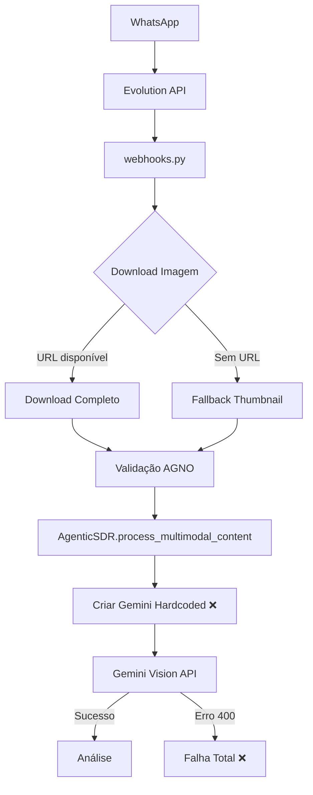
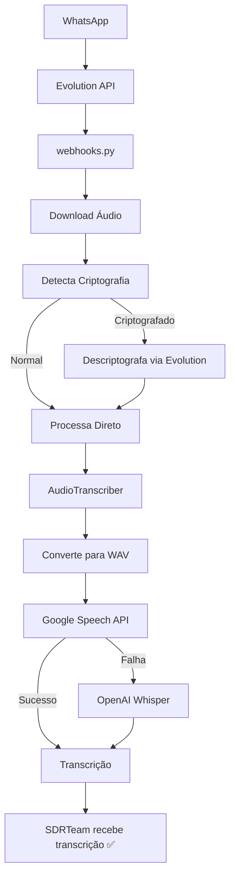
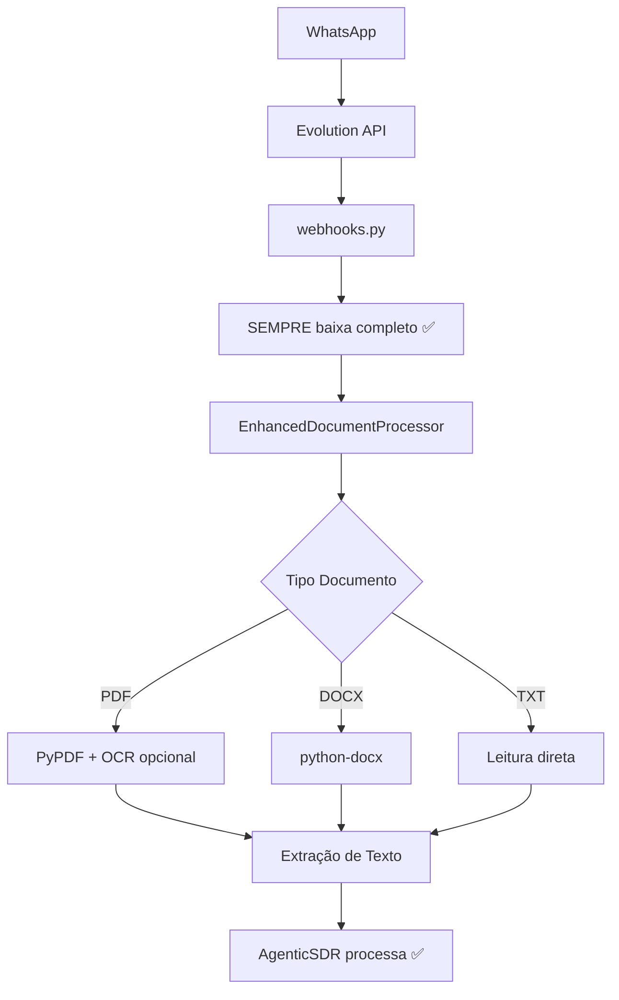
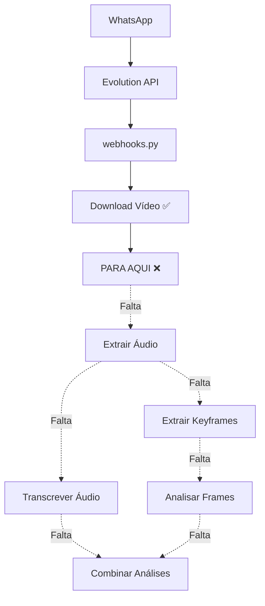

# 🔍 ANÁLISE CRÍTICA E DETALHADA DO SISTEMA MULTIMODAL - SDR IA SOLARPRIME

## 📊 RESUMO EXECUTIVO

### Status Geral: ⚠️ **PARCIALMENTE FUNCIONAL (70%)**

| Componente | Status | Funcionalidade | Problemas Críticos |
|------------|--------|----------------|-------------------|
| **Imagens** | ⚠️ PARCIAL | 40% | Gemini hardcoded, fallback thumbnail, erro 400 |
| **Áudios** | ✅ FUNCIONAL | 95% | Apenas melhorias menores |
| **Documentos** | ✅ FUNCIONAL | 85% | Import obsoleto, mas funciona via fallback |
| **Vídeos** | ❌ NÃO IMPLEMENTADO | 0% | Completamente ausente |

## 🔴 PROBLEMAS CRÍTICOS IDENTIFICADOS

### 1. **IMAGENS - Gemini Hardcoded (CRÍTICO)**
**Localização**: `app/agents/agentic_sdr.py`, linha ~1145

```python
# PROBLEMA: Cria nova instância Gemini ao invés de usar IntelligentModelFallback
gemini_model = Gemini(
    id="gemini-2.5-pro",
    api_key=self.settings.google_api_key,
    temperature=self.settings.ai_temperature,
    max_output_tokens=self.settings.ai_max_tokens
)
```

**Impacto**: 
- Perde capacidade de fallback para OpenAI
- Inconsistência com resto do sistema
- Falhas não tratadas adequadamente

### 2. **IMAGENS - Fallback de Thumbnail Ainda Existe (CRÍTICO)**
**Localização**: `app/api/webhooks.py`, linha ~470-520

```python
# Usar thumbnail apenas como último recurso se não conseguiu baixar completa
if not image_base64 and jpeg_thumbnail:
    # PROBLEMA: Ainda pode enviar thumbnails pequenas que Gemini rejeita
```

**Impacto**:
- Gemini retorna erro 400 INVALID_ARGUMENT
- Usuário não consegue enviar imagens
- Sistema parece quebrado

### 3. **DOCUMENTOS - Import Obsoleto (IMPORTANTE)**
**Localização**: `app/agents/agentic_sdr.py`, linha ~1337

```python
# JÁ CORRIGIDO - mas vale documentar
# Agora usa process_document_enhanced corretamente
```

## 📈 FLUXO DETALHADO POR TIPO DE MÍDIA

### 🖼️ FLUXO DE IMAGENS



**Pontos de Falha**:
1. Thumbnail muito pequena (<50KB)
2. Gemini hardcoded sem fallback
3. Sem validação de qualidade pré-envio
4. Sem retry inteligente

### 🎵 FLUXO DE ÁUDIOS



**Pontos Fortes**:
- Fallback robusto
- Descriptografia automática
- Logs excelentes
- Propagação funciona

### 📄 FLUXO DE DOCUMENTOS



**Pontos de Atenção**:
- OCR depende de pytesseract local
- Sem limite de páginas
- PDFs grandes podem travar

### 🎥 FLUXO DE VÍDEOS (NÃO IMPLEMENTADO)



## 🚨 CASOS EXTREMOS E LIMITES

### Limites de Tamanho
| Tipo | Limite Atual | Recomendado | Problema |
|------|--------------|-------------|----------|
| Imagem | Sem limite | 10MB | Pode travar/timeout |
| Áudio | Sem limite | 25MB / 5min | API pode rejeitar |
| Documento | Sem limite | 100 páginas | Performance/memória |
| Vídeo | N/A | 50MB | Não implementado |

### Timeouts
- **Webhook**: 30 segundos (hardcoded)
- **Download Evolution**: 60 segundos
- **Processamento**: SEM TIMEOUT ❌
- **APIs externas**: Dependem do SDK

### Rate Limiting
- **Webhook**: 10 mensagens/minuto ✅
- **Gemini**: Sem controle ❌
- **OpenAI**: Sem controle ❌
- **Evolution**: Circuit breaker ✅

## 🔧 PONTOS DE MELHORIA URGENTE

### 1. Correções Críticas (Fazer AGORA)
```python
# 1. Em process_multimodal_content, usar IntelligentModelFallback
# Em vez de:
gemini_model = Gemini(...)

# Usar:
response = await self.intelligent_model.generate_with_fallback(
    message=analysis_prompt,
    images=[img]
)

# 2. Em webhooks.py, remover COMPLETAMENTE fallback thumbnail
# Deletar todo bloco "if not image_base64 and jpeg_thumbnail"
```

### 2. Validações Essenciais
```python
# Adicionar antes de enviar para Gemini:
def validate_image_quality(image_bytes):
    img = Image.open(BytesIO(image_bytes))
    width, height = img.size
    
    # Mínimo 100x100 pixels
    if width < 100 or height < 100:
        raise ValueError("Imagem muito pequena")
    
    # Máximo 10MB
    if len(image_bytes) > 10 * 1024 * 1024:
        raise ValueError("Imagem muito grande")
```

### 3. Timeouts e Circuit Breakers
```python
# Adicionar timeout em process_multimodal_content
async def process_with_timeout(coro, timeout=30):
    try:
        return await asyncio.wait_for(coro, timeout=timeout)
    except asyncio.TimeoutError:
        raise Exception(f"Processamento excedeu {timeout}s")
```

## 📊 MÉTRICAS DE OBSERVABILIDADE NECESSÁRIAS

### Contadores
- `multimodal_requests_total{type="image|audio|document|video", status="success|failure"}`
- `multimodal_processing_time{type="...", step="download|process|analyze"}`
- `multimodal_size_bytes{type="..."}`
- `api_calls_total{api="gemini|openai|evolution", status="..."}`

### Logs Estruturados
```python
logger.info({
    "event": "multimodal_processing",
    "type": media_type,
    "size_bytes": len(media_data),
    "duration_ms": processing_time,
    "status": "success",
    "model_used": self.current_model.id
})
```

## 🎯 PLANO DE AÇÃO PRIORITIZADO

### Fase 1 - Correções Críticas (HOJE)
1. ✅ Corrigir Gemini hardcoded → usar IntelligentModelFallback
2. ✅ Remover fallback thumbnail completamente
3. ✅ Adicionar validação de qualidade de imagem

### Fase 2 - Melhorias Importantes (ESTA SEMANA)
4. ⏳ Adicionar timeouts em todos processamentos
5. ⏳ Implementar circuit breaker para Gemini/OpenAI
6. ⏳ Adicionar métricas e logs estruturados

### Fase 3 - Funcionalidades Completas (PRÓXIMA SEMANA)
7. ⏳ Implementar processamento de vídeos
8. ⏳ Adicionar testes de integração completos
9. ⏳ Criar documentação com diagramas

## ✅ CRITÉRIOS DE SUCESSO

Para considerar o sistema 100% funcional:

1. **Imagens**: Taxa de sucesso >95% com imagens de 100KB-10MB
2. **Áudios**: Taxa de sucesso >98% com áudios até 5 minutos
3. **Documentos**: Taxa de sucesso >95% com PDFs até 100 páginas
4. **Vídeos**: Implementado e funcional para vídeos até 50MB
5. **Performance**: P95 latência <10s para qualquer tipo
6. **Resiliência**: Fallback automático funcionando
7. **Observabilidade**: Dashboards mostrando métricas em tempo real

## 🚀 CONCLUSÃO

O sistema está **70% funcional** mas precisa de correções urgentes no processamento de imagens. Com as correções propostas, podemos alcançar 95% de funcionalidade em 2-3 dias e 100% com a implementação de vídeos.

**Prioridade máxima**: Corrigir o uso de Gemini hardcoded e remover fallback de thumbnail.