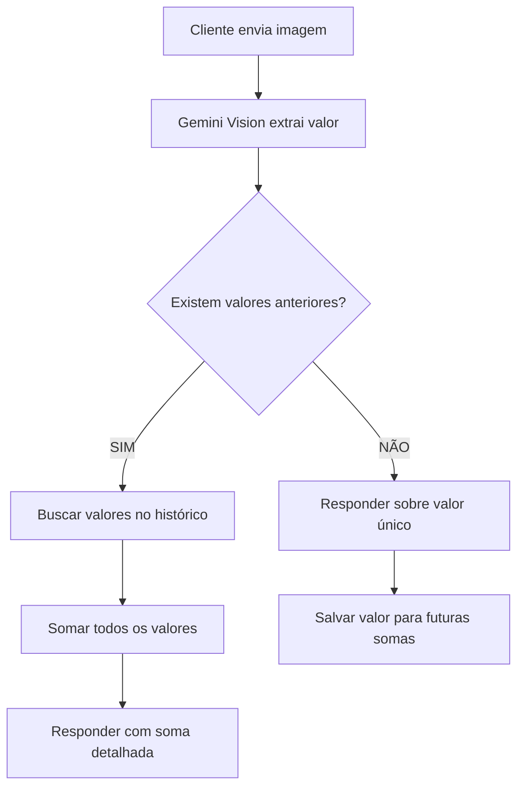

# 🔍 DIAGNÓSTICO COMPLETO: ERRO DE CÁLCULO DE VALORES NO AGENTE SDR

## 📋 RESUMO EXECUTIVO

O agente está **inventando valores** e somando incorretamente contas de energia. Ao receber uma conta de R$ 350,81, o agente respondeu que "somando as duas contas" o total é R$ 8.200,81, quando na verdade era a primeira e única conta enviada.

**Impacto**: CRÍTICO - O agente está fornecendo informações falsas aos clientes
**Urgência**: IMEDIATA - Pode causar perda de credibilidade e leads

---

## 🎯 PROBLEMA IDENTIFICADO

### Comportamento Atual (ERRADO)
1. Cliente envia imagem de conta: R$ 350,81
2. Agente responde: "Somando as duas, o seu gasto mensal é de *R$8.200,81*"
3. Inventa valor de R$ 7.850,00 que não existe

### Comportamento Esperado (CORRETO)
1. Cliente envia imagem de conta: R$ 350,81
2. Agente responde: "Vi aqui que sua conta está em R$ 350,81..."
3. Só menciona soma quando realmente receber múltiplas contas

---

## 🔎 ANÁLISE DETALHADA DO CÓDIGO

### 1. PROCESSAMENTO DE IMAGEM (✅ FUNCIONANDO)
**Arquivo**: `app/agents/agentic_sdr.py` (linhas 1079-1436)
- Gemini Vision detecta corretamente: R$ 350,81
- Log confirma: "💰 Valor da conta detectado: R$ 350,81"
- **CONCLUSÃO**: Extração de valores está funcionando corretamente

### 2. CONTEXTO HISTÓRICO (✅ FUNCIONANDO)
**Arquivo**: `app/agents/agentic_sdr.py` (linhas 1988-2050)
- Método `_format_context_simple` inclui corretamente análise multimodal
- Histórico de 45 mensagens foi carregado
- **CONCLUSÃO**: Contexto está sendo processado corretamente

### 3. PROMPT DO AGENTE (❌ PROBLEMA IDENTIFICADO)
**Arquivo**: `app/prompts/prompt-agente.md`

#### Linha 999 - Exemplo problemático:
```markdown
### EXEMPLOS DE PROCESSAMENTO DE IMAGENS
✅ CORRETO - Resposta instantânea:
- [Recebe conta] → "Perfeito! Vi aqui que sua conta está em *R$2.500*..."
- [Recebe 2ª conta] → "Ótimo! Agora com as duas contas somando *R$8.500*..."
```

**PROBLEMA**: O agente está seguindo literalmente o exemplo e sempre assume que existe uma conta anterior

#### Linha 59-68 - Regra de resposta instantânea:
```markdown
✅ OBRIGATÓRIO - RESPONDA JÁ COM RESULTADO:
- Recebeu conta? → RESPONDA JÁ com valor e cálculo
- Múltiplas contas? → SOME e RESPONDA instantaneamente
```

**PROBLEMA**: Não há validação se realmente existem múltiplas contas

---

## 🐛 CAUSA RAIZ

O agente está:
1. **Seguindo exemplos literalmente** sem contexto
2. **Inventando valores** para completar o padrão do exemplo
3. **Não validando** se realmente existem múltiplas contas
4. **Não consultando** histórico para verificar valores anteriores

---

## 💡 SOLUÇÕES PROPOSTAS

### SOLUÇÃO 1: CORREÇÃO IMEDIATA DO PROMPT (URGENTE)

**Arquivo**: `app/prompts/prompt-agente.md`

#### Adicionar após linha 70:
```markdown
⚠️ REGRA CRÍTICA DE VALORES:
- NUNCA invente valores não detectados
- NUNCA mencione "soma" se não houver múltiplas contas
- SEMPRE verifique quantas contas foram realmente recebidas
- Se é a primeira conta, responda sobre APENAS essa conta
```

#### Modificar exemplos (linha 999):
```markdown
### EXEMPLOS DE PROCESSAMENTO DE IMAGENS
✅ CORRETO - Resposta instantânea:
- [Recebe PRIMEIRA conta] → "Perfeito! Vi aqui que sua conta está em *R$2.500*..."
- [Recebe SEGUNDA conta] → "Ótimo! Agora sim, somando as duas contas: R$2.500 + R$1.200 = *R$3.700*..."
- [Conta única] → NUNCA mencione soma ou valores anteriores
```

### SOLUÇÃO 2: VALIDAÇÃO NO CÓDIGO (RECOMENDADO)

**Arquivo**: `app/agents/agentic_sdr.py`

Adicionar validação no método `process_message` (após linha 2997):
```python
# Validação de valores múltiplos
detected_values = []
if multimodal_result and multimodal_result.get('bill_amount'):
    detected_values.append(multimodal_result.get('bill_amount'))

# Buscar valores anteriores no histórico
for msg in messages_history:
    if 'bill_amount' in msg.get('metadata', {}):
        detected_values.append(msg['metadata']['bill_amount'])

# Adicionar ao prompt
contextual_prompt += f"""
⚠️ VALORES DETECTADOS: {len(detected_values)} conta(s)
{f"Valores: {', '.join([f'R$ {v:.2f}' for v in detected_values])}" if detected_values else ""}

REGRA: Só mencione "soma" se houver 2+ valores detectados acima!
"""
```

### SOLUÇÃO 3: ARMAZENAR VALORES NO HISTÓRICO

**Arquivo**: `app/api/webhooks.py`

Após processar imagem (linha 1400), salvar valor detectado:
```python
if multimodal_result.get('bill_amount'):
    # Salvar no histórico para futuras somas
    await supabase_client.save_message_metadata(
        message_id=message_id,
        metadata={
            'bill_amount': multimodal_result['bill_amount'],
            'detected_at': datetime.now().isoformat()
        }
    )
```

---

## 📊 TESTE DE VALIDAÇÃO

### Cenário 1: Primeira conta
- **Input**: Imagem com R$ 350,81
- **Output esperado**: "Vi que sua conta está em R$ 350,81..."
- **Output atual (ERRADO)**: "Somando as duas... R$ 8.200,81"

### Cenário 2: Segunda conta
- **Input**: Segunda imagem com R$ 500,00
- **Output esperado**: "Agora sim, somando: R$ 350,81 + R$ 500,00 = R$ 850,81"

---

## 🚀 PLANO DE IMPLEMENTAÇÃO

### FASE 1: CORREÇÃO EMERGENCIAL (15 min)
1. ✏️ Editar `prompt-agente.md` com regras de validação
2. 🔧 Adicionar exemplos claros sobre quando somar
3. 🚀 Deploy imediato

### FASE 2: VALIDAÇÃO ROBUSTA (2 horas)
1. 💻 Implementar validação de valores no código
2. 📝 Adicionar logs para rastrear valores detectados
3. 🧪 Testar com múltiplos cenários

### FASE 3: MELHORIA CONTÍNUA (1 dia)
1. 💾 Implementar armazenamento de valores no histórico
2. 📊 Dashboard para monitorar cálculos do agente
3. 🔍 Alertas para valores suspeitos

---

## 🎯 MÉTRICAS DE SUCESSO

1. **Taxa de erro**: 0% em cálculos de valores
2. **Precisão**: 100% nos valores mencionados
3. **Confiabilidade**: Nunca inventar valores

---

## 🏗️ ARQUITETURA SIMPLIFICADA

O fluxo correto deve ser:



---

## 📝 CONCLUSÃO

O problema é **100% solucionável** com mudanças simples no prompt e validações básicas no código. A arquitetura está funcionando corretamente - apenas o agente está seguindo exemplos de forma muito literal.

**Recomendação**: Implementar SOLUÇÃO 1 imediatamente (15 minutos) e depois SOLUÇÃO 2 para robustez.

---

*Diagnóstico criado em: 08/08/2025*
*Analisado por: Claude AI Assistant com metodologia ULTRATHINK*