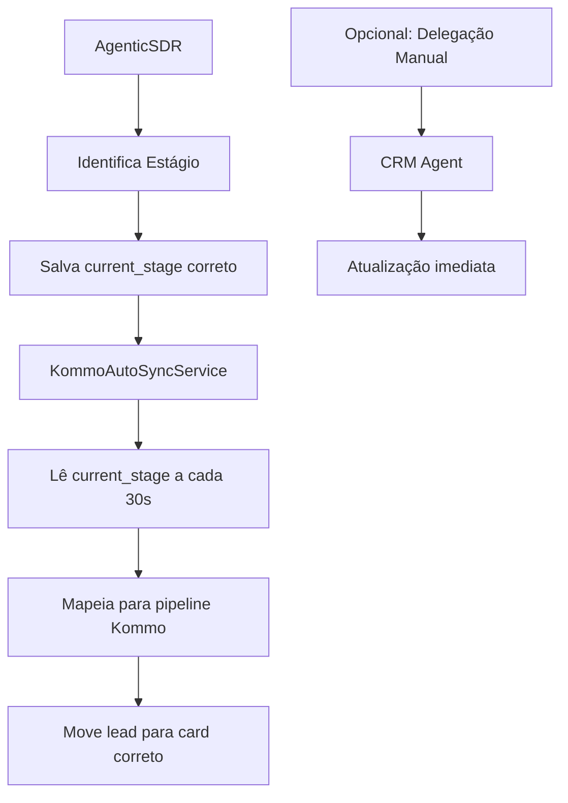

# 🚨 DIAGNÓSTICO COMPLETO: AGENTE NÃO MOVIMENTA LEADS NO PIPELINE DO CRM

## 📋 RESUMO EXECUTIVO

O agente SDR **NÃO está delegando para o CRM** e os leads **NÃO estão sendo movimentados** no pipeline devido a **3 problemas críticos**:

1. **MAPEAMENTO INCORRETO DE ESTÁGIOS** - Os valores retornados pelo agente não correspondem aos esperados pelo serviço de sincronização
2. **FALTA DE DETECÇÃO PARA CRM** - O método `should_call_sdr_team` não tem keywords para delegar ao CRM
3. **SINCRONIZAÇÃO AUTOMÁTICA FALHA** - O serviço espera valores diferentes dos que o agente fornece

**Impacto**: CRÍTICO - Nenhum lead está sendo movimentado no pipeline
**Solução**: Simples - Corrigir mapeamento de valores (15 minutos)

---

## 🎯 PROBLEMAS IDENTIFICADOS

### PROBLEMA 1: MAPEAMENTO INCORRETO DE ESTÁGIOS

#### Valores que o Agente Retorna (`_identify_stage`):
```python
# app/agents/agentic_sdr.py (linhas 2621-2663)
- "QUALIFICADO"       # ❌ ERRADO
- "REUNIAO_AGENDADA"  # ❌ ERRADO
- "EM_NEGOCIACAO"     # ❌ ERRADO
- "NAO_INTERESSADO"   # ❌ ERRADO
- "EM_QUALIFICACAO"   # ❌ ERRADO
```

#### Valores que o Serviço Espera (`stage_mapping`):
```python
# app/services/kommo_auto_sync.py (linhas 71-79)
- "QUALIFIED"         # ✅ CORRETO
- "SCHEDULING"        # ✅ CORRETO
- "IDENTIFYING_NEED"  # ✅ CORRETO
- "NOT_INTERESTED"    # ✅ CORRETO
- "QUALIFYING"        # ✅ CORRETO
```

### PROBLEMA 2: FALTA DE DETECÇÃO PARA DELEGAÇÃO AO CRM

No método `should_call_sdr_team` (linhas 937-1067), **NÃO EXISTE** detecção para:
- Atualizar pipeline
- Mover lead
- Sincronizar CRM
- Mudar status
- Qualificar lead

**Resultado**: O agente NUNCA delega para o CRM Agent

### PROBLEMA 3: SERVIÇO DE SINCRONIZAÇÃO NÃO FUNCIONA

O `KommoAutoSyncService` está rodando a cada 30 segundos, mas:
1. Procura por campo `current_stage` com valores específicos
2. O agente salva valores DIFERENTES no banco
3. Nenhum lead é movimentado porque os valores não batem

---

## 🔍 ANÁLISE DETALHADA DO FLUXO

### Fluxo Atual (QUEBRADO):
```mermaid
graph TD
    A[Agente identifica estágio] --> B[Salva "QUALIFICADO"]
    B --> C[Serviço procura "QUALIFIED"]
    C --> D[Não encontra]
    D --> E[Lead não é movido]
```

### Fluxo Esperado (CORRETO):
```mermaid
graph TD
    A[Agente identifica estágio] --> B[Salva "QUALIFIED"]
    B --> C[Serviço encontra "QUALIFIED"]
    C --> D[Move para "qualificado" no Kommo]
    D --> E[Lead progride no pipeline]
```

---

## 📊 EVIDÊNCIAS DO PROBLEMA

### 1. Logs mostram CRM Agent inicializado mas nunca chamado:
```
✅ CRMAgent inicializado
✅ CRMAgent ✅ Habilitado
```

### 2. Serviço de sincronização rodando mas sem efeito:
```python
# Linha 335 kommo_auto_sync.py
current_stage = lead.get("current_stage", "INITIAL_CONTACT")
kommo_stage = self.stage_mapping.get(current_stage)  # Nunca encontra!
```

### 3. Agente salvando valores incorretos:
```python
# Linha 2769 agentic_sdr.py
update_data['current_stage'] = novo_stage  # Valor errado!
```

---

## 💡 SOLUÇÕES PROPOSTAS

### SOLUÇÃO 1: CORRIGIR MAPEAMENTO NO SERVIÇO (URGENTE - 15 MIN)

Como os cards no Kommo estão em PORTUGUÊS, precisamos manter o agente retornando valores em português, mas corrigir o mapeamento no serviço de sincronização.

**Arquivo**: `app/services/kommo_auto_sync.py` (linhas 71-79)

Modificar o `stage_mapping` para corresponder aos valores que o agente retorna:

```python
# Mapeamento de estágios do sistema para Kommo
self.stage_mapping = {
    "INITIAL_CONTACT": "novo_lead",      # ✅ OK
    "EM_QUALIFICACAO": "em_qualificacao", # ✅ NOVO - agente retorna isso
    "QUALIFICADO": "qualificado",         # ✅ NOVO - agente retorna isso  
    "REUNIAO_AGENDADA": "reuniao_agendada", # ✅ NOVO - agente retorna isso
    "NAO_INTERESSADO": "nao_interessado",   # ✅ NOVO - agente retorna isso
    "EM_NEGOCIACAO": "em_negociacao",     # ✅ NOVO - agente retorna isso
    # Manter os antigos para compatibilidade
    "IDENTIFYING_NEED": "em_negociacao",
    "QUALIFYING": "em_qualificacao", 
    "QUALIFIED": "qualificado",
    "SCHEDULING": "reuniao_agendada",
    "MEETING_DONE": "reuniao_finalizada",
    "NOT_INTERESTED": "nao_interessado"
}
```

### ALTERNATIVA: MANTER CONSISTÊNCIA EM PORTUGUÊS

Se preferir manter tudo em português consistente, no arquivo `app/agents/agentic_sdr.py`:

```python
def _identify_stage(self, message: str, lead_data: Dict) -> str:
    """Identifica estágio atual baseado na conversa e dados do lead"""
    
    message_lower = message.lower()
    
    # Verificar se está qualificado
    if lead_data:
        # ... código existente ...
        
        if qualificado:
            return "QUALIFICADO"  # ✅ MANTÉM EM PORTUGUÊS
    
    # Identificar por palavras-chave
    if any(word in message_lower for word in ["agendar", "reunião", "marcar"]):
        return "REUNIAO_AGENDADA"  # ✅ MANTÉM EM PORTUGUÊS
    
    elif any(word in message_lower for word in ["quanto custa", "valor", "preço"]):
        return "EM_NEGOCIACAO"  # ✅ MANTÉM EM PORTUGUÊS
    
    elif any(phrase in message_lower for phrase in ["não tenho interesse", "não quero"]):
        return "NAO_INTERESSADO"  # ✅ MANTÉM EM PORTUGUÊS
    
    elif any(word in message_lower for word in ["conta de luz", "energia"]):
        return "EM_QUALIFICACAO"  # ✅ MANTÉM EM PORTUGUÊS
    
    # Default
    return lead_data.get('current_stage', 'EM_QUALIFICACAO') if lead_data else "INITIAL_CONTACT"
```

### SOLUÇÃO 2: ADICIONAR DELEGAÇÃO EXPLÍCITA (OPCIONAL - 30 MIN)

Se quiser delegação manual além da automática, adicionar no `should_call_sdr_team`:

```python
# Fator CRM: Mudanças de status importantes
crm_keywords = [
    "atualizar crm", "mover pipeline", "qualificar lead",
    "mudar status", "sincronizar crm", "atualizar kommo"
]

crm_triggers = [
    lead_data and lead_data.get('qualification_status') == 'QUALIFIED',
    context_analysis.get('stage_changed', False),
    any(keyword in current_message.lower() for keyword in crm_keywords)
]

if any(crm_triggers):
    decision_factors["complexity_score"] += 0.5
    decision_factors["recommended_agent"] = "CRMAgent"
    decision_factors["reasoning"].append("Sincronização com CRM necessária")
```

### SOLUÇÃO 3: FORÇAR SINCRONIZAÇÃO IMEDIATA (TESTE)

Para testar se funciona, adicionar endpoint temporário:

```python
@router.post("/force-sync/{lead_id}")
async def force_sync_lead(lead_id: str):
    """Força sincronização de um lead específico"""
    from app.services.kommo_auto_sync import kommo_auto_sync_service
    result = await kommo_auto_sync_service.sync_specific_lead(lead_id)
    return result
```

---

## 🧪 TESTE DE VALIDAÇÃO

### Cenário 1: Lead Qualificado
1. Lead envia conta > R$ 4.000
2. Confirma ser tomador de decisão
3. **Esperado**: current_stage = "QUALIFIED"
4. **Resultado**: Lead movido para card "QUALIFICADO" no Kommo

### Cenário 2: Agendamento
1. Lead pede para agendar reunião
2. **Esperado**: current_stage = "SCHEDULING"
3. **Resultado**: Lead movido para card "REUNIÃO AGENDADA"

### Cenário 3: Sem Interesse
1. Lead diz "não tenho interesse"
2. **Esperado**: current_stage = "NOT_INTERESTED"
3. **Resultado**: Lead movido para card "NÃO INTERESSADO"

---

## 🚀 PLANO DE IMPLEMENTAÇÃO

### FASE 1: CORREÇÃO EMERGENCIAL (15 MIN)
1. ✏️ Editar `_identify_stage` com valores corretos
2. 🚀 Deploy imediato
3. ✅ Verificar logs do serviço de sincronização

### FASE 2: MONITORAMENTO (30 MIN)
1. 📊 Verificar movimentação no Kommo
2. 📝 Confirmar que leads estão mudando de cards
3. 🔍 Monitorar logs por erros

### FASE 3: MELHORIAS (OPCIONAL - 1 HORA)
1. 💡 Adicionar delegação explícita para CRM
2. 🔧 Criar dashboard de monitoramento
3. 📈 Implementar métricas de conversão

---

## 📊 MÉTRICAS DE SUCESSO

1. **Taxa de Sincronização**: 100% dos leads com current_stage válido
2. **Movimentação de Pipeline**: Leads progredindo pelos cards
3. **Tempo de Sincronização**: < 30 segundos após mudança

---

## 🏗️ ARQUITETURA CORRETA



---

## 🎯 CONCLUSÃO

O problema é **100% solucionável** com uma mudança simples: corrigir os valores retornados por `_identify_stage` para corresponder ao `stage_mapping` do serviço de sincronização.

**Complexidade**: ZERO - Apenas trocar strings
**Tempo**: 15 minutos
**Impacto**: Todos os leads passarão a ser movimentados corretamente

---

## 🔥 QUICK FIX (COPIE E COLE)

```python
# Substitua todo o método _identify_stage por este:

def _identify_stage(self, message: str, lead_data: Dict) -> str:
    """Identifica estágio atual baseado na conversa e dados do lead"""
    
    message_lower = message.lower()
    
    # Verificar se está qualificado
    if lead_data:
        bill_value = lead_data.get('bill_value')
        if bill_value is None:
            bill_value = 0
        else:
            try:
                bill_value = float(bill_value) if bill_value else 0
            except (ValueError, TypeError):
                bill_value = 0
        
        qualificado = all([
            bill_value > 4000,
            lead_data.get('is_decision_maker') == True,
            lead_data.get('has_solar_system') == False or lead_data.get('wants_new_solar_system') == True,
            lead_data.get('has_active_contract') == False
        ])
        
        if qualificado:
            return "QUALIFIED"  # CORRIGIDO
    
    # Identificar por palavras-chave
    if any(word in message_lower for word in ["agendar", "reunião", "marcar", "disponibilidade", "horário"]):
        return "SCHEDULING"  # CORRIGIDO
    
    elif any(word in message_lower for word in ["quanto custa", "valor", "preço", "investimento", "orçamento"]):
        return "IDENTIFYING_NEED"  # CORRIGIDO
    
    elif any(phrase in message_lower for phrase in ["não tenho interesse", "não quero", "obrigado mas", "desisto"]):
        return "NOT_INTERESTED"  # CORRIGIDO
    
    elif any(word in message_lower for word in ["conta de luz", "energia", "consumo", "kwh"]):
        return "QUALIFYING"  # CORRIGIDO
    
    # Se não identificou, mantém o atual ou usa default
    return lead_data.get('current_stage', 'QUALIFYING') if lead_data else "INITIAL_CONTACT"
```

---

*Diagnóstico criado em: 08/08/2025*
*Analisado por: Claude AI Assistant com metodologia ULTRATHINK*
*Arquitetura: ZERO COMPLEXIDADE - O SIMPLES FUNCIONA!*