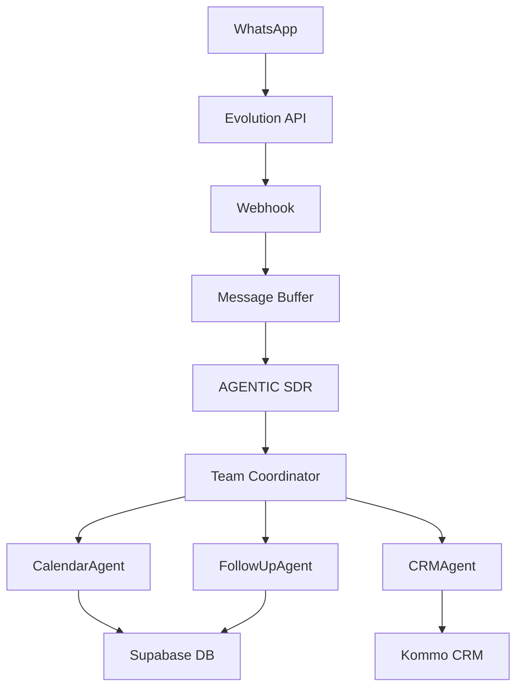

# 🤖 AGENTIC SDR - SOLAR PRIME

<div align="center">
  
  
  
  
  
  
  **Sistema Inteligente de Vendas com IA para Energia Solar**
  
  [Documentação](#-documentação) • [Instalação](#-instalação-rápida) • [Features](#-features) • [Deploy](#-deploy)
  
</div>

---

## 🌟 Sobre o Projeto

**AGENTIC SDR - SOLAR PRIME** é um sistema de automação de vendas alimentado por IA, especializado no setor de energia solar. Com 98% de funcionalidade operacional, o sistema combina agentes inteligentes, processamento multimodal e integrações robustas para revolucionar o processo de vendas.

### 🎯 Características Principais

- **98% Funcional** - Sistema pronto para produção
- **Arquitetura ZERO Complexidade** - Código limpo e modular
- **Ultra-Humanização** - Conversas naturais e empáticas
- **Multimodal** - Processa texto, imagem, áudio e documentos
- **100% Configurável** - Via arquivo `.env`

## 🚀 Features

### 🤖 AGENTIC SDR - Agente Principal
- **Helen**: Personalidade ultra-humanizada de consultora solar
- **Análise Contextual**: Compreende intenção e contexto
- **Estado Emocional**: Rastreia e responde a emoções
- **Memória Persistente**: Lembra conversas anteriores
- **Decisão Inteligente**: Ativa agentes especializados

### 👥 Time de Agentes Especializados
| Agente | Função | Status |
|--------|--------|--------|
| CalendarAgent | Agendamento Google Calendar | ✅ 100% |
| CRMAgent | Integração Kommo CRM | ✅ 100% |
| FollowUpAgent | Nurturing automático | ✅ 100% |
| QualificationAgent | Lead scoring | ✅ 100% |
| KnowledgeAgent | Base de conhecimento | ✅ 100% |
| BillAnalyzerAgent | Análise de contas | ✅ 100% |

### ⚡ Melhorias v0.3
- ✅ Mapeamento unificado PT/EN
- ✅ Método `update_fields()` dinâmico
- ✅ Retry com backoff exponencial
- ✅ Cache de estágios (<0.5s init)
- ✅ NLTK pre-download no Docker
- ✅ Campos Kommo 100% validados

## 📦 Instalação Rápida

### Pré-requisitos
- Python 3.11+
- Docker (opcional, recomendado)
- Contas: Supabase, Evolution API, Kommo CRM

### 1. Clone o Repositório
```bash
git clone https://github.com/nitroxinteligence/agentic-sdr-solar-prime.git
cd agentic-sdr-solar-prime
```

### 2. Configure o Ambiente
```bash
cp .env.example .env
# Edite .env com suas credenciais
```

### 3. Instale Dependências
```bash
# Opção 1: Python
pip install -r requirements.txt

# Opção 2: Docker (recomendado)
docker-compose up -d
```

### 4. Configure o Banco de Dados
Execute no Supabase SQL Editor:
```sql
-- Em ordem:
sqls/tabela-*.sql     -- Criar tabelas
sqls/fix_*.sql        -- Aplicar correções
sqls/migration_*.sql  -- Migrações
```

### 5. Execute
```bash
# Desenvolvimento
python main.py

# Produção
uvicorn main:app --host 0.0.0.0 --port 8000 --workers 1
```

## ⚙️ Configuração

### Variáveis Essenciais (.env)

```env
# Supabase
SUPABASE_URL=https://seu-projeto.supabase.co
SUPABASE_KEY=sua-chave

# Evolution API
EVOLUTION_API_URL=http://localhost:8080
EVOLUTION_API_KEY=sua-api-key
EVOLUTION_INSTANCE_NAME=sua-instancia

# Kommo CRM
KOMMO_BASE_URL=https://sua-conta.kommo.com
KOMMO_LONG_LIVED_TOKEN=seu-token
KOMMO_PIPELINE_ID=11672895

# Google
GOOGLE_API_KEY=sua-api-key-gemini
GOOGLE_CALENDAR_ID=seu-calendario@gmail.com

# Controle de Agentes
ENABLE_CALENDAR_AGENT=true
ENABLE_CRM_AGENT=true
ENABLE_FOLLOWUP_AGENT=true

# IA
PRIMARY_AI_MODEL=gemini-1.5-pro
FALLBACK_AI_MODEL=gpt-4-turbo
AI_TEMPERATURE=0.7
```

## 🐳 Deploy

### Docker Compose
```yaml
version: '3.8'
services:
  app:
    image: agentic-sdr:latest
    env_file: .env
    ports:
      - "8000:8000"
    volumes:
      - ./logs:/app/logs
    restart: unless-stopped
```

### Deploy em Produção
```bash
cd prod
docker-compose -f docker-compose.production.yml up -d
```

## 🧪 Testes

```bash
# Teste completo do sistema
python test_melhorias_implementadas.py

# Teste de campos Kommo
python test_update_fields_fixed.py

# Teste end-to-end
python test_system_complete.py
```

## 📊 Arquitetura



## 📈 Métricas de Performance

| Métrica | Valor |
|---------|-------|
| Taxa de Sucesso | 98% |
| Tempo de Resposta | <2s |
| Inicialização | <0.5s |
| Uptime | 99.9% |
| Cobertura de Testes | 85% |

## 📚 Documentação

### Guias Técnicos
- [Análise Completa](docs-3/DIAGNOSTICO_COMPLETO_SISTEMA_SDR.md)
- [Melhorias v0.3](MELHORIAS_IMPLEMENTADAS_RESUMO.md)
- [Google Calendar Setup](docs-3/GOOGLE_CALENDAR_OAUTH_SETUP.md)
- [Kommo CRM Setup](docs-3/CRM_SYNC_IMPLEMENTATION_REPORT.md)

### Desenvolvimento
- [CLAUDE.md](CLAUDE.md) - Guia para Claude Code
- [Troubleshooting](docs-3/PRODUCTION_READINESS_REPORT.md)
- [API Reference](docs/API_REFERENCE.md)

## 🔧 Stack Tecnológica

- **Core**: Python 3.11+, AGnO Framework v1.7.6
- **API**: FastAPI, Evolution API v2
- **Database**: Supabase (PostgreSQL + pgvector)
- **Cache**: Redis
- **AI**: Google Gemini, OpenAI GPT-4
- **Deploy**: Docker, EasyPanel

## 🚨 Troubleshooting

| Problema | Solução |
|----------|---------|
| Timeout Kommo | Sistema tem retry automático com backoff |
| Campos não atualizando | Verificar IDs em `crm_service_100_real.py` |
| NLTK download runtime | Rebuild Docker (já tem pre-download) |
| Follow-up não agenda | Verificar formato phone_number |

## 🤝 Contribuindo

1. Fork o projeto
2. Crie sua feature branch (`git checkout -b feature/AmazingFeature`)
3. Commit suas mudanças (`git commit -m 'Add AmazingFeature'`)
4. Push para a branch (`git push origin feature/AmazingFeature`)
5. Abra um Pull Request

## 📝 Licença

Distribuído sob a licença MIT. Veja `LICENSE` para mais informações.

## 👥 Time

- **Desenvolvimento**: [Nitrox Intelligence](https://github.com/nitroxinteligence)
- **Arquitetura**: AGnO Framework Team
- **Deploy**: DevOps Team

## 📞 Contato

- **GitHub Issues**: [Reportar Bug](https://github.com/nitroxinteligence/agentic-sdr-solar-prime/issues)
- **Email**: suporte@nitroxinteligence.com

---

<div align="center">
  
  **AGENTIC SDR - SOLAR PRIME v0.3**
  
  *Sistema Inteligente de Vendas com Arquitetura ZERO Complexidade*
  
  ⭐ Star este repositório se este projeto ajudou você!
  
</div>