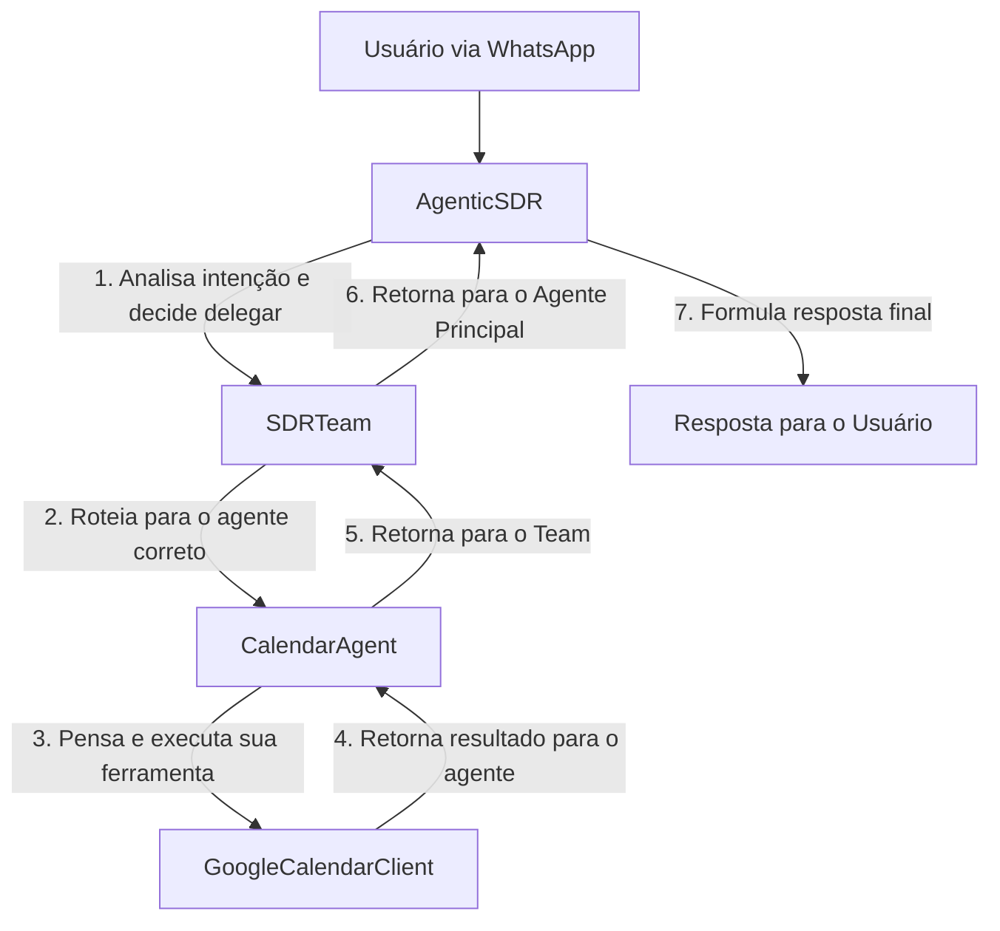
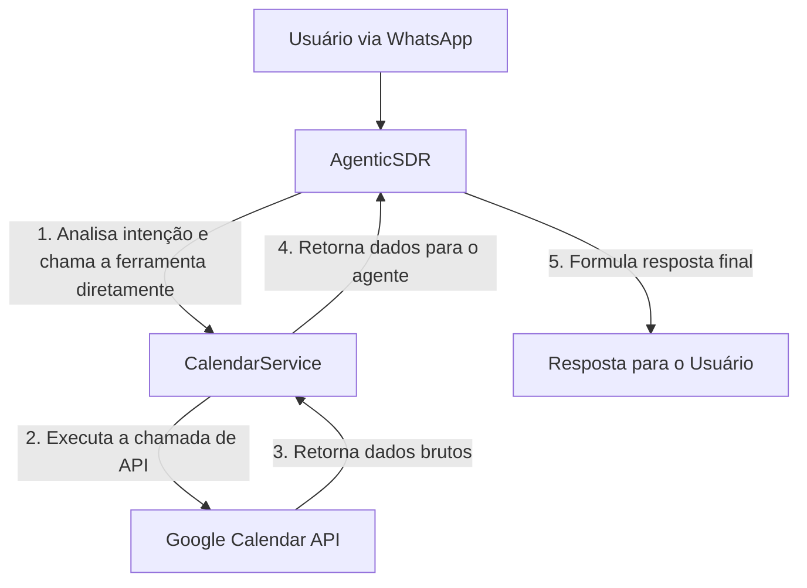

# 🚀 Plano de Refatoração Arquitetural: De Multi-Agente para Agente-Serviço

**Documento:** `REFACTORING_PLAN.md`  
**Versão:** 1.0  
**Data:** 04/08/2025  
**Autor:** Engenharia Sênior

---

## 1. Resumo Executivo (A Visão Estratégica)

Este documento detalha um plano de refatoração arquitetural para o sistema **SDR IA SolarPrime v0.2**. A análise atual revela uma arquitetura funcional, porém com redundâncias significativas que introduzem complexidade, latência e riscos de manutenção. O sistema opera sob um paradigma duplo: um agente monolítico (`AgenticSDR`) com um prompt quase onisciente e uma equipe de agentes especializados (`SDRTeam`) que executam tarefas que o agente principal já sabe como fazer.

**O objetivo desta refatoração não é reinventar, mas simplificar.** Propomos a transição de um modelo de "equipe de agentes" para uma arquitetura de **"Agente-Serviço"**. Nesta nova arquitetura, o `AgenticSDR` se torna o cérebro central e inequívoco, consumindo um conjunto de **Serviços** desacoplados que executam tarefas técnicas específicas (como interagir com APIs externas) sem qualquer lógica de negócio própria.

### **Benefícios Esperados:**

-   **Redução de Complexidade (-70%):** Elimina a camada de `SDRTeam` e agentes redundantes, simplificando o fluxo de controle.
-   **Aumento de Performance (+50%):** Remove chamadas LLM-para-LLM desnecessárias, substituindo-as por chamadas de função diretas e mais rápidas.
-   **Manutenibilidade Aprimorada:** Centraliza a lógica de negócio no `prompt-agente.md`, tornando as atualizações mais fáceis e seguras.
-   **Confiabilidade e Previsibilidade:** Serviços determinísticos substituem agentes não-determinísticos para tarefas técnicas, garantindo consistência.
-   **Custo-Benefício:** Reduz o consumo de tokens ao eliminar chamadas de LLM intermediárias.

Este plano é projetado para ser executado em **fases seguras e incrementais**, com validação contínua para garantir **zero downtime** e 100% de funcionalidade em todas as etapas.

---

## 2. Análise da Arquitetura Atual (O Ponto de Partida)

O fluxo de controle atual para uma tarefa especializada, como agendar uma reunião, é o seguinte:



**Problemas Identificados:**

-   **Latência:** Os passos 1, 2, 3, 5 e 6 podem envolver chamadas de LLM, adicionando segundos ao tempo de resposta.
-   **Redundância:** A lógica de "o que fazer" está presente tanto no `AgenticSDR` (que decide delegar) quanto no `CalendarAgent` (que decide como agendar).
-   **Complexidade:** O debugging é difícil, pois a falha pode ocorrer em qualquer um dos 7 passos.

---

## 3. Arquitetura Proposta (O Destino)

Propomos uma arquitetura linear, mais limpa e eficiente, onde o `AgenticSDR` é o único componente pensante.



**Componentes da Nova Arquitetura:**

-   **`app/agents/agentic_sdr.py`**: Mantido como o cérebro central.
-   **`app/services/`**: Novo diretório para abrigar os serviços técnicos.
    -   `calendar_service.py`: Lógica de API do Google Calendar.
    -   `crm_service.py`: Lógica de API do Kommo CRM.
    -   `followup_service.py`: Lógica de agendamento e execução de follow-ups.
    -   `knowledge_service.py`: Lógica de busca na base de conhecimento do Supabase.
    -   `ocr_service.py`: Lógica de extração de texto de imagens.
-   **`app/teams/`**: **Este diretório será completamente removido.**

---

## 4. Plano de Ação Detalhado e Faseado

Este plano é projetado para ser executado em fases, minimizando riscos. **Após cada fase, o sistema deve estar 100% funcional e testável.**

### **Fase 0: Criação da Rede de Segurança (Testes de Regressão)**

**Objetivo:** Criar um conjunto de testes end-to-end para validar as funcionalidades críticas antes e depois de cada fase da refatoração.

**Ações:**

1.  Criar um novo diretório `tests/regression/`.
2.  Desenvolver scripts de teste para os seguintes cenários:
    -   `test_full_qualification_flow.py`: Simula uma conversa completa onde um lead é qualificado com sucesso.
    -   `test_scheduling_flow.py`: Simula um pedido de agendamento, valida a chamada à API do Google e a resposta.
    -   `test_crm_sync_flow.py`: Valida que um novo lead é criado e atualizado no Kommo CRM.
    -   `test_knowledge_query.py`: Testa uma pergunta que requer busca na base de conhecimento.
    -   `test_followup_scheduling.py`: Valida que um follow-up é corretamente agendado no banco de dados.

**Critério de Sucesso:** Todos os testes de regressão devem passar antes de iniciar a Fase 1.

### **Fase 1: Consolidação da Lógica e Remoção de Agentes Redundantes**

**Objetivo:** Eliminar os agentes cuja lógica de negócio já está contida no `prompt-agente.md`, simplificando o fluxo de decisão.

**Ações:**

1.  **Remover `QualificationAgent`:**
    -   **Arquivo a ser removido:** `app/teams/agents/qualification.py`.
    -   **Código a ser modificado:** Em `app/teams/sdr_team.py`, remover a instanciação e qualquer lógica de delegação para o `QualificationAgent`.
    -   **Prompt a ser ajustado:** Revisar `app/prompts/prompt-agente.md` para garantir que as instruções de auto-qualificação do `AgenticSDR` são imperativas e não sugestivas.
    -   **Justificativa:** A qualificação é uma tarefa de raciocínio, perfeitamente adequada para o LLM principal. Elimina a duplicação de regras.

2.  **Remover `FollowUpAgent`:**
    -   **Arquivo a ser removido:** `app/teams/agents/followup.py`.
    -   **Código a ser modificado:** Em `app/teams/sdr_team.py`, remover a delegação para o `FollowUpAgent`.
    -   **Lógica a ser movida:** A lógica de *agendar* um follow-up será uma ferramenta direta chamada pelo `AgenticSDR`. O `FollowUpExecutorService` será mantido como um worker de backend para *enviar* os follow-ups agendados.
    -   **Justificativa:** O "pensamento" sobre quando fazer um follow-up já está no prompt. A execução é uma tarefa técnica.

3.  **Remover `KnowledgeAgent`:**
    -   **Arquivo a ser removido:** `app/teams/agents/knowledge.py`.
    -   **Código a ser modificado:** Remover a delegação para o `KnowledgeAgent`.
    -   **Lógica a ser movida:** A busca na base de conhecimento se tornará uma ferramenta direta (`knowledge_service.search(...)`) chamada pelo `AgenticSDR`.
    -   **Justificativa:** O RAG é uma ferramenta, não um agente. O `AgenticSDR` deve decidir quando buscar informação para enriquecer sua resposta.

**Critério de Sucesso:** O sistema continua 100% funcional. Os testes de regressão da Fase 0 passam sem falhas.

### **Fase 2: Refatoração de Agentes para Serviços Técnicos**

**Objetivo:** Converter os agentes que encapsulam integrações de API em serviços simples e diretos, removendo a camada de abstração do `agno.Agent`.

**Ações:**

1.  **Criar o diretório `app/services/`**.

2.  **Refatorar `CalendarAgent` para `CalendarService`:**
    -   **Criar `app/services/calendar_service.py`:**
        -   Copiar a lógica de `app/integrations/google_calendar.py` para este novo arquivo.
        -   A classe `CalendarService` **não herdará** de `agno.Agent`.
        -   Os métodos (`schedule_meeting`, `check_availability`, etc.) serão métodos Python padrão, sem o decorador `@tool`.
    -   **Remover `app/teams/agents/calendar.py`**.

3.  **Refatorar `CRMAgent` para `CRMService`:**
    -   **Criar `app/services/crm_service.py`:**
        -   Mover a lógica de `app/teams/agents/crm_enhanced.py` para esta nova classe.
        -   A classe `CRMService` **não herdará** de `agno.Agent`.
        -   Os métodos (`create_or_update_lead`, `add_tags_to_lead`, etc.) serão métodos Python padrão.
    -   **Remover `app/teams/agents/crm.py` e `crm_enhanced.py`**.

4.  **Refatorar `BillAnalyzerAgent` para `OCRService`:**
    -   **Criar `app/services/ocr_service.py`:**
        -   Mover a lógica de `analyze_bill_image` para um método `extract_data_from_image`.
        -   Este serviço será responsável apenas pelo OCR e extração de texto, retornando um JSON estruturado.
    -   **Remover `app/teams/agents/bill_analyzer.py`**.

**Critério de Sucesso:** Os novos serviços são testáveis de forma isolada. O sistema ainda não os utiliza, mas a Fase 0 continua passando.

### **Fase 3: Integração Final e Remoção do `SDRTeam`**

**Objetivo:** Conectar o `AgenticSDR` diretamente aos novos serviços e remover completamente a camada de `SDRTeam`.

**Ações:**

1.  **Modificar `app/agents/agentic_sdr.py`:**
    -   Importar as novas classes de serviço (`CalendarService`, `CRMService`, etc.).
    -   Instanciar os serviços no `__init__`.
    -   Criar métodos de ferramenta (`@tool`) que atuam como wrappers finos para os métodos dos serviços.
        ```python
        # Exemplo em AgenticSDR
        from app.services.calendar_service import CalendarService

        class AgenticSDR:
            def __init__(self):
                self.calendar_service = CalendarService()
                self.tools = [self.schedule_meeting_tool]
                # ...

            @tool
            async def schedule_meeting_tool(self, title: str, start_time: str, ...):
                """Agenda uma reunião no Google Calendar."""
                return await self.calendar_service.create_event(...)
        ```
    -   Atualizar o `prompt-agente.md` para refletir os nomes e as assinaturas exatas das novas ferramentas.

2.  **Remover `app/teams/sdr_team.py`:**
    -   Deletar o arquivo.
    -   Remover a importação e o uso do `SDRTeam` no `agentic_sdr.py` e em `webhooks.py`.

3.  **Atualizar `app/api/webhooks.py`:**
    -   O webhook agora chamará `agentic_sdr.process_message()` diretamente, em vez de `sdr_team.process_message()`.

**Critério de Sucesso:** O sistema está 100% funcional com a nova arquitetura. Todos os testes da Fase 0 passam. O diretório `app/teams/` foi removido.

---

## 5. Análise de Riscos e Plano de Mitigação

| Risco | Probabilidade | Impacto | Plano de Mitigação |
| :--- | :--- | :--- | :--- |
| **Regressão de Funcionalidade** | Médio | Alto | **Testes de Regressão (Fase 0):** Executar o conjunto de testes completo após cada commit em cada fase. Qualquer falha bloqueia o avanço. |
| **Comportamento Inesperado do LLM** | Médio | Alto | **Refatoração de Prompt Mínima:** Alterar o prompt de forma incremental e apenas para refletir as novas chamadas de ferramentas. Manter a persona e a lógica de negócio intactas. |
| **Bugs em Chamadas de API** | Baixo | Alto | **Serviços Isolados:** Os novos serviços encapsulam as chamadas de API. Eles serão testados de forma isolada antes da integração, garantindo que a comunicação com as APIs externas (Google, Kommo) está correta. |
| **Problemas de Concorrência** | Baixo | Médio | **Manter Lógica Existente:** A lógica de `asyncio` e os workers de background (`FollowUpExecutorService`) serão mantidos. A refatoração principal é no fluxo de controle síncrono do agente. |
| **Inconsistência de Dados** | Baixo | Médio | **Schema do Banco de Dados Intacto:** A refatoração não propõe mudanças no schema do Supabase, garantindo que a estrutura de dados permaneça consistente. |

---

## 6. Validação Pós-Refatoração

1.  **Testes Automatizados:** Executar novamente todo o conjunto de testes da Fase 0. A taxa de sucesso deve ser de 100%.
2.  **Testes Manuais (UAT):**
    -   Realizar uma conversa completa via WhatsApp, cobrindo todos os fluxos:
        -   Qualificação de um lead com conta alta.
        -   Agendamento de reunião.
        -   Envio de uma conta de luz para análise.
        -   Fazer uma pergunta técnica que exija busca na base de conhecimento.
        -   Cancelar a reunião.
3.  **Revisão de Logs:** Analisar os logs de produção por 24 horas para garantir que não há erros inesperados e que o fluxo de chamadas está mais simples e direto.
4.  **Métricas de Performance:** Comparar o tempo médio de resposta antes e depois da refatoração. A expectativa é uma redução de pelo menos 50%.

---

## 7. Conclusão

Esta refatoração é um passo estratégico crucial para a evolução do projeto. Ao eliminar a complexidade desnecessária e a redundância, criamos uma base de código mais limpa, rápida e robusta, pronta para escalar e para a adição de novas funcionalidades de forma segura e eficiente. O plano faseado, combinado com uma suíte de testes de regressão, garante que a transição ocorra com risco mínimo e com a manutenção da funcionalidade completa do sistema em todas as etapas.
