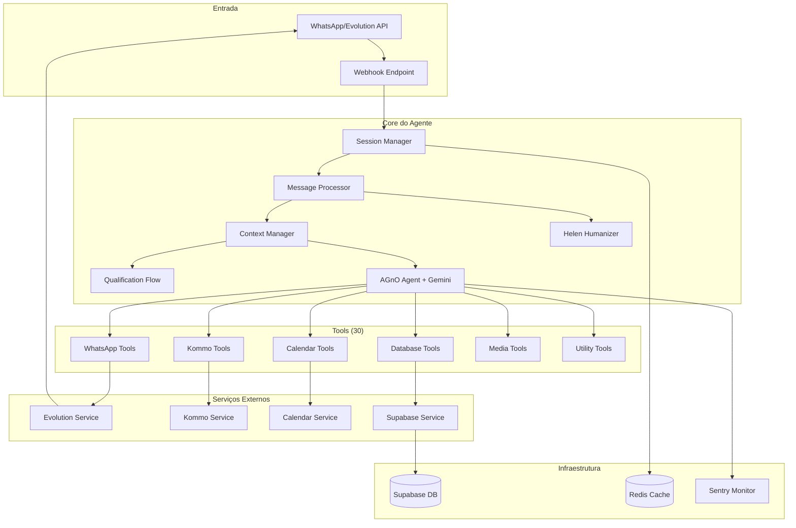

# Arquitetura do SDR Agent - Helen Vieira

## Visão Geral

O SDR Agent é um sistema modular de inteligência artificial para vendas de energia solar via WhatsApp, desenvolvido para a SolarPrime. O sistema utiliza o framework AGnO com Google Gemini 2.0 Flash Exp para processar conversas naturais e qualificar leads automaticamente.

## Arquitetura de Alto Nível



## Componentes Principais

### 1. Core Components

#### Session Manager (`core/session_manager.py`)
- Gerencia sessões de conversação por telefone
- Timeout de 30 minutos de inatividade
- Armazena contexto da conversa em memória
- Integração com Redis para persistência

#### Message Processor (`core/message_processor.py`)
- Processa mensagens recebidas do WhatsApp
- Implementa buffer de mensagens (3 segundos)
- Divide mensagens longas em chunks naturais
- Integra com HelenHumanizer para timing realista

#### Context Manager (`core/context_manager.py`)
- Mantém estado da conversação
- Gerencia estágios de qualificação
- Rastreia informações coletadas do lead
- Calcula score de qualificação

#### Qualification Flow (`core/qualification_flow.py`)
- Define fluxo de qualificação em 9 estágios
- Valida critérios de qualificação
- Calcula score baseado em múltiplos fatores
- Identifica próximas ações necessárias

#### Helen Humanizer (`core/humanizer.py`)
- Simula digitação realista (45-55 WPM)
- Adiciona personalidade da Helen
- Gerencia emojis e expressões
- Calcula timing natural de respostas

### 2. AGnO Tools (30 tools organizadas em 6 categorias)

#### WhatsApp Tools (8)
- `send_text_message`: Enviar mensagens de texto
- `type_simulation`: Simular digitação
- `send_image_message`: Enviar imagens
- `send_document_message`: Enviar documentos
- `send_audio_message`: Enviar áudios
- `send_location_message`: Enviar localização
- `message_buffer`: Gerenciar buffer de mensagens
- `message_chunking`: Dividir mensagens longas

#### Kommo Tools (6)
- `create_kommo_lead`: Criar lead no CRM
- `update_kommo_lead`: Atualizar informações
- `add_kommo_note`: Adicionar notas
- `schedule_kommo_activity`: Agendar atividades
- `update_kommo_stage`: Atualizar estágio
- `search_kommo_lead`: Buscar leads

#### Calendar Tools (5)
- `check_calendar_availability`: Verificar disponibilidade
- `create_meeting`: Criar reunião
- `update_meeting`: Atualizar reunião
- `cancel_meeting`: Cancelar reunião
- `send_calendar_invite`: Enviar convite

#### Database Tools (6)
- `get_lead_data`: Buscar dados do lead
- `update_lead_data`: Atualizar lead
- `save_message`: Salvar mensagem
- `update_conversation_session`: Atualizar sessão
- `schedule_followup`: Agendar follow-up
- `create_new_lead`: Criar novo lead

#### Media Tools (3)
- `process_image`: Processar imagens (contas de luz)
- `process_document`: Processar PDFs
- `process_audio`: Transcrever áudios

#### Utility Tools (2)
- `format_currency`: Formatar valores em R$
- `validate_phone`: Validar telefone brasileiro

### 3. Serviços de Integração

#### Evolution Service
- Integração com Evolution API v2
- Gerenciamento de instância WhatsApp
- Envio de mensagens multimodais
- Download de mídia

#### Kommo Service
- Integração com Kommo CRM
- Gerenciamento de leads e pipeline
- Criação de tarefas e atividades
- Long-lived token authentication

#### Calendar Service
- Integração com Google Calendar API
- Service Account authentication
- Gerenciamento de disponibilidade
- Criação de eventos com Google Meet

#### Supabase Service
- Persistência de dados
- Gerenciamento de leads e conversas
- Histórico de mensagens
- Analytics e relatórios

## Fluxo de Processamento

### 1. Recepção de Mensagem
```
WhatsApp → Evolution API → Webhook → Session Manager
```

### 2. Processamento
```
Session Manager → Message Processor → Context Manager → AGnO Agent
```

### 3. Geração de Resposta
```
AGnO Agent → Tools → Helen Humanizer → Message Processor
```

### 4. Envio de Resposta
```
Message Processor → Evolution Service → WhatsApp
```

## Estágios de Qualificação

1. **INITIAL_CONTACT**: Primeiro contato
2. **IDENTIFICATION**: Captura nome
3. **SOLUTION_DISCOVERY**: Identifica solução ideal
4. **BILL_ANALYSIS**: Análise da conta de luz
5. **PROPERTY_VALIDATION**: Validação do imóvel
6. **COMPETITOR_CHECK**: Verificação de concorrentes
7. **BUDGET_QUALIFICATION**: Qualificação financeira
8. **MEETING_SCHEDULING**: Agendamento de reunião
9. **COMPLETED**: Processo finalizado

## Critérios de Qualificação

### Lead Qualificado
- Valor da conta > R$ 400 (residencial) ou > R$ 4.000 (comercial)
- Imóvel próprio ou com autorização
- Sem contrato ativo com concorrentes
- Interesse demonstrado em economia

### Lead Desqualificado
- Valor da conta insuficiente
- Já possui sistema solar
- Contrato ativo com concorrente
- Imóvel alugado sem autorização

## Segurança e Privacidade

### Proteção de Dados
- Criptografia de dados sensíveis
- Mascaramento de telefones em logs
- Compliance com LGPD
- Sanitização de inputs

### Autenticação
- Evolution API: API Key
- Kommo CRM: Long-lived Token
- Google Calendar: Service Account
- Supabase: JWT + API Key

### Monitoramento
- Sentry para captura de erros
- Logs estruturados com Loguru
- Métricas de performance
- Alertas de anomalias

## Performance e Escalabilidade

### Metas de Performance
- Tempo de resposta < 3s por mensagem
- Suporte a 100+ conversas simultâneas
- Throughput > 5 mensagens/segundo
- Uso de memória < 1MB por sessão

### Estratégias de Otimização
- Message buffering (3s window)
- Session caching com Redis
- Parallel tool execution
- Connection pooling

### Limites e Rate Limiting
- Evolution API: 10 req/s
- Kommo API: 7 req/s
- Google Calendar: 10 req/s
- Gemini API: 60 req/min

## Deployment

### Ambiente de Produção
- **Hosting**: Hostinger VPS (Ubuntu 22.04)
- **Container**: Docker com multi-stage build
- **Proxy**: Nginx reverse proxy
- **Process Manager**: Uvicorn com workers
- **Queue**: Celery + Redis

### Variáveis de Ambiente
```env
# APIs
GOOGLE_API_KEY=
EVOLUTION_API_KEY=
KOMMO_LONG_LIVED_TOKEN=

# URLs
EVOLUTION_API_URL=
WEBHOOK_URL=
SUPABASE_URL=

# Config
BUSINESS_HOURS_START=09:00
BUSINESS_HOURS_END=18:00
AI_RESPONSE_DELAY_SECONDS=2
```

## Manutenção e Monitoramento

### Health Checks
- `/health` - Status do agente
- `/sessions` - Sessões ativas
- Session timeout monitoring
- API connectivity checks

### Logs e Debugging
- Structured logging com Loguru
- Request/response tracking
- Error context preservation
- Performance metrics

### Backup e Recovery
- Database backups diários
- Session state persistence
- Migration rollback capability
- Disaster recovery plan