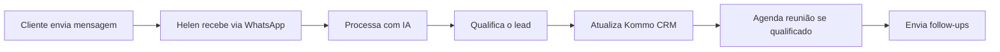

# 📚 Guia de Treinamento - SDR Agent Helen Vieira

## 🎯 Objetivo do Treinamento

Este guia fornece instruções completas para operadores, administradores e equipe técnica sobre como utilizar e manter o SDR Agent Helen Vieira da SolarPrime.

## 👥 Público-Alvo

1. **Operadores de Vendas** - Acompanhamento dos leads
2. **Administradores** - Configuração e monitoramento
3. **Equipe Técnica** - Manutenção e troubleshooting
4. **Gestores** - Análise de métricas e relatórios

---

## 📖 Módulo 1: Introdução ao Sistema

### O que é o SDR Agent Helen Vieira?

O SDR Agent é um sistema de inteligência artificial que:
- 🤖 Atende clientes automaticamente via WhatsApp
- 💬 Mantém conversas naturais e humanizadas
- 📊 Qualifica leads segundo critérios da SolarPrime
- 📅 Agenda reuniões automaticamente
- 🔄 Integra com Kommo CRM

### Características da Helen Vieira

A Helen é uma consultora virtual com personalidade única:
- 34 anos, nascida em Recife
- Especialista em energia solar há 8 anos
- Tom amigável mas profissional
- Usa emojis moderadamente
- Fala português coloquial do Nordeste

### Fluxo de Operação



---

## 📱 Módulo 2: Operação Básica

### Como o Sistema Funciona

#### 1. Recepção de Mensagens
- Cliente envia mensagem no WhatsApp
- Sistema recebe via Evolution API
- Helen processa e responde em 2-5 segundos

#### 2. Tipos de Mensagens Suportadas
- ✅ **Texto**: Mensagens normais
- ✅ **Áudio**: Transcritos automaticamente
- ✅ **Imagem**: Analisadas (contas de luz)
- ✅ **PDF**: Extraído texto automaticamente

#### 3. Estágios de Qualificação

1. **Contato Inicial** - Apresentação
2. **Identificação** - Captura nome
3. **Descoberta de Solução** - Tipo de interesse
4. **Análise de Conta** - Valor da energia
5. **Validação de Imóvel** - Próprio ou alugado
6. **Verificação de Concorrentes** - Desconto atual
7. **Qualificação Financeira** - Capacidade
8. **Agendamento** - Marcar reunião
9. **Finalizado** - Lead processado

### Acompanhando Conversas

#### No Kommo CRM

1. Acesse o Kommo CRM
2. Vá para "Leads" ou "Negócios"
3. Filtre por "Origem: WhatsApp"
4. Clique no lead para ver detalhes

**Informações disponíveis:**
- Histórico completo da conversa
- Score de qualificação (0-100)
- Estágio atual
- Próximas ações

#### Status dos Leads

- 🟢 **Qualificado**: Pronto para reunião
- 🟡 **Em Qualificação**: Helen coletando dados
- 🔴 **Desqualificado**: Não atende critérios
- ⚫ **Abandonado**: Não respondeu follow-ups

### Monitorando Performance

#### Métricas em Tempo Real
```
http://seu-dominio.com/health
```

Mostra:
- Sessões ativas
- Status do sistema
- Últimas mensagens processadas

#### Relatórios Semanais

Enviados automaticamente no WhatsApp:
- Segunda-feira às 9h (configurável)
- Total de leads recebidos
- Taxa de qualificação
- Reuniões agendadas
- Principais objeções

---

## ⚙️ Módulo 3: Administração

### Configurações do Sistema

#### Variáveis de Ambiente Principais

```env
# Tempo de resposta da Helen
AI_RESPONSE_DELAY_SECONDS=3

# Horário comercial
BUSINESS_HOURS_START=08:00
BUSINESS_HOURS_END=18:00

# Relatórios
REPORT_DAY_OF_WEEK=monday
REPORT_TIME=09:00
```

#### Ajustando Comportamento

**Tempo de Resposta:**
- Mínimo: 2 segundos
- Recomendado: 3-5 segundos
- Máximo: 10 segundos

**Follow-ups:**
- Primeiro: 30 minutos após inatividade
- Segundo: 24 horas depois
- Confirmação: 8h do dia da reunião

### Gerenciando o Sistema

#### Comandos Úteis

**Ver logs em tempo real:**
```bash
docker-compose logs -f
```

**Reiniciar o sistema:**
```bash
docker-compose restart
```

**Verificar saúde:**
```bash
python agente/scripts/health_check.py
```

**Fazer backup:**
```bash
./agente/scripts/backup.sh
```

#### Monitoramento

**Dashboard de Métricas:**
1. Acesse Sentry para erros
2. Verifique logs no servidor
3. Monitore filas no Redis

**Alertas Configurados:**
- ❌ Sistema offline
- ⚠️ Taxa de erro > 5%
- 🔴 Fila com > 100 mensagens
- 📉 Taxa de resposta < 95%

### Troubleshooting Comum

#### Problema: Helen não responde

**Verificar:**
1. WhatsApp conectado no Evolution
2. Webhook configurado corretamente
3. Serviços rodando (`docker ps`)
4. Logs de erro

**Solução:**
```bash
# Verificar conexão WhatsApp
curl http://localhost:8080/instance/connectionState/suainstancia

# Reiniciar serviços
docker-compose restart

# Ver logs detalhados
docker-compose logs evolution -f
```

#### Problema: Mensagens duplicadas

**Causa:** Webhook processando múltiplas vezes

**Solução:**
1. Verificar configuração do webhook
2. Implementar idempotência
3. Limpar cache Redis

#### Problema: Erro ao agendar reunião

**Verificar:**
1. Token Kommo válido
2. Pipeline configurado
3. Calendário disponível

---

## 📊 Módulo 4: Análise e Relatórios

### Interpretando Métricas

#### Taxa de Qualificação

**Fórmula:**
```
Taxa = (Leads Qualificados / Total de Leads) × 100
```

**Benchmarks:**
- Excelente: > 40%
- Bom: 25-40%
- Regular: 15-25%
- Baixo: < 15%

#### Score de Qualificação

**Componentes do Score (0-100):**
- Valor da conta: 30 pontos
- Imóvel próprio: 20 pontos
- Decisor: 20 pontos
- Urgência: 15 pontos
- Engajamento: 15 pontos

**Interpretação:**
- 80-100: Lead quente 🔥
- 60-79: Lead morno 🟡
- 40-59: Lead frio ❄️
- 0-39: Desqualificado ❌

### Relatórios Personalizados

#### Extraindo Dados

**Via API:**
```bash
curl -X GET http://seu-dominio.com/api/leads \
  -H "Authorization: Bearer seu-token" \
  -H "Content-Type: application/json"
```

**Filtros disponíveis:**
- `start_date`: Data inicial
- `end_date`: Data final
- `status`: qualified/disqualified
- `score_min`: Score mínimo

#### Análise de Conversas

**Principais Indicadores:**
- Tempo médio de qualificação
- Mensagens por conversa
- Taxa de abandono
- Horários de pico

**Exportando para Excel:**
1. Acesse o Supabase Dashboard
2. Vá para a tabela `leads`
3. Aplique filtros desejados
4. Clique em "Export to CSV"

---

## 🛠️ Módulo 5: Manutenção Técnica

### Rotinas de Manutenção

#### Diárias
- [ ] Verificar logs de erro
- [ ] Monitorar uso de recursos
- [ ] Checar fila de mensagens
- [ ] Validar backups

#### Semanais
- [ ] Analisar métricas de performance
- [ ] Limpar logs antigos
- [ ] Revisar conversas problemáticas
- [ ] Atualizar base de conhecimento

#### Mensais
- [ ] Atualizar dependências
- [ ] Revisar configurações
- [ ] Otimizar queries
- [ ] Treinar novos padrões

### Atualizações do Sistema

#### Processo de Atualização

1. **Backup completo:**
```bash
./agente/scripts/backup.sh full
```

2. **Teste em staging:**
```bash
git checkout -b update-staging
# Aplicar mudanças
docker-compose -f docker-compose.staging.yml up
```

3. **Deploy em produção:**
```bash
git checkout main
git merge update-staging
docker-compose up -d --build
```

4. **Verificar funcionamento:**
```bash
python agente/scripts/health_check.py
```

### Gestão de Logs

#### Locais dos Logs

- **Aplicação**: `/app/logs/`
- **Docker**: `docker logs container-name`
- **Sistema**: `/var/log/syslog`
- **Nginx**: `/var/log/nginx/`

#### Rotação de Logs

Configurada automaticamente para:
- Rotacionar diariamente
- Comprimir após 1 dia
- Deletar após 30 dias

---

## 🎯 Módulo 6: Melhores Práticas

### Para Operadores

#### Do's ✅
- Monitore leads quentes diariamente
- Responda dúvidas sobre o sistema
- Relate problemas imediatamente
- Sugira melhorias baseadas em feedback

#### Don'ts ❌
- Não interfira em conversas ativas
- Não altere configurações sem autorização
- Não compartilhe dados de clientes
- Não ignore alertas do sistema

### Para Administradores

#### Checklist Diário
- [ ] Verificar health check
- [ ] Monitorar taxa de erro
- [ ] Checar leads não processados
- [ ] Validar agendamentos

#### Otimizações Recomendadas

**Performance:**
- Ajuste workers do Uvicorn
- Otimize queries do banco
- Configure cache Redis
- Balance carga se necessário

**Qualidade:**
- Refine prompts da Helen
- Ajuste scores de qualificação
- Melhore textos de follow-up
- Treine novos padrões

### Para Equipe Técnica

#### Debugging Avançado

**Ativar modo debug:**
```env
DEBUG=true
LOG_LEVEL=DEBUG
```

**Ferramentas úteis:**
- Postman para testar APIs
- Redis Commander para cache
- pgAdmin para banco
- Grafana para métricas

#### Resolução de Problemas

**Fluxo de investigação:**
1. Identificar sintoma
2. Verificar logs
3. Reproduzir problema
4. Isolar componente
5. Aplicar correção
6. Testar solução
7. Documentar

---

## 📞 Módulo 7: Suporte e Contatos

### Níveis de Suporte

#### Nível 1 - Operacional
- Dúvidas de uso
- Interpretação de métricas
- Acompanhamento de leads

**Contato**: Supervisor de vendas

#### Nível 2 - Técnico
- Erros do sistema
- Configurações
- Integrações

**Contato**: suporte@nitroxai.com

#### Nível 3 - Desenvolvimento
- Bugs críticos
- Novas features
- Customizações

**Contato**: dev@nitroxai.com

### Procedimento de Abertura de Chamado

1. **Identifique o problema**
   - O que aconteceu?
   - Quando aconteceu?
   - É recorrente?

2. **Colete evidências**
   - Screenshots
   - IDs de conversa
   - Horários
   - Logs se possível

3. **Classifique urgência**
   - 🔴 Crítico: Sistema parado
   - 🟡 Alto: Funcionalidade quebrada
   - 🟢 Médio: Problema isolado
   - ⚪ Baixo: Melhoria

4. **Envie chamado**
   - Email com template
   - WhatsApp para urgências
   - Include todas evidências

### Template de Chamado

```
ASSUNTO: [URGÊNCIA] - Breve descrição

DESCRIÇÃO DO PROBLEMA:
- O que está acontecendo
- Desde quando
- Quantos usuários afetados

PASSOS PARA REPRODUZIR:
1. Passo 1
2. Passo 2
3. Resultado esperado vs atual

EVIDÊNCIAS:
- Screenshots anexos
- IDs relevantes
- Logs (se disponível)

IMPACTO:
- Vendas afetadas
- Leads perdidos
- Urgência da correção
```

---

## 🎓 Módulo 8: Certificação

### Níveis de Certificação

#### Operador Bronze 🥉
- Entende fluxo básico
- Monitora conversas
- Interpreta métricas simples
- 4 horas de treinamento

#### Operador Prata 🥈
- Configura sistema
- Resolve problemas básicos
- Gera relatórios
- 8 horas de treinamento

#### Operador Ouro 🥇
- Administra completamente
- Otimiza performance
- Treina outros usuários
- 16 horas de treinamento

### Avaliação

**Prova teórica:**
- 20 questões
- 70% para passar
- Pode refazer em 7 dias

**Prova prática:**
- Resolver 3 cenários
- Demonstrar operação
- Gerar relatório

### Material de Estudo

1. Este guia completo
2. Vídeos de demonstração
3. Ambiente de testes
4. Sessões tira-dúvidas

---

## 📋 Anexos

### A. Glossário de Termos

- **Lead**: Potencial cliente
- **Score**: Pontuação de qualificação
- **Pipeline**: Funil de vendas
- **Webhook**: Gatilho de eventos
- **Follow-up**: Mensagem de acompanhamento
- **CRM**: Sistema de gestão de clientes
- **OCR**: Reconhecimento de texto em imagens
- **NLP**: Processamento de linguagem natural

### B. FAQ - Perguntas Frequentes

**P: Helen pode atender múltiplos clientes ao mesmo tempo?**
R: Sim, o sistema suporta centenas de conversas simultâneas.

**P: O que acontece fora do horário comercial?**
R: Helen responde 24/7, mas informa sobre horário de atendimento humano.

**P: Como altero as mensagens da Helen?**
R: As mensagens base estão no system_prompt.md e requerem aprovação para mudança.

**P: Posso ver conversas antigas?**
R: Sim, todo histórico fica salvo no banco de dados e acessível via Kommo.

**P: Helen aprende com as conversas?**
R: Sim, o sistema evolui com patterns identificados, mas requer revisão humana.

### C. Comandos Rápidos

```bash
# Status do sistema
docker ps

# Logs em tempo real
docker-compose logs -f

# Reiniciar tudo
docker-compose restart

# Backup manual
./agente/scripts/backup.sh

# Verificar saúde
python agente/scripts/health_check.py

# Limpar cache
docker exec -it redis redis-cli FLUSHALL

# Ver métricas
curl http://localhost:8000/health
```

---

## 🎉 Conclusão

Parabéns por completar o treinamento! Você agora está capacitado para operar o SDR Agent Helen Vieira.

### Lembrete Final

- 🔐 Mantenha credenciais seguras
- 📊 Monitore métricas regularmente
- 🐛 Reporte bugs imediatamente
- 💡 Sugira melhorias sempre
- 🤝 Colabore com a equipe

### Próximos Passos

1. Pratique no ambiente de testes
2. Acompanhe um operador experiente
3. Comece com tarefas simples
4. Evolua gradualmente

**Bem-vindo à equipe de operação do SDR Agent Helen Vieira!** 🚀

---

*Última atualização: Dezembro 2024*
*Versão: 2.0*
*Desenvolvido por Nitrox AI para SolarPrime*