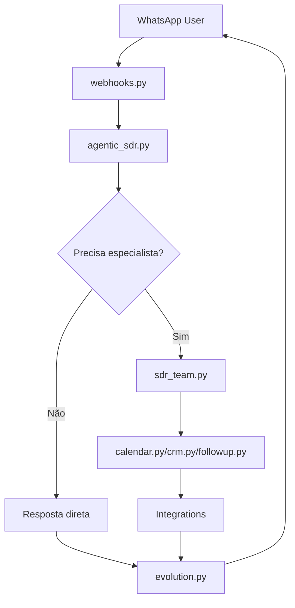

# 📁 ARQUITETURA ATUAL - SDR IA SolarPrime v0.2

**Data:** 07/08/2025  
**Status:** Documentação da estrutura funcional atual  
**Princípio:** "O SIMPLES FUNCIONA" - Sistema estável não se mexe

---

## 🎯 VISÃO GERAL

Sistema de SDR (Sales Development Representative) inteligente para energia solar usando WhatsApp Business.

**CORE FUNCIONAL:**
- ✅ Helen Vieira: Agente conversacional especialista em energia solar
- ✅ Qualificação automática de leads
- ✅ Agendamento Google Calendar
- ✅ Follow-ups inteligentes
- ✅ Integração Kommo CRM
- ✅ Sistema de reações/replies WhatsApp

---

## 📂 ESTRUTURA ATUAL (Funcional - Não mexer!)

### `/api/` - Endpoints da aplicação
```
api/
├── health.py           # Status do servidor
├── kommo_webhook.py    # Webhook CRM Kommo  
└── webhooks.py         # Webhook principal WhatsApp
```

### `/agents/` - Cérebro do sistema
```
agents/
└── agentic_sdr.py      # 🧠 AGENTE PRINCIPAL (Helen Vieira)
                        # Orquestra todo o fluxo de qualificação
```

### `/prompts/` - Personalidade do agente
```
prompts/
├── prompt-agente.md         # 🎭 Personalidade Helen Vieira (20K chars)
└── prompt-agente-backup.md  # Backup da versão anterior
```

### `/teams/` - Sistema de agentes especializados
```
teams/
├── sdr_team.py         # 👥 Orquestrador de agentes especializados
└── agents/
    ├── calendar.py     # 📅 Agendamento Google Calendar
    ├── crm.py          # 🏢 Integração Kommo CRM
    ├── crm_enhanced.py # 🏢 CRM avançado (consolidar com crm.py)
    └── followup.py     # 📞 Sistema de follow-ups
```

### `/services/` - Serviços de backend
```
services/
├── audio_transcriber.py         # 🎤 Transcrição de áudios
├── followup_executor_service.py # 📞 Executor de follow-ups
├── kommo_auto_sync.py           # 🔄 Sincronização automática CRM
├── knowledge_service.py         # 🧠 Base de conhecimento
├── message_buffer.py            # 📨 Buffer de mensagens
├── message_splitter.py          # ✂️ Divisão de mensagens
└── typing_controller.py         # ⌨️ Simulação de digitação
```

### `/integrations/` - Clientes para APIs externas
```
integrations/
├── evolution.py           # 📱 Cliente WhatsApp (Evolution API)
├── google_calendar.py     # 📅 Cliente Google Calendar
├── google_meet_handler.py # 🎥 Criação links Google Meet
├── redis_client.py        # 🗄️ Cache Redis
└── supabase_client.py     # 🗄️ Banco de dados Supabase
```

### `/utils/` - Utilitários gerais
```
utils/
├── agno_media_detection.py # 📎 Detecção de mídia
├── gemini_retry.py          # 🔄 Retry Gemini API
├── logger.py                # 📝 Sistema de logs
├── optional_storage.py      # 💾 Storage opcional (Supabase)
├── retry_handler.py         # 🔄 Tratamento de retry geral
├── safe_conversions.py      # 🔒 Conversões seguras
├── supabase_storage.py      # 💾 Implementação Supabase
└── time_utils.py            # ⏰ Utilitários de tempo
```

### `/testing/` - Sistema de mocks para testes
```
testing/
├── README.md           # 📖 Documentação do sistema de mocks
├── mock_supabase.py    # 🎭 Mock Supabase para testes
└── pytest_helpers.py  # 🧪 Helpers para pytest
```

---

## 🔄 FLUXO PRINCIPAL



---

## ⚠️ PONTOS DE ATENÇÃO

### 🔴 NÃO MEXER (Sistema funcionando):
- `agentic_sdr.py` - Cérebro principal
- `webhooks.py` - Processamento WhatsApp
- `evolution.py` - Cliente WhatsApp
- `supabase_client.py` - Banco funcionando

### 🟡 POSSÍVEIS MELHORIAS (Baixo risco):
- Consolidar `crm.py` + `crm_enhanced.py`
- Documentar melhor dependências de `/teams/`
- Adicionar mais testes

### 🔴 EVITAR (Alto risco):
- Renomear módulos core
- Reestruturar pastas principais
- Eliminar `/teams/` sem análise completa
- Refatoração de nomenclatura massiva

---

## 📊 MÉTRICAS DE QUALIDADE

| Componente | Status | Observações |
|------------|--------|-------------|
| **Helen (agentic_sdr.py)** | ✅ 100% | Funcional após correções |
| **Reações/Replies** | ✅ 100% | Sistema implementado |
| **Follow-ups personalizados** | ✅ 100% | Helen + contexto |
| **Google Calendar** | ✅ 100% | Lembretes personalizados |
| **Kommo CRM** | ✅ 95% | Funcional, consolidar arquivos |
| **PostgreSQL cleanup** | ✅ 100% | Apenas Supabase |

---

## 🎯 PRINCÍPIO ARQUITETURAL

**"O SIMPLES FUNCIONA SEMPRE"**

- Sistema atual está funcional ✅
- Melhorias incrementais apenas ✅  
- Evitar refatoração cosmética ❌
- Priorizar estabilidade sobre beleza ✅

**Última atualização:** Sistema estabilizado após correção de bugs críticos (UUID, PostgreSQL, new_emotional_state, mock system).