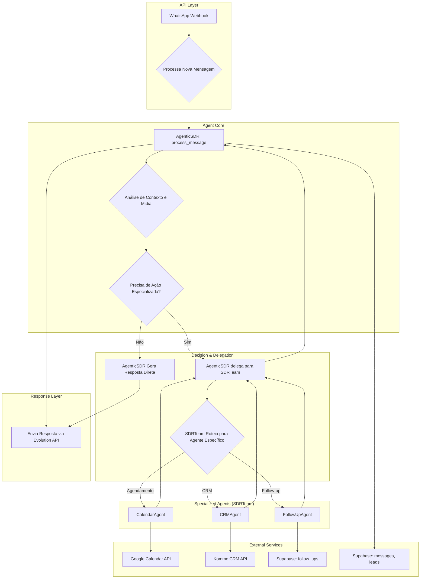

# 📊 Análise Arquitetural Completa - SDR IA SolarPrime v0.2

**Documento:** `SYSTEM_ANALYSIS.md`  
**Versão:** 1.0  
**Data:** 04/08/2025  
**Autor:** Engenharia Sênior

---

## 1. Resumo Executivo

Esta análise fornece um mapa detalhado da arquitetura atual do sistema, detalhando o fluxo de dados e controle entre os principais componentes. O sistema é construído em torno de um agente central, o **`AgenticSDR`**, que orquestra um conjunto de serviços e um `SDRTeam` para interagir com sistemas externos e executar a lógica de negócio.

**Principais Componentes:**

-   **Ponto de Entrada:** `app/api/webhooks.py` recebe as mensagens do WhatsApp via Evolution API.
-   **Cérebro Principal:** `app/agents/agentic_sdr.py` é o agente central que processa todas as interações, analisa contexto e decide as ações.
-   **Camada de Delegação:** `app/teams/sdr_team.py` atua como um coordenador que delega tarefas especializadas para agentes específicos.
-   **Serviços de Backend:**
    -   `kommo_auto_sync.py`: Sincroniza dados com o Kommo CRM em background.
    -   `followup_executor_service.py`: Envia follow-ups e lembretes agendados.
-   **Integrações Externas:** Módulos em `app/integrations/` gerenciam a comunicação com Supabase, Google Calendar, Redis e Evolution API.

**Diagnóstico Geral:**

A arquitetura é funcional e modular, mas apresenta **redundâncias significativas** entre o `AgenticSDR` e o `SDRTeam`. Muitas lógicas de negócio estão duplicadas, o que justifica o plano de refatoração proposto no `REFACTORING_PLAN.md` para simplificar a arquitetura para um modelo de **Agente-Serviço**.

---

## 2. Fluxograma Geral do Sistema

O fluxograma abaixo ilustra o fluxo de uma mensagem de usuário desde a recepção até a resposta final.

---

## 3. Análise Detalhada dos Componentes

### 3.1. Ponto de Entrada: `app/api/webhooks.py`

-   **Função:** Recebe todos os eventos da Evolution API, principalmente `MESSAGES_UPSERT`.
-   **Fluxo:**
    1.  Valida e extrai o conteúdo da mensagem (`extract_message_content`).
    2.  Processa mídias (imagens, documentos, áudio), baixando o conteúdo completo se a URL estiver disponível.
    3.  Cria ou recupera o `lead` e a `conversation` no Supabase.
    4.  Salva a mensagem recebida na tabela `messages`.
    5.  Aciona o `AgenticSDR` para processar a mensagem em uma `background_task` para não bloquear o webhook.
-   **Pontos Fortes:**
    -   Uso de `background_tasks` para processamento assíncrono.
    -   Lógica robusta para extração de conteúdo de diferentes tipos de mensagem.
    -   Tratamento de mensagens de grupo e mensagens do próprio agente.
-   **Pontos de Melhoria:**
    -   A validação de mídia poderia ser mais centralizada.

### 3.2. O Cérebro: `app/agents/agentic_sdr.py`

-   **Função:** É o coração do sistema. Orquestra a resposta, gerencia o estado emocional, analisa o contexto e decide quando delegar.
-   **Fluxo:**
    1.  **`process_message`**: Ponto de entrada principal.
    2.  **`get_last_100_messages`**: Busca o histórico da conversa no Supabase (com cache em Redis).
    3.  **`analyze_conversation_context`**: Analisa o histórico para extrair intenções, tópicos, sinais de qualificação e estado emocional.
    4.  **`should_call_sdr_team`**: Usa um sistema de pontuação para decidir se a tarefa é simples (resolvida diretamente) ou complexa (delegada ao `SDRTeam`).
    5.  **Se Simples:** Gera uma resposta usando seu prompt principal (`prompt-agente.md`), que contém a lógica de negócio para qualificação e conversação.
    6.  **Se Complexa:** Chama `sdr_team.process_message_with_context`, passando todo o contexto analisado.
-   **Pontos Fortes:**
    -   **Análise de Contexto Robusta:** A capacidade de analisar as últimas 100 mensagens dá ao agente uma visão profunda da conversa.
    -   **Fallback de Modelo:** O `IntelligentModelFallback` garante resiliência contra falhas da API do Gemini.
-   **Conflitos e Bugs:**
    -   **Redundância Crítica:** A lógica de qualificação e as regras de negócio estão duplicadas entre o prompt do `AgenticSDR` e os agentes do `SDRTeam` (ex: `QualificationAgent`). Isso é um risco de manutenção e inconsistência.

### 3.3. A Equipe de Especialistas: `app/teams/sdr_team.py` e `app/teams/agents/`

-   **Função:** Atuar como uma camada de especialização, onde cada agente é responsável por uma integração externa.
-   **Fluxo:**
    1.  O `SDRTeam` recebe a chamada do `AgenticSDR`.
    2.  O `Team Leader` (um `agno.Agent`) interpreta a solicitação e delega para o agente correto (`CalendarAgent`, `CRMAgent`, etc.).
    3.  O agente especialista executa sua tarefa usando uma ferramenta (ex: `calendar_agent.schedule_meeting_tool`).
    4.  O resultado é retornado em cascata até o `AgenticSDR`.
-   **Pontos Fortes:**
    -   **Modularidade:** Em teoria, permite adicionar novas especialidades facilmente.
-   **Conflitos e Bugs:**
    -   **Complexidade Desnecessária:** A delegação LLM-para-LLM é lenta e propensa a erros para tarefas que são essencialmente chamadas de API.
    -   **Inconsistência:** O `CRMAgent` e o `kommo_auto_sync.py` realizam tarefas de sincronização de forma paralela, o que pode levar a condições de corrida e dados inconsistentes no Kommo CRM.

### 3.4. Serviços de Background

-   **`app/services/kommo_auto_sync.py`**
    -   **Função:** Sincroniza periodicamente (a cada 30s) os dados dos leads do Supabase para o Kommo CRM.
    -   **Fluxo:** Roda em um loop infinito, buscando leads novos ou atualizados e enviando-os para o Kommo via `KommoEnhancedCRM`.
    -   **Conflitos:** Opera de forma independente do `CRMAgent`, que também pode ser acionado pelo `SDRTeam`. Isso cria duas fontes de verdade para a sincronização com o CRM, um risco potencial.

-   **`app/services/followup_executor_service.py`**
    -   **Função:** Executa os follow-ups e lembretes que foram agendados na tabela `follow_ups` do Supabase.
    -   **Fluxo:** Roda em um loop, verifica a tabela `follow_ups` por registros pendentes e envia as mensagens via Evolution API.
    -   **Pontos Fortes:** Desacopla o *agendamento* do *envio*, tornando o sistema mais robusto.

### 3.5. Integrações (`app/integrations/`)

-   **`google_calendar.py`:** Cliente robusto para a API do Google Calendar, com lógica de retry e tratamento de erros de quota. **Status: OK.**
-   **`kommo_crm.py` (via `crm_enhanced.py`):** Cliente para a API do Kommo. **Status: OK.**
-   **`evolution.py`:** Cliente para a Evolution API, com lógica de retry e descriptografia de mídia. **Status: OK.**
-   **`supabase_client.py`:** Interface de alto nível para todas as operações de banco de dados. **Status: OK.**
-   **`redis_client.py`:** Cliente para cache e rate limiting. **Status: OK.**

---

## 4. Análise de Funcionalidades Específicas

### **Kommo CRM**
-   **Funcionamento:** A sincronização é feita de duas formas: (1) em tempo real, quando o `CRMAgent` é acionado, e (2) em background, pelo `KommoAutoSyncService`. Ambos usam o `KommoEnhancedCRM` para interagir com a API.
-   **Bugs/Conflitos:** O duplo mecanismo de sincronização é um risco. O ideal seria centralizar toda a lógica de sincronização em um único serviço (o `KommoAutoSyncService`) e fazer com que o agente apenas *sinalize* que um lead precisa ser sincronizado (ex: adicionando a um fila no Redis).

### **Google Calendar**
-   **Funcionamento:** O `CalendarAgent` é o único ponto de contato com o `GoogleCalendarClient`. Ele expõe ferramentas para agendar, reagendar e cancelar reuniões.
-   **Bugs/Conflitos:** A lógica está bem encapsulada. O principal ponto de falha seria a configuração incorreta das credenciais da Service Account, mas o código em si é sólido.

### **Follow-ups e Lembretes**
-   **Funcionamento:** O sistema é bem projetado. O `FollowUpAgent` (ou o `AgenticSDR` após a refatoração) é responsável por *agendar* a tarefa na tabela `follow_ups`. O `FollowUpExecutorService` é um worker de backend que *executa* essas tarefas.
-   **Bugs/Conflitos:** Nenhum bug óbvio foi encontrado. O sistema é robusto, pois o agendamento e a execução são desacoplados.

### **Base de Conhecimento (Knowledge Base)**
-   **Funcionamento:** O `AgenticSDR` possui uma ferramenta `search_knowledge_base` que utiliza o `KnowledgeService` para fazer buscas diretas na tabela `knowledge_base` do Supabase.
-   **Bugs/Conflitos:** A implementação atual usa uma busca textual simples (`ilike`). A refatoração para usar busca vetorial (RAG) com a tabela `embeddings` é uma melhoria crucial que já está planejada.

---

## 5. Conclusão da Análise

O sistema está funcional e bem estruturado em sua camada de integrações. No entanto, a camada de agentes (`app/agents` e `app/teams`) sofre de uma dualidade arquitetural que gera complexidade e redundância.

-   **Pontos Fortes:**
    -   Integrações com APIs externas são robustas e bem encapsuladas.
    -   O uso de serviços de background para tarefas assíncronas (follow-ups, sync de CRM) é uma boa prática.
    -   O `AgenticSDR` possui uma análise de contexto poderosa.

-   **Pontos Críticos para Melhoria:**
    -   **Redundância de Agentes:** A lógica do `SDRTeam` e seus agentes deve ser absorvida por um `AgenticSDR` mais poderoso que utiliza serviços diretos.
    -   **Sincronização Dupla com CRM:** A lógica de sincronização com o Kommo deve ser unificada para evitar inconsistências.
    -   **Busca na Base de Conhecimento:** A busca deve ser aprimorada para utilizar RAG e busca vetorial, explorando todo o potencial do `pgvector` no Supabase.

Esta análise valida e reforça a necessidade do plano de refatoração delineado em `REFACTORING_PLAN.md`. A execução desse plano resultará em uma arquitetura significativamente mais simples, rápida e fácil de manter.
