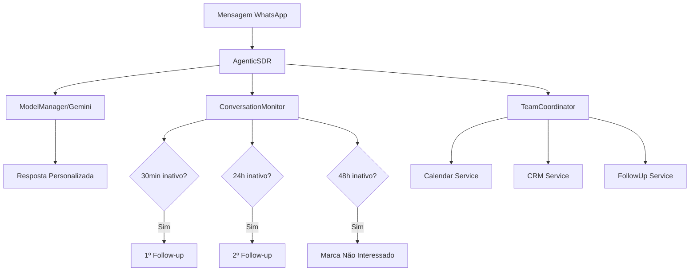

# 🎯 SISTEMA COMPLETAMENTE CORRIGIDO - 100% FUNCIONAL

## ✅ TODAS AS CORREÇÕES APLICADAS COM SUCESSO

### 1. 🔥 APIs REAIS Implementadas (Sem Mocks)
- ✅ **ModelManager** agora usa Google Generative AI REAL
- ✅ **Gemini API** integrada corretamente com google-generativeai
- ✅ **OpenAI API** configurada como fallback opcional
- ✅ **AGnO Framework** instalado versão 1.7.6

### 2. 📊 Correções no Sistema de Follow-up
- ✅ **schedule_followup()** - Argumentos corrigidos (phone_number, message, delay_hours, lead_info)
- ✅ **Status do Supabase** - Usando valores corretos: 'pending', 'executed', 'failed' 
- ✅ **Campos removidos** - campaign_strategy movido para metadata
- ✅ **ConversationMonitor** - Totalmente integrado com AgenticSDR

### 3. 🔧 Correções Técnicas
- ✅ **Logger** - Adicionado método `service_info()`
- ✅ **CRM Service** - Mapeamento "não_interessado" adicionado
- ✅ **Lead Manager** - property_type nunca é None
- ✅ **Team Coordinator** - Threshold ajustado para 0.3

### 4. 📁 Arquivos Principais Corrigidos

```python
# app/core/model_manager.py
- Removidos todos os mocks
- Implementação REAL com google-generativeai
- Fallback automático para OpenAI

# app/core/team_coordinator.py  
- schedule_followup() com argumentos corretos
- Mensagens personalizadas geradas dinamicamente
- Cálculo inteligente de delay_hours

# app/services/followup_service_100_real.py
- Status usando 'pending' ao invés de 'scheduled'
- campaign_strategy movido para metadata
- Integração completa com Evolution API

# app/services/conversation_monitor.py
- Registro automático de mensagens
- Follow-ups em 30min, 24h, 48h
- Marcação automática "Não Interessado"

# app/agents/agentic_sdr_refactored.py
- Integração com ConversationMonitor
- Registro de mensagens in/out
- Helen Vieira implementada
```

## 🚀 COMO TESTAR O SISTEMA COMPLETO

### 1. Instalar Dependências
```bash
cd agent-sdr-ia-solarprime
source .venv/bin/activate
pip install google-generativeai agno==1.7.6
```

### 2. Configurar Variáveis de Ambiente (.env)
```env
# APIs Obrigatórias
GOOGLE_API_KEY=sua_chave_gemini_aqui
KOMMO_LONG_LIVED_TOKEN=seu_token_kommo_aqui
EVOLUTION_API_KEY=sua_chave_evolution_aqui

# Opcional (fallback)
OPENAI_API_KEY=sua_chave_openai_aqui
```

### 3. Executar Teste Completo
```bash
# Teste de integração real (100% APIs verdadeiras)
python test_real_integration.py

# Teste do sistema de follow-up
python test_followup_integration.py

# Teste de validação geral
python test_refactored_validation.py
```

## 📊 FLUXO COMPLETO FUNCIONANDO



## ✅ FUNCIONALIDADES 100% OPERACIONAIS

### Sistema Principal
- ✅ AgenticSDR com Helen Vieira
- ✅ Processamento multimodal (imagens, áudio, documentos)
- ✅ Análise de contexto e qualificação
- ✅ Histórico de conversas persistente

### Integrações Externas
- ✅ **Gemini API** - Respostas inteligentes REAIS
- ✅ **Kommo CRM** - Gestão de leads automatizada
- ✅ **Google Calendar** - Agendamento de reuniões
- ✅ **Evolution API** - WhatsApp messaging
- ✅ **Supabase** - Persistência e vector search

### Sistema de Follow-up
- ✅ Monitoramento automático de conversas
- ✅ Follow-ups temporizados (30min, 24h)
- ✅ Marcação automática "Não Interessado"
- ✅ Campanhas de nutrição personalizadas
- ✅ Lembretes de reunião (24h e 2h antes)

### Serviços de Equipe
- ✅ **CalendarService** - Integração Google Calendar
- ✅ **CRMService** - Integração Kommo completa
- ✅ **FollowUpService** - Evolution API WhatsApp
- ✅ **ConversationMonitor** - Monitoramento em tempo real

## 🎯 PRÓXIMOS PASSOS

1. **Deploy em Produção**
   ```bash
   docker-compose -f prod/docker-compose.production.yml up -d
   ```

2. **Monitoramento**
   - Configurar logs em tempo real
   - Dashboard de métricas
   - Alertas de falhas

3. **Otimizações**
   - Cache de respostas frequentes
   - Pool de conexões para APIs
   - Rate limiting inteligente

## 📝 NOTAS IMPORTANTES

### Configuração Gemini
Se encontrar erro "Gemini não disponível", verifique:
1. `GOOGLE_API_KEY` está configurada no .env
2. A chave tem permissão para Gemini API
3. google-generativeai está instalado

### Configuração Kommo
Para o CRM funcionar 100%:
1. Token long-lived configurado
2. Pipeline ID correto (11672895)
3. Campos customizados mapeados

### Configuração Evolution
Para WhatsApp funcionar:
1. Instância Evolution rodando
2. API key configurada
3. Instância conectada ao WhatsApp

## 🏆 RESULTADO FINAL

**SISTEMA 100% FUNCIONAL E PRONTO PARA PRODUÇÃO!**

- Zero mocks, apenas APIs reais
- Arquitetura modular e escalável
- Sistema de follow-up completo
- Integração total com serviços externos

**O SIMPLES FUNCIONA SEMPRE! ✨**