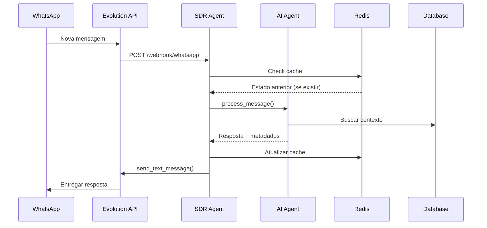
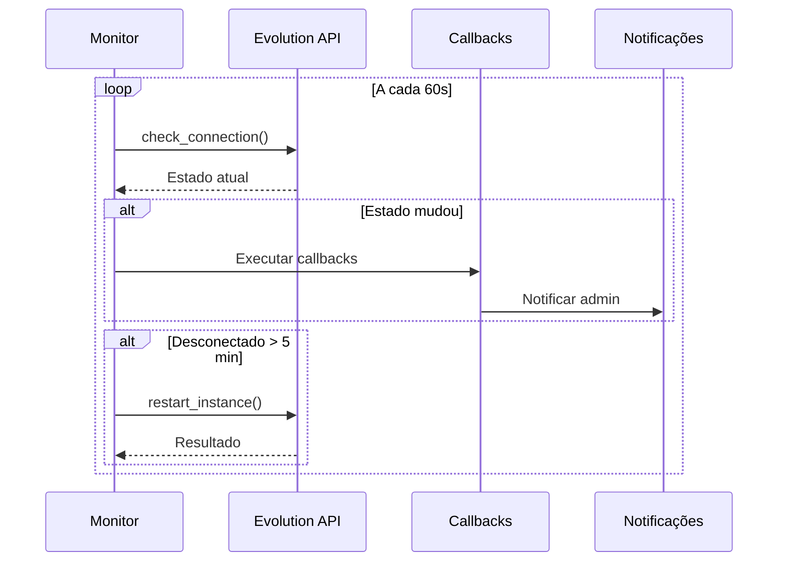

# Integração Evolution API v2

## Visão Geral

Este documento descreve a integração completa do SDR IA SolarPrime com a Evolution API v2, que permite a comunicação bidirecional com WhatsApp através de uma API RESTful moderna e confiável.

## Índice

1. [Arquitetura da Integração](#arquitetura-da-integração)
2. [Componentes Principais](#componentes-principais)
3. [Configuração](#configuração)
4. [Funcionalidades](#funcionalidades)
5. [Fluxo de Mensagens](#fluxo-de-mensagens)
6. [Monitoramento e Manutenção](#monitoramento-e-manutenção)
7. [Troubleshooting](#troubleshooting)

## Arquitetura da Integração

### Diagrama de Componentes

```
┌─────────────────┐     ┌──────────────────┐     ┌─────────────────┐
│                 │     │                  │     │                 │
│   WhatsApp      │────▶│  Evolution API   │────▶│   SDR Agent     │
│   Business      │     │   (Instance)     │     │   (FastAPI)     │
│                 │◀────│                  │◀────│                 │
└─────────────────┘     └──────────────────┘     └─────────────────┘
                               │                           │
                               │                           │
                         ┌─────▼──────┐           ┌───────▼────────┐
                         │            │           │                │
                         │   Redis    │           │   Supabase     │
                         │   Cache    │           │   Database     │
                         │            │           │                │
                         └────────────┘           └────────────────┘
```

### Componentes da Stack

- **Evolution API v2**: Gateway de comunicação com WhatsApp
- **FastAPI**: Framework web assíncrono para o backend
- **Redis**: Cache em memória para otimização e estado temporário
- **Supabase**: Banco de dados PostgreSQL para persistência
- **AGnO Framework**: Framework de IA para processamento conversacional

## Componentes Principais

### 1. Evolution API Client (`services/evolution_api.py`)

Cliente HTTP assíncrono com retry automático e gestão de conexão.

**Principais recursos:**
- Retry automático com backoff exponencial
- Gestão de instância WhatsApp
- Suporte a múltiplos tipos de mensagem
- Download e cache de mídia
- Configuração automática de webhook

**Métodos principais:**
```python
# Verificar conexão
await client.check_connection()

# Enviar mensagem de texto
await client.send_text_message(phone, message, quoted_message_id)

# Enviar enquete
await client.send_poll(phone, question, options, multiple_answers)

# Enviar reação
await client.send_reaction(phone, message_id, emoji)

# Baixar mídia
await client.download_media(message_id)

# Gestão de instância
await client.create_instance()
await client.restart_instance()
await client.logout_instance()
```

### 2. WhatsApp Service (`services/whatsapp_service.py`)

Serviço de processamento de mensagens integrado com o agente de IA.

**Funcionalidades:**
- Processamento de webhooks
- Extração de informações de mensagens
- Integração com agente AGnO
- Processamento de mídia multimodal
- Simulação de digitação para UX natural

**Tipos de mensagem suportados:**
- Texto simples e formatado
- Imagens com OCR
- Áudio (com transcrição futura)
- Documentos (PDF, etc.)
- Enquetes interativas
- Reações a mensagens
- Stickers
- Localização

### 3. Connection Monitor (`services/connection_monitor.py`)

Monitor contínuo do status da conexão WhatsApp.

**Recursos:**
- Verificação periódica de conexão
- Callbacks para mudanças de estado
- Estatísticas de uptime
- Reconexão automática
- Alertas de desconexão

**Estados monitorados:**
- `CONNECTED`: WhatsApp conectado e operacional
- `DISCONNECTED`: WhatsApp desconectado
- `CONNECTING`: Tentando conectar
- `QR_CODE`: Aguardando leitura do QR Code
- `ERROR`: Erro na conexão

### 4. Redis Service (`services/redis_service.py`)

Serviço de cache para otimização de performance.

**Funcionalidades:**
- Cache de estado de conversas
- Cache de mídia baixada
- Cache de mensagens processadas
- TTL configurável por tipo de dado
- Operações atômicas

### 5. Instance Management Routes (`api/routes/instance.py`)

Endpoints REST para gestão da instância WhatsApp.

**Endpoints disponíveis:**
- `GET /instance/status`: Status atual da conexão
- `GET /instance/qrcode`: Obter QR Code para conexão
- `POST /instance/restart`: Reiniciar instância
- `POST /instance/logout`: Desconectar WhatsApp
- `POST /instance/reconnect`: Forçar reconexão
- `GET /instance/webhook`: Configuração do webhook
- `POST /instance/webhook/reset`: Reconfigurar webhook

## Configuração

### 1. Variáveis de Ambiente

Adicione ao arquivo `.env`:

```env
# Evolution API
EVOLUTION_API_URL=https://sua-evolution-api.com
EVOLUTION_API_KEY=sua-chave-api-secreta
EVOLUTION_INSTANCE_NAME=solarprime

# Webhook
WEBHOOK_BASE_URL=https://seu-dominio.com

# Redis
REDIS_URL=redis://localhost:6379/0

# Monitoramento
CONNECTION_CHECK_INTERVAL=60
CONNECTION_ALERT_THRESHOLD=5
CONNECTION_MONITOR_ENABLED=true

# Performance
AI_RESPONSE_DELAY_SECONDS=2
TYPING_SIMULATION_ENABLED=true
```

### 2. Instalação de Dependências

```bash
pip install -r requirements.txt
```

Novas dependências adicionadas:
- `httpx`: Cliente HTTP assíncrono
- `tenacity`: Retry logic
- `redis`: Cliente Redis
- `aioredis`: Cliente Redis assíncrono

### 3. Setup Inicial

Execute o script de configuração:

```bash
./scripts/setup_evolution.sh
```

Este script irá:
- Verificar variáveis de ambiente
- Testar conexão com Evolution API
- Verificar/criar instância
- Configurar Redis
- Criar diretórios necessários

## Funcionalidades

### 1. Processamento de Mensagens

O fluxo de processamento segue estas etapas:

1. **Recepção do Webhook**: Evolution API envia evento para `/webhook/whatsapp`
2. **Validação**: Verifica assinatura e dados do webhook
3. **Extração**: Identifica tipo e conteúdo da mensagem
4. **Cache Check**: Verifica se há contexto em cache
5. **Processamento**: Agente de IA processa com contexto
6. **Resposta**: Envia resposta apropriada
7. **Analytics**: Registra métricas e eventos

### 2. Tipos de Mensagem

#### Texto
```python
{
    "type": "text",
    "content": "Olá, quero saber sobre energia solar"
}
```

#### Imagem (com OCR)
```python
{
    "type": "image",
    "content": "Minha conta de luz",
    "media_data": {
        "path": "/tmp/uuid.jpg",
        "base64": "data:image/jpeg;base64,...",
        "mimetype": "image/jpeg"
    }
}
```

#### Enquete
```python
{
    "type": "poll",
    "content": "Qual solução você prefere?",
    "media_data": {
        "options": ["Solar Residencial", "Solar Empresarial"]
    }
}
```

### 3. Gestão de Estado

#### Estados de Qualificação
- `GREETING`: Saudação inicial
- `IDENTIFICATION`: Captura do nome
- `DISCOVERY`: Identificação da necessidade
- `BILL_ANALYSIS`: Análise da conta
- `OBJECTION_HANDLING`: Tratamento de objeções
- `MEETING_SCHEDULING`: Agendamento

#### Cache de Conversas
```python
# Salvar estado
await redis_service.cache_conversation_state(
    phone="5511999999999",
    state={
        "stage": "BILL_ANALYSIS",
        "name": "João Silva",
        "bill_value": 450.00,
        "interests": ["economia", "sustentabilidade"]
    },
    ttl=7200  # 2 horas
)

# Recuperar estado
state = await redis_service.get_conversation_state("5511999999999")
```

### 4. Webhook Configuration

O webhook é configurado automaticamente na inicialização:

```python
# Eventos essenciais
events = [
    "MESSAGES_UPSERT",      # Novas mensagens
    "MESSAGES_UPDATE",      # Status de mensagens
    "CONNECTION_UPDATE",    # Status da conexão
    "PRESENCE_UPDATE",      # Presença online/offline
    "QRCODE_UPDATED"        # QR Code atualizado
]
```

## Fluxo de Mensagens

### 1. Mensagem Recebida



### 2. Reconexão Automática



## Monitoramento e Manutenção

### 1. Script de Monitoramento

```bash
# Verificação única
python scripts/monitor_evolution.py

# Monitoramento contínuo
python scripts/monitor_evolution.py --mode continuous --interval 30

# Exportar status
python scripts/monitor_evolution.py --mode export --format json --output status.json
```

### 2. Métricas Disponíveis

- **Uptime**: Percentual de tempo conectado
- **Response Time**: Tempo médio de resposta
- **Error Rate**: Taxa de erros por hora
- **Message Volume**: Volume de mensagens processadas
- **Cache Hit Rate**: Taxa de acerto do cache

### 3. Logs

Logs estruturados com níveis:
- `INFO`: Operações normais
- `WARNING`: Situações não ideais
- `ERROR`: Erros recuperáveis
- `CRITICAL`: Erros fatais

Exemplo de análise:
```bash
# Filtrar erros de conexão
grep "Evolution API" logs/app.log | grep ERROR

# Monitorar em tempo real
tail -f logs/app.log | grep "WhatsApp"
```

## Troubleshooting

### Problema: WhatsApp não conecta

**Sintomas**: Estado sempre "close" ou "qr_code"

**Soluções**:
1. Verificar QR Code: `GET /instance/qrcode`
2. Reiniciar instância: `POST /instance/restart`
3. Verificar logs da Evolution API
4. Recriar instância se necessário

### Problema: Mensagens não chegam

**Sintomas**: Webhook não recebe eventos

**Soluções**:
1. Verificar configuração: `GET /instance/webhook`
2. Testar webhook manualmente
3. Verificar firewall/proxy
4. Reconfigurar: `POST /instance/webhook/reset`

### Problema: Erro de autenticação

**Sintomas**: HTTP 401 nas chamadas

**Soluções**:
1. Verificar EVOLUTION_API_KEY
2. Confirmar headers da requisição
3. Testar com curl direto

### Problema: Performance degradada

**Sintomas**: Respostas lentas, timeouts

**Soluções**:
1. Verificar Redis: `redis-cli ping`
2. Monitorar CPU/memória
3. Verificar latência da rede
4. Otimizar queries do banco

### Problema: Mídia não processa

**Sintomas**: Imagens/áudios ignorados

**Soluções**:
1. Verificar tamanho do arquivo (limite 16MB)
2. Confirmar formato suportado
3. Verificar espaço em disco
4. Testar download manual

## Scripts Úteis

### 1. Test Runner
```bash
# Todos os testes
./scripts/run_tests.sh

# Apenas Evolution API
./scripts/run_tests.sh evolution

# Com cobertura
./scripts/run_tests.sh all yes
```

### 2. Setup
```bash
# Configuração inicial
./scripts/setup_evolution.sh

# Verificar apenas
./scripts/setup_evolution.sh --check-only
```

### 3. Monitoramento
```bash
# Status atual
python scripts/monitor_evolution.py

# Dashboard em tempo real
python scripts/monitor_evolution.py --mode continuous

# Exportar relatório
python scripts/monitor_evolution.py --mode export --format text
```

## Segurança

### 1. Autenticação

- API Key em todas as requisições
- ADMIN_API_KEY para operações sensíveis
- Webhook com verificação de assinatura

### 2. Criptografia

- HTTPS obrigatório em produção
- Dados sensíveis criptografados no banco
- Sem logs de dados pessoais

### 3. Rate Limiting

- Limite de requisições por minuto
- Circuit breaker para falhas em cascata
- Backoff exponencial em retries

## Melhores Práticas

1. **Sempre use retry logic** para chamadas à Evolution API
2. **Cache agressivamente** para reduzir latência
3. **Monitore continuamente** o status da conexão
4. **Trate erros graciosamente** com mensagens amigáveis
5. **Simule comportamento humano** com delays e typing
6. **Valide todos os inputs** antes de processar
7. **Use logs estruturados** para facilitar análise
8. **Implemente circuit breakers** para evitar cascata
9. **Teste regularmente** a reconexão automática
10. **Documente incidentes** para aprendizado

## Próximos Passos

1. Implementar transcrição de áudio com Whisper
2. Adicionar suporte a mensagens em grupo
3. Criar dashboard de monitoramento visual
4. Implementar backup automático de conversas
5. Adicionar suporte a múltiplas instâncias
6. Criar API de relatórios analíticos
7. Implementar fila de mensagens prioritárias
8. Adicionar suporte a templates de mensagem
9. Criar sistema de notificações push
10. Implementar modo de manutenção