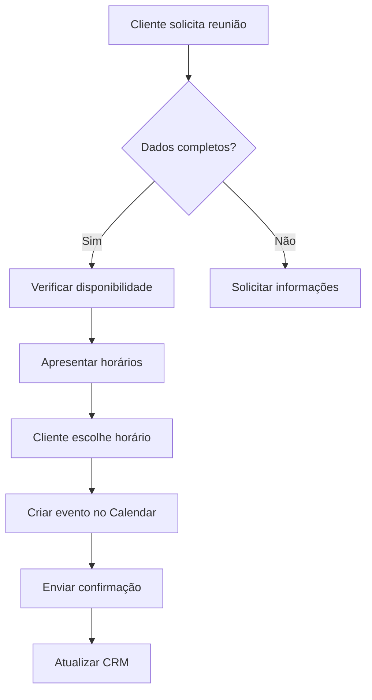

# Configuração do Google Calendar - SDR IA SolarPrime

Este documento explica como configurar a integração com o Google Calendar para agendamento automático de reuniões.

## 🎯 Visão Geral

A integração permite que o agente SDR:
- ✅ Agende reuniões automaticamente no Google Calendar
- 🔄 Reagende reuniões quando necessário
- ❌ Cancele reuniões com notificações
- 📅 Verifique disponibilidade de horários
- 📧 Envie convites automáticos por email

## 📋 Pré-requisitos

1. Conta Google com acesso ao Google Calendar
2. Projeto no Google Cloud Console
3. Python 3.8+ instalado
4. Acesso administrativo ao sistema

## 🔧 Configuração Passo a Passo

### 1. Criar Projeto no Google Cloud Console

1. Acesse [Google Cloud Console](https://console.cloud.google.com/)
2. Clique em "Criar Projeto" ou selecione um existente
3. Anote o ID do projeto

### 2. Ativar Google Calendar API

1. No Console, vá para "APIs e Serviços" > "Biblioteca"
2. Pesquise por "Google Calendar API"
3. Clique e ative a API
4. Aguarde a ativação completa

### 3. Criar Credenciais OAuth 2.0

1. Vá para "APIs e Serviços" > "Credenciais"
2. Clique em "+ CRIAR CREDENCIAIS" > "ID do cliente OAuth"
3. Configure a tela de consentimento OAuth:
   - Tipo de usuário: Interno (se usar G Suite) ou Externo
   - Nome do app: "SDR IA SolarPrime"
   - Email de suporte: seu email
   - Escopos: Adicione os escopos do Calendar
4. Tipo de aplicativo: "Aplicativo para desktop"
5. Nome: "SDR Calendar Integration"
6. Clique em "Criar"

### 4. Baixar Credenciais

1. Após criar, clique no botão de download (ícone ⬇️)
2. Salve o arquivo JSON baixado
3. Renomeie para `google_calendar_credentials.json`
4. Mova para a pasta `credentials/` do projeto:
   ```bash
   mkdir -p credentials
   mv ~/Downloads/client_secret_*.json credentials/google_calendar_credentials.json
   ```

### 5. Configurar Variáveis de Ambiente

Edite o arquivo `.env` e adicione:

```env
# Google Calendar Configuration
GOOGLE_CALENDAR_CREDENTIALS_PATH=credentials/google_calendar_credentials.json
GOOGLE_CALENDAR_TOKEN_PATH=credentials/google_calendar_token.pickle
GOOGLE_CALENDAR_ID=primary
MEETING_DURATION_MINUTES=60
MEETING_LOCATION=SolarPrime - Av. Boa Viagem, 3344 - Boa Viagem, Recife - PE
BUSINESS_HOURS_START=9
BUSINESS_HOURS_END=18
```

### 6. Primeira Autenticação

Na primeira execução, o sistema abrirá o navegador para autorização:

```bash
# Executar script de teste
python scripts/test_google_calendar.py
```

1. Uma janela do navegador abrirá automaticamente
2. Faça login com a conta Google desejada
3. Autorize os escopos solicitados:
   - Ver e editar eventos do calendário
   - Criar novos eventos
   - Modificar eventos existentes
4. Após autorizar, você verá "A autenticação foi concluída"
5. O token será salvo em `credentials/google_calendar_token.pickle`

### 7. Testar Integração

Execute o script de teste completo:

```bash
python scripts/test_calendar_integration.py
```

Isso testará:
- ✅ Conexão com a API
- ✅ Criação de evento teste
- ✅ Listagem de eventos
- ✅ Atualização de evento
- ✅ Cancelamento de evento

## 🔒 Segurança

### Práticas Recomendadas

1. **Nunca commite credenciais**:
   ```bash
   # Adicione ao .gitignore
   credentials/
   *.pickle
   google_calendar_credentials.json
   ```

2. **Use conta de serviço em produção**:
   - Para produção, considere usar Service Account
   - Mais seguro para automação
   - Não requer interação do usuário

3. **Rotação de credenciais**:
   - Renove credenciais a cada 90 dias
   - Monitore uso da API
   - Configure alertas de segurança

4. **Permissões mínimas**:
   - Use apenas os escopos necessários
   - Revise permissões regularmente

## 🚀 Uso no Sistema

### Comandos Disponíveis para o Agente

O agente pode usar os seguintes comandos naturalmente na conversa:

1. **Agendar reunião**:
   - "Vamos agendar para amanhã às 14h"
   - "Que tal quinta-feira às 10h?"
   - "Podemos marcar dia 15/01 às 15h"

2. **Reagendar**:
   - "Preciso remarcar nossa reunião"
   - "Podemos mudar para outro horário?"

3. **Cancelar**:
   - "Preciso cancelar nossa reunião"
   - "Vou ter que desmarcar"

4. **Verificar disponibilidade**:
   - "Quais horários você tem disponível?"
   - "Tem horário amanhã?"

### Fluxo de Agendamento



## 🐛 Troubleshooting

### Erro: "Credenciais não encontradas"

```bash
# Verificar se o arquivo existe
ls -la credentials/google_calendar_credentials.json

# Verificar permissões
chmod 600 credentials/google_calendar_credentials.json
```

### Erro: "Token expirado"

```bash
# Remover token antigo
rm credentials/google_calendar_token.pickle

# Executar autenticação novamente
python scripts/test_google_calendar.py
```

### Erro: "Quota excedida"

- Verifique limites no Google Cloud Console
- Calendar API tem limite de 1.000.000 requisições/dia
- Implemente cache para reduzir chamadas

### Erro: "Acesso negado"

1. Verifique os escopos no Cloud Console
2. Confirme que a conta tem acesso ao calendário
3. Para G Suite, verifique políticas da organização

## 📊 Monitoramento

### Métricas Importantes

1. **Taxa de sucesso de agendamentos**
   - Meta: > 95%
   - Monitorar falhas

2. **Tempo de resposta da API**
   - Meta: < 500ms
   - Implementar cache se necessário

3. **Uso de quota**
   - Monitorar no Cloud Console
   - Configurar alertas

### Logs

Todos os eventos são registrados em:
- `logs/google_calendar.log` - Log específico do Calendar
- `logs/app.log` - Log geral da aplicação

## 🔄 Manutenção

### Tarefas Regulares

1. **Semanal**:
   - Verificar logs de erro
   - Monitorar taxa de sucesso

2. **Mensal**:
   - Revisar uso de quota
   - Atualizar dependências

3. **Trimestral**:
   - Rotacionar credenciais
   - Revisar permissões

## 📚 Referências

- [Google Calendar API Documentation](https://developers.google.com/calendar)
- [Python Client Library](https://github.com/googleapis/google-api-python-client)
- [OAuth 2.0 Guide](https://developers.google.com/identity/protocols/oauth2)
- [AGnO Framework Docs](https://docs.agno.dev/tools/google-calendar)

## 🤝 Suporte

Para problemas ou dúvidas:
1. Consulte os logs em `logs/`
2. Verifique a documentação oficial
3. Contate a equipe de desenvolvimento