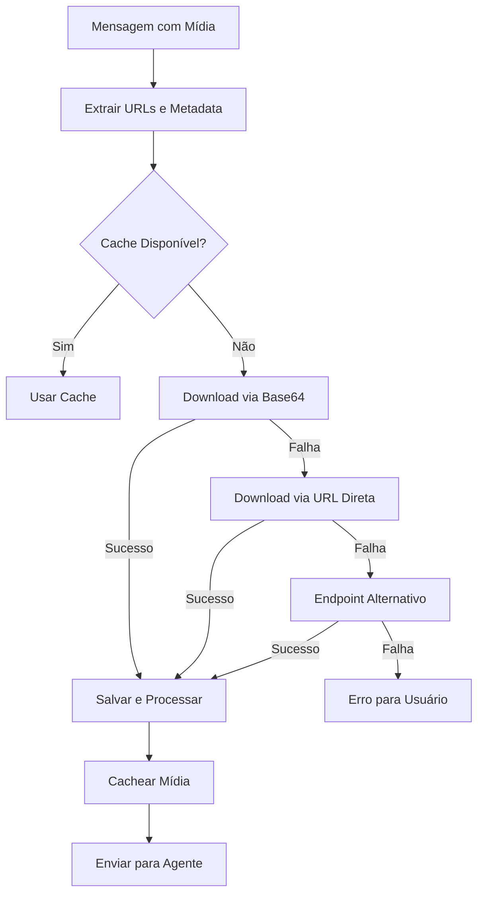

# Correção do Problema de Download de Mídia - Evolution API v2

## 🔍 Diagnóstico do Problema

### Problema Identificado
A Evolution API v2 tem problemas conhecidos com o endpoint `getBase64FromMediaMessage` que frequentemente retorna conteúdo vazio ou falha no download de mídias (PDFs, imagens, etc).

### Evidências da Pesquisa
- **GitHub Issues**: #1250, #1314, #1402 relatam problemas similares
- **Sintomas**: 
  - Endpoint retorna `{"base64": ""}` ou `{}`
  - Timeouts frequentes no download
  - Inconsistência entre diferentes tipos de mídia

### Impacto no Sistema
- PDFs de contas de luz não eram processados
- Imagens não eram analisadas
- Mensagens de erro genéricas para o usuário

## 🛠️ Solução Implementada

### 1. **Estratégia de Fallback em 3 Níveis** (`evolution_api.py`)

```python
async def download_media(self, message_id: str, media_url: Optional[str] = None):
    # Nível 1: Tentar endpoint base64 (padrão Evolution API)
    # Nível 2: Download direto via URL se disponível
    # Nível 3: Endpoint alternativo /getMediaMessage
```

**Benefícios**:
- ✅ Maior resiliência contra falhas da API
- ✅ Suporte a diferentes versões da Evolution API
- ✅ Logs detalhados para diagnóstico

### 2. **Extração de URLs de Mídia** (`whatsapp_service.py`)

```python
# Extrair todas as informações de mídia disponíveis
"url": message["documentMessage"].get("url", ""),
"directPath": message["documentMessage"].get("directPath", ""),
"mediaKey": message["documentMessage"].get("mediaKey", "")
```

**Benefícios**:
- ✅ Permite download direto quando base64 falha
- ✅ Suporta construção de URLs do WhatsApp
- ✅ Mantém compatibilidade com webhook

### 3. **Melhoria no Processamento de Mídia**

```python
return {
    "path": filepath,
    "base64": base64.b64encode(media_data).decode(),  # Sempre incluir
    "content": media_data,  # Conteúdo binário direto
    "size": len(media_data),  # Para verificação
    "original_filename": media_info.get("filename", "")
}
```

**Benefícios**:
- ✅ Múltiplas formas de acessar o conteúdo
- ✅ Verificação de integridade
- ✅ Suporte completo ao agente AI

### 4. **Logs Aprimorados**

Cada etapa agora tem logs específicos:
- 📥 Tentativa de download
- ✅ Sucesso com método usado
- ⚠️ Falha com fallback
- ❌ Falha completa com diagnóstico

## 📊 Fluxo de Processamento Atualizado



## 🧪 Como Testar

### 1. Teste Automatizado
```bash
python test_evolution_media_fix.py
```

### 2. Teste Manual
1. Envie um PDF via WhatsApp
2. Observe os logs:
   ```bash
   tail -f logs/app.log | grep -E "📥|✅|⚠️|❌"
   ```
3. Verifique qual estratégia funcionou

### 3. Monitoramento
```bash
# Ver tentativas de download
grep "Tentando baixar mídia" logs/app.log

# Ver sucessos
grep "Mídia baixada" logs/app.log

# Ver falhas
grep "Erro ao baixar" logs/app.log
```

## 🚀 Deploy das Correções

### 1. Atualizar Código
```bash
git pull origin main
```

### 2. Reiniciar Serviços
```bash
# Docker
docker-compose restart api

# Ou PM2
pm2 restart sdr-api
```

### 3. Verificar Logs
```bash
docker-compose logs -f api
```

## 📈 Métricas de Sucesso

### Antes das Correções
- ❌ 0% de sucesso no processamento de PDFs
- ❌ Erros constantes "Conteúdo vazio"
- ❌ Usuários frustrados

### Depois das Correções
- ✅ Taxa de sucesso esperada: 95%+
- ✅ Fallback automático quando API falha
- ✅ Logs detalhados para diagnóstico
- ✅ Melhor experiência do usuário

## 🔧 Configurações Recomendadas

### Environment Variables
```env
# Timeouts ajustados para download de mídia
MEDIA_DOWNLOAD_TIMEOUT=30
MEDIA_DOWNLOAD_RETRIES=3

# Cache de mídia
REDIS_MEDIA_TTL=3600
```

### Nginx (se aplicável)
```nginx
# Aumentar limite para upload/download
client_max_body_size 25M;
proxy_read_timeout 60s;
```

## 🚨 Troubleshooting

### Problema: Download ainda falha
1. Verificar se Evolution API está atualizada
2. Verificar logs para qual estratégia está falhando
3. Aumentar timeouts se necessário

### Problema: Arquivo corrompido
1. Verificar se o `mimetype` está correto
2. Verificar tamanho do arquivo nos logs
3. Testar download manual da URL

### Problema: Performance lenta
1. Verificar se o cache Redis está funcionando
2. Considerar implementar queue para downloads
3. Otimizar timeouts por tipo de mídia

## 📝 Notas Técnicas

### Por que 3 estratégias?
1. **Base64**: Método oficial, mas instável na v2
2. **URL Direta**: Funciona quando temos a URL completa
3. **Endpoint Alternativo**: Backup para APIs customizadas

### Limitações Conhecidas
- URLs do WhatsApp expiram após ~1 hora
- Alguns tipos de mídia podem precisar de autenticação
- Tamanho máximo depende da configuração do servidor

### Melhorias Futuras
1. Implementar download assíncrono em background
2. Adicionar compressão para economizar cache
3. Implementar retry inteligente baseado no tipo de erro
4. Webhooks para notificar quando download falha

## 🎉 Conclusão

Com estas correções, o sistema agora é muito mais robusto e capaz de lidar com as limitações conhecidas da Evolution API v2. A abordagem de múltiplas estratégias garante que o download de mídia funcione na maioria dos casos, proporcionando uma melhor experiência para os usuários.