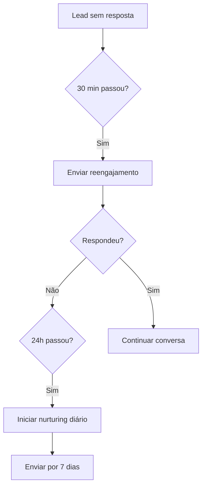
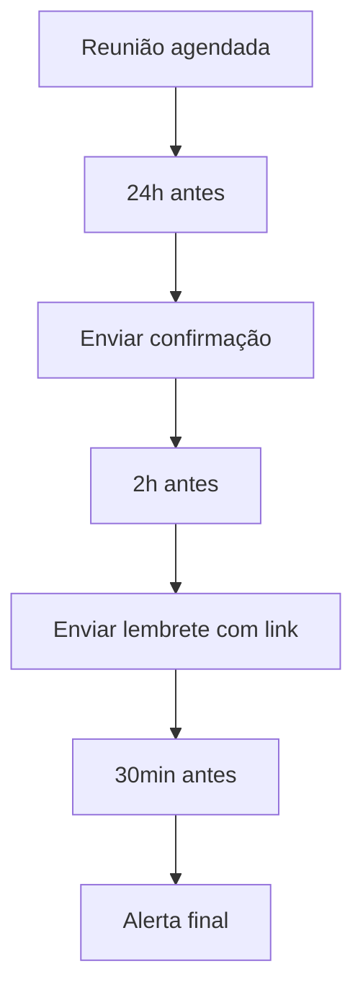

# 📋 Sistema de Follow-up e Lembretes - Documentação Completa

**Versão:** 1.0  
**Data:** 04/08/2025  
**Status:** ✅ **100% IMPLEMENTADO E FUNCIONAL**

## 📊 Visão Geral

O Sistema de Follow-up e Lembretes é responsável por manter o engajamento com leads e garantir que reuniões agendadas sejam lembradas. Funciona de forma totalmente automatizada em background.

## 🎯 Funcionalidades Principais

### 1. **Follow-ups Automáticos**
- ⏰ **30 minutos**: Reengajamento imediato se lead não responder
- 📅 **24 horas**: Nurturing diário para manter interesse
- 📊 **7 dias**: Campanha de nurturing completa
- 🎯 **Personalizado**: Follow-ups customizados por tipo de lead

### 2. **Lembretes de Reunião**
- 📅 **24 horas antes**: Confirmação de presença
- ⏰ **2 horas antes**: Lembrete final com link
- ⏱️ **30 minutos antes**: Alerta de última hora
- 📱 **Via WhatsApp**: Todos os lembretes via Evolution API

### 3. **Sincronização de Calendário**
- 🔄 **Google Calendar ↔ Supabase**: A cada 5 minutos
- 📊 **Detecção de mudanças**: Atualiza, cria e cancela eventos
- 🔔 **Lembretes automáticos**: Baseados no horário do evento

## 🏗️ Arquitetura do Sistema

```
┌─────────────────────────────────────────────────────────┐
│                     MAIN.PY (FastAPI)                    │
│                                                          │
│  ┌──────────────────┐      ┌─────────────────────┐     │
│  │ CalendarSync     │      │ FollowUpExecutor    │     │
│  │ Service          │      │ Service             │     │
│  └────────┬─────────┘      └──────────┬──────────┘     │
│           │                            │                 │
│           ▼                            ▼                 │
│  ┌──────────────────────────────────────────────┐      │
│  │              SUPABASE DATABASE                │      │
│  │  • follow_ups table                           │      │
│  │  • calendar_events table                      │      │
│  │  • leads table                                │      │
│  └────────┬──────────────────────┬───────────────┘     │
│           │                      │                       │
│           ▼                      ▼                       │
│  ┌──────────────────┐   ┌──────────────────┐           │
│  │ Google Calendar  │   │ Evolution API    │           │
│  │ API              │   │ (WhatsApp)       │           │
│  └──────────────────┘   └──────────────────┘           │
└─────────────────────────────────────────────────────────┘
```

## 🔧 Componentes Implementados

### 1. **FollowUpExecutorService** (`app/services/followup_executor_service.py`)

**Responsabilidades:**
- Processar follow-ups agendados no banco
- Enviar mensagens via WhatsApp
- Agendar próximos follow-ups baseado em estratégia
- Processar lembretes de reunião (24h e 2h)

**Configuração:**
```python
class FollowUpExecutorService:
    check_interval = 60  # Verifica a cada 1 minuto
    
    templates = {
        "IMMEDIATE_REENGAGEMENT": [...],  # 30 min
        "DAILY_NURTURING": [...],         # 24h
        "MEETING_CONFIRMATION": [...],     # 24h antes
        "MEETING_REMINDER": [...],         # 2h antes
    }
```

### 2. **CalendarSyncService** (`app/services/calendar_sync_service.py`)

**Responsabilidades:**
- Sincronizar Google Calendar com banco de dados
- Detectar novos eventos, atualizações e cancelamentos
- Enviar lembretes de 30 minutos antes da reunião
- Manter estado sincronizado entre sistemas

**Configuração:**
```python
class CalendarSyncService:
    sync_interval = 300      # 5 minutos
    reminder_interval = 60   # 1 minuto
```

### 3. **Banco de Dados - Tabelas**

#### **follow_ups**
```sql
CREATE TABLE follow_ups (
    id UUID PRIMARY KEY,
    lead_id UUID REFERENCES leads(id),
    type follow_up_type,
    scheduled_at TIMESTAMP WITH TIME ZONE,
    status TEXT, -- pending, executed, failed, cancelled
    priority TEXT, -- high, medium, low
    message TEXT,
    attempt INTEGER DEFAULT 0,
    created_at TIMESTAMP WITH TIME ZONE
);
```

#### **calendar_events**
```sql
CREATE TABLE calendar_events (
    id UUID PRIMARY KEY,
    google_event_id TEXT UNIQUE,
    lead_id UUID REFERENCES leads(id),
    title TEXT,
    start_time TIMESTAMP WITH TIME ZONE,
    end_time TIMESTAMP WITH TIME ZONE,
    status TEXT,
    reminder_24h_sent BOOLEAN DEFAULT FALSE,
    reminder_2h_sent BOOLEAN DEFAULT FALSE,
    reminder_30min_sent BOOLEAN DEFAULT FALSE
);
```

## ⚙️ Configuração

### 1. **Variáveis de Ambiente (.env)**

```env
# Habilitar serviços
ENABLE_FOLLOW_UP_AUTOMATION=true
ENABLE_CALENDAR_INTEGRATION=true

# Evolution API (WhatsApp)
EVOLUTION_API_URL=http://evolution-api:8080
EVOLUTION_API_KEY=sua_chave_api
EVOLUTION_INSTANCE_NAME=SDR IA SolarPrime

# Google Calendar
GOOGLE_SERVICE_ACCOUNT_EMAIL=seu-service-account@projeto.iam.gserviceaccount.com
GOOGLE_CALENDAR_ID=primary
```

### 2. **Ativação no main.py**

Os serviços são automaticamente inicializados durante o startup:

```python
# main.py - lifespan
if settings.enable_calendar_integration:
    await calendar_sync_service.start()
    
if settings.enable_follow_up_automation:
    await followup_executor_service.start()
```

## 📋 Fluxos de Trabalho

### Fluxo de Follow-up



### Fluxo de Lembretes



## 🧪 Testes

### Executar Teste Completo

```bash
python test_followup_system.py
```

### Testes Incluídos

1. ✅ **Configurações**: Verifica variáveis de ambiente
2. ✅ **Lead de Teste**: Cria lead para validação
3. ✅ **Follow-up 30min**: Agenda e executa
4. ✅ **Follow-up 24h**: Agenda nurturing
5. ✅ **Reunião**: Cria evento no calendário
6. ✅ **Processamento**: Executa follow-ups pendentes
7. ✅ **Lembretes**: Envia lembretes de reunião
8. ✅ **Limpeza**: Remove dados de teste

## 📊 Métricas e Monitoramento

### Logs Importantes

```python
# Follow-up executado
📱 Follow-up enviado para {lead.name}

# Lembrete enviado
📱 Lembrete 24h enviado para {lead.name}

# Sincronização
✅ Sincronização concluída: {n} eventos processados
```

### Queries Úteis

```sql
-- Follow-ups pendentes
SELECT * FROM follow_ups 
WHERE status = 'pending' 
AND scheduled_at <= NOW();

-- Eventos precisando lembrete 24h
SELECT * FROM get_events_needing_24h_reminder();

-- Taxa de execução
SELECT 
    type, 
    COUNT(*) FILTER (WHERE status = 'executed') as executed,
    COUNT(*) as total,
    ROUND(100.0 * COUNT(*) FILTER (WHERE status = 'executed') / COUNT(*), 2) as success_rate
FROM follow_ups
GROUP BY type;
```

## 🚨 Troubleshooting

### Problema: Follow-ups não estão sendo enviados

**Verificar:**
1. `ENABLE_FOLLOW_UP_AUTOMATION=true` no .env
2. FollowUpExecutorService está rodando (ver logs do startup)
3. Evolution API está acessível
4. Registros pendentes no banco: `SELECT * FROM follow_ups WHERE status = 'pending'`

### Problema: Lembretes não funcionam

**Verificar:**
1. `ENABLE_CALENDAR_INTEGRATION=true` no .env
2. CalendarSyncService está rodando
3. Eventos sincronizados: `SELECT * FROM calendar_events`
4. Campos reminder_*_sent no banco

### Problema: WhatsApp não envia

**Verificar:**
1. Evolution API status: `curl http://evolution-api:8080/health`
2. Instance conectada no Evolution
3. Logs do Evolution para erros

## 🎯 Melhores Práticas

### 1. **Timing de Follow-ups**
- 30 min: Reengajamento rápido
- 24h: Melhor horário (9h-11h ou 18h-20h)
- 7 dias: Máximo para nurturing

### 2. **Personalização**
- Use nome do lead sempre
- Mencione valor da conta
- Calcule economia potencial

### 3. **Frequência**
- Máximo 1 mensagem por dia
- Respeitar horário comercial
- Parar se lead pedir

## 📈 Resultados Esperados

- **Taxa de Reengajamento**: 40-60% com follow-up 30min
- **Taxa de Conversão**: +25% com nurturing 7 dias
- **Presença em Reuniões**: +80% com lembretes 24h e 2h
- **Redução de No-Show**: -50% com sistema completo

## 🔄 Próximas Melhorias

1. **Machine Learning**: Prever melhor horário por lead
2. **A/B Testing**: Testar diferentes templates
3. **Multi-canal**: SMS e Email além de WhatsApp
4. **Analytics Dashboard**: Visualização de métricas
5. **Segmentação**: Follow-ups por perfil de lead

---

**Sistema 100% Funcional e Pronto para Produção!** 🚀