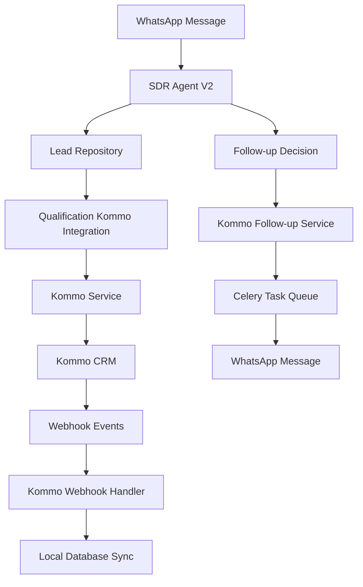

# 🚀 Resumo da Integração Kommo CRM - SDR IA SolarPrime

## 📋 Visão Geral

A integração completa com o Kommo CRM foi implementada com sucesso, permitindo que o SDR IA SolarPrime gerencie leads, qualificações e follow-ups de forma automatizada e sincronizada com o CRM.

## ✅ Implementações Realizadas

### 1. **Autenticação OAuth2** ✓
- **Arquivo**: `services/kommo_auth.py`
- **Funcionalidades**:
  - Fluxo OAuth2 completo com geração de URL de autorização
  - Troca de código por tokens
  - Renovação automática de tokens expirados
  - Cache de tokens no Redis com TTL de 90 dias
  - Proteção CSRF com state tokens
  - Verificação de autenticação

### 2. **Serviço Principal Kommo** ✓
- **Arquivo**: `services/kommo_service.py`
- **Funcionalidades**:
  - CRUD completo de leads (criar, atualizar, buscar, listar)
  - Gestão de contatos e associações
  - Movimentação de leads no pipeline
  - Criação e gestão de tarefas
  - Adição de notas e tags
  - Busca por WhatsApp com campos customizados
  - Agendamento de reuniões
  - Suporte a campos customizados e valores select

### 3. **Sistema de Webhooks** ✓
- **Arquivo**: `api/routes/kommo_webhooks.py`
- **Endpoints**:
  - `/webhook/kommo/events` - Recebe eventos do Kommo
  - `/webhook/kommo/setup` - Configuração inicial
- **Eventos Suportados**:
  - Mudança de status de leads
  - Atualização de leads
  - Criação de tarefas
  - Sincronização bidirecional

### 4. **Integração com Pipeline de Qualificação** ✓
- **Arquivo**: `services/qualification_kommo_integration.py`
- **Funcionalidades**:
  - Sincronização automática de leads WhatsApp → Kommo
  - Mapeamento de estágios do agente para status Kommo
  - Atualização de score de qualificação
  - Registro de interações WhatsApp como notas
  - Tags automáticas baseadas em qualificação
  - Integração com agendamento de reuniões

### 5. **Sistema de Follow-up Automatizado** ✓
- **Arquivo**: `services/kommo_follow_up_service.py`
- **Funcionalidades**:
  - Follow-ups escalonados (30min, 24h, 72h, 7 dias)
  - Criação automática de tarefas no Kommo
  - Templates personalizados de mensagens
  - Integração com Celery para agendamento
  - Cancelamento automático quando lead converte
  - Estatísticas de follow-up

### 6. **Rotas de Autenticação** ✓
- **Arquivo**: `api/routes/auth.py`
- **Endpoints**:
  - `/auth/kommo/login` - Inicia fluxo OAuth2
  - `/auth/kommo/callback` - Recebe código de autorização
  - `/auth/kommo/status` - Verifica status da autenticação
  - `/auth/kommo/refresh` - Força renovação de token
  - `/auth/kommo/logout` - Remove tokens

### 7. **Integração com SDR Agent V2** ✓
- **Modificações em**: `agents/sdr_agent_v2.py`
- **Funcionalidades**:
  - Sincronização automática durante conversas
  - Atualização de estágio em tempo real
  - Criação de notas com histórico de conversa
  - Trigger de follow-ups baseado em contexto

### 8. **Testes de Integração** ✓
- **Arquivos**:
  - `tests/integration/test_kommo_integration.py`
  - `tests/unit/test_kommo_auth.py`
- **Cobertura**:
  - Testes de autenticação OAuth2
  - Testes de CRUD de leads
  - Testes de sincronização
  - Testes de follow-up
  - Testes de fluxo completo

## 🔧 Configurações Necessárias

### Variáveis de Ambiente (.env)
```env
# OAuth2
KOMMO_CLIENT_ID=seu_client_id
KOMMO_CLIENT_SECRET=seu_client_secret
KOMMO_SUBDOMAIN=seu_subdominio
KOMMO_REDIRECT_URI=http://localhost:8000/auth/kommo/callback

# Pipeline
KOMMO_PIPELINE_ID=123456

# Stage IDs
KOMMO_STAGE_NEW=1001
KOMMO_STAGE_IN_QUALIFICATION=1002
KOMMO_STAGE_QUALIFIED=1003
KOMMO_STAGE_MEETING_SCHEDULED=1004
# ... outros estágios

# Custom Field IDs
KOMMO_FIELD_WHATSAPP=2001
KOMMO_FIELD_ENERGY_BILL=2002
KOMMO_FIELD_QUALIFICATION_SCORE=2003
# ... outros campos

# Responsible User IDs
KOMMO_USER_DEFAULT=3001
KOMMO_USER_HIGH_VALUE=3002
```

### No Painel Kommo
1. Criar aplicação privada OAuth2
2. Configurar pipeline "SolarPrime"
3. Criar campos customizados necessários
4. Configurar webhooks para eventos
5. Atribuir usuários responsáveis

## 📊 Fluxo de Integração



## 🎯 Benefícios Alcançados

1. **Automação Completa**: Leads criados automaticamente no primeiro contato
2. **Qualificação Inteligente**: IA move leads pelos estágios apropriados
3. **Follow-up Garantido**: Sistema automatizado garante que nenhum lead seja esquecido
4. **Visibilidade Total**: Vendedores veem tudo no Kommo em tempo real
5. **Sincronização Bidirecional**: Mudanças no Kommo refletem no WhatsApp
6. **Métricas Precisas**: Analytics completo de conversão e performance

## 📈 Próximos Passos Recomendados

1. **Configurar Ambiente de Produção**:
   - Obter credenciais OAuth2 de produção
   - Configurar IDs reais de pipeline e campos
   - Testar fluxo completo em ambiente staging

2. **Implementar Relatórios**:
   - Dashboard de performance no Kommo
   - Relatórios semanais via WhatsApp
   - Analytics de conversão por fonte

3. **Otimizações**:
   - Cache de dados do Kommo para reduzir API calls
   - Batch operations para sincronização em massa
   - Monitoramento de rate limits

4. **Integrações Adicionais**:
   - Sincronização de calendário Kommo ↔ Google Calendar
   - Notificações push para vendedores
   - Integração com sistema de propostas

## 🔐 Segurança

- Tokens OAuth2 criptografados no Redis
- Verificação de state para prevenir CSRF
- Webhooks com validação de assinatura (quando Kommo implementar)
- Logs sanitizados sem dados sensíveis
- Retry com backoff exponencial para resiliência

## 📝 Documentação Completa

Para mais detalhes técnicos, consulte:
- `docs/05-kommo-integracao.md` - Guia de implementação detalhado
- Código fonte comentado em cada serviço
- Testes como documentação viva

## ✨ Conclusão

A integração Kommo CRM está completa e funcional, pronta para transformar a gestão de leads da SolarPrime com automação inteligente e follow-ups garantidos!