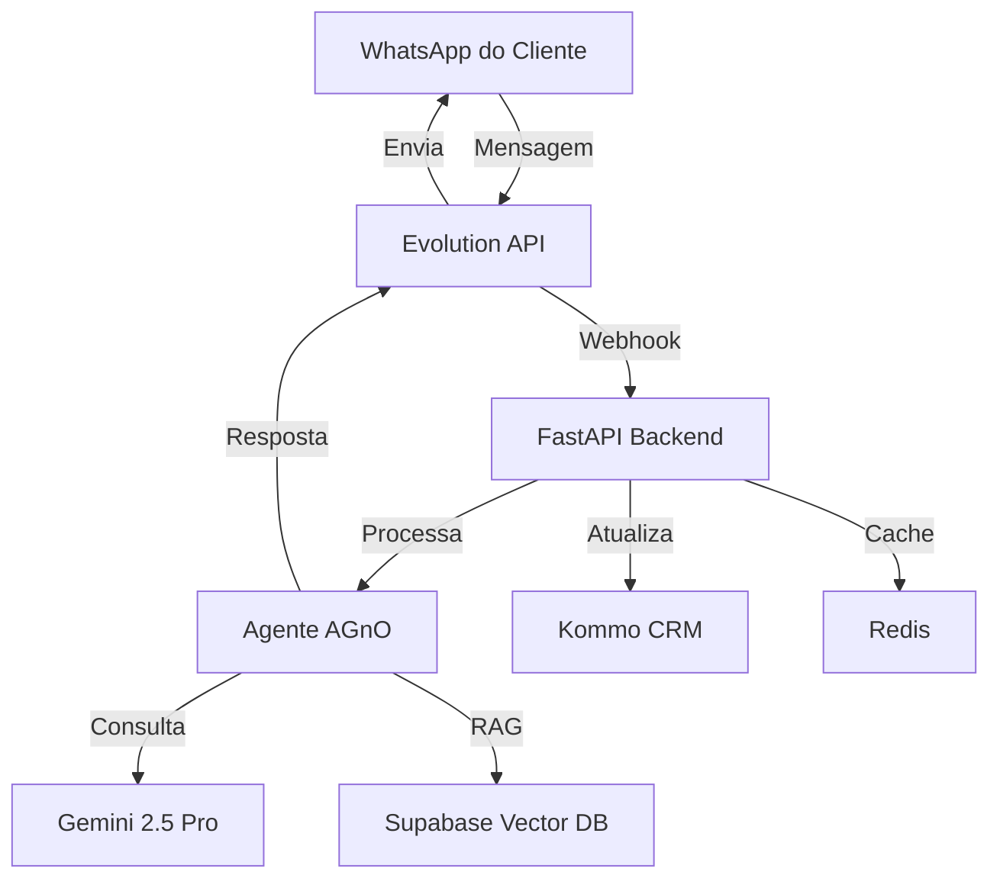

# 🤖 Agente de IA SDR SolarPrime - Guia Completo de Desenvolvimento

## 📋 Visão Geral do Projeto

O **Agente de IA SDR SolarPrime** é um sistema inteligente de vendas automatizado para energia solar que opera via WhatsApp. Este documento fornece um guia completo e detalhado para desenvolver o sistema do zero, utilizando as tecnologias mais modernas disponíveis em 2025.

### 🎯 Objetivos do Sistema

- **Automatizar** o processo completo de qualificação de leads via WhatsApp
- **Integrar** com Kommo CRM para gestão profissional do pipeline de vendas
- **Utilizar** Google Gemini 2.5 Pro para conversação natural e inteligente
- **Implementar** RAG (Retrieval Augmented Generation) com conhecimento específico sobre energia solar
- **Escalar** o processo de vendas mantendo qualidade e personalização

### 🏢 Informações do Projeto

- **Cliente:** Solarprime Boa Viagem - PE
- **Responsável:** Diego Castro
- **Contato:** Leonardo Ferraz - (81) 9.9649-1408
- **Email:** leonardo.vieira1@solarprime.com.br
- **Desenvolvedor:** Nitrox AI
- **Timeline:** 7 a 10 dias para MVP

---

## 🚀 Funcionalidades Principais

### 🤝 Qualificação Inteligente de Leads

- **Identificação automática** do perfil do lead
- **Análise de necessidades** baseada em conversas naturais
- **Classificação por potencial** (Hot, Warm, Cold)
- **Score de qualificação** automático (0-100)
- **Extração de informações** relevantes (orçamento, timeline, autoridade)

### 💬 Processamento Multimodal

- **Áudio:** Transcrição automática de mensagens de voz
- **Imagem:** OCR para contas de luz e documentos
- **PDF:** Análise completa de contratos e propostas
- **Texto:** Processamento de linguagem natural avançado

### 🔄 Follow-up Inteligente

- **Follow-up imediato:** 30 minutos após inatividade
- **Follow-up diário:** 24 horas sem resposta
- **Confirmação de reuniões:** No dia do agendamento às 8h
- **Reagendamento automático:** Quando solicitado pelo cliente
- **Classificação de abandono:** Leads que não respondem após 2 tentativas

### 📅 Agendamento Automatizado

- **Integração direta** com Kommo CRM
- **Consulta de disponibilidade** em tempo real
- **Reagendamento inteligente** quando necessário
- **Confirmação automática** no dia da reunião
- **Movimentação de cards** no kanban do Kommo

### 📊 Relatórios Automáticos

#### Relatórios Semanais (configurável)
- Leads recebidos
- Leads qualificados  
- Leads quentes identificados
- Reuniões agendadas
- Taxa de conversão

**Entrega:** Grupo do WhatsApp da Solarprime (dia e horário configuráveis)

### 🎭 Experiência Conversacional Natural

- **Simulação de digitação** ("digitando..." no WhatsApp)
- **Tempo de resposta configurável** conforme necessidade do cliente
- **Personalidade do Leonardo** (consultor da Solarprime)
- **Tom consultivo e profissional**
- **Uso apropriado de emojis** para WhatsApp

---

## 🏗️ Arquitetura do Sistema

### Stack Tecnológico Detalhado

| Componente | Tecnologia | Versão | Função |
|------------|------------|---------|---------|
| **Framework AI** | AGnO Framework | Latest | Orquestração de agentes de IA |
| **LLM** | Google Gemini 2.5 Pro | 2.5 | Processamento de linguagem natural |
| **WhatsApp** | Evolution API | v2 | Integração com WhatsApp Business |
| **CRM** | Kommo CRM | v4 | Gestão de leads e pipeline de vendas |
| **Banco de Dados** | Supabase | Latest | PostgreSQL + pgvector para RAG |
| **Cache** | Redis | 7.0+ | Cache e filas de mensagens |
| **API** | FastAPI | 0.115+ | Backend REST API |
| **Servidor** | Ubuntu | 22.04 LTS | VPS Hostinger |

### Diagrama de Arquitetura

```
┌─────────────────────────────────────────────────────────────┐
│                    CAMADA DE APLICAÇÃO                      │
├─────────────────────────────────────────────────────────────┤
│  FastAPI + Uvicorn    │    AGnO Framework    │   Pydantic   │
├─────────────────────────────────────────────────────────────┤
│                    CAMADA DE INTEGRAÇÃO                     │
├─────────────────────────────────────────────────────────────┤
│ Evolution API (WhatsApp) │ Kommo CRM API │ Google Gemini 2.5│
├─────────────────────────────────────────────────────────────┤
│                    CAMADA DE DADOS                          │
├─────────────────────────────────────────────────────────────────┤
│    Supabase (PostgreSQL)    │    Redis (Cache/Queue)       │
├─────────────────────────────────────────────────────────────┤
│                    CAMADA DE INFRAESTRUTURA                 │
├─────────────────────────────────────────────────────────────┤
│      Hostinger VPS (Ubuntu 22.04)     │     Nginx          │
└─────────────────────────────────────────────────────────────┘
```

### Fluxo de Dados



### Componentes Principais

#### 🧠 Framework de IA
- **AGnO Framework:** Framework ultrarrápido para agentes de IA
- **Google Gemini 2.5 Pro:** LLM conversacional principal
- **Memória persistente:** Contexto de conversas mantido
- **Reasoning Tools:** Ferramentas de raciocínio avançado

#### 📱 Integração WhatsApp
- **Evolution API:** API não oficial para WhatsApp Business
- **Baileys Integration:** Suporte completo ao protocolo WhatsApp
- **Webhooks em tempo real:** Processamento instantâneo de mensagens
- **Suporte multimodal:** Texto, áudio, imagem, documentos

#### 🗄️ Banco de Dados
- **Supabase:** PostgreSQL com recursos em tempo real
- **Realtime subscriptions:** Atualizações instantâneas
- **Row Level Security:** Segurança avançada de dados
- **Backup automático:** Proteção completa dos dados

#### 🔄 Sistema de Filas
- **Celery:** Processamento assíncrono de tarefas
- **Redis:** Broker de mensagens e cache
- **Task scheduling:** Agendamento de follow-ups
- **Retry logic:** Tratamento de falhas automático

---

## 📚 Documentação Estruturada do Projeto

Este guia está organizado em documentos específicos para cada fase do desenvolvimento. Siga a ordem recomendada para implementar o sistema com sucesso.

### 📁 Estrutura da Documentação

#### 🔧 Fase 1: Configuração e Setup
- **[01. Setup do Ambiente](01-setup-ambiente.md)**
  - Configuração da VPS Hostinger
  - Instalação do Ubuntu 22.04 e dependências
  - Setup do Python, Docker, Redis e Nginx
  - Configuração de segurança e firewall

#### 🧠 Fase 2: Desenvolvimento do Agente de IA
- **[02. Desenvolvimento do Agente IA](02-agente-ia.md)**
  - Implementação com AGnO Framework
  - Integração com Google Gemini 2.5 Pro
  - Criação de prompts especializados em vendas
  - Sistema de memória e contexto

#### 📊 Fase 3: RAG e Base de Conhecimento
- **[03. Sistema RAG com Supabase](03-rag-supabase.md)**
  - Configuração do Supabase e pgvector
  - Implementação de embeddings
  - Popular base de conhecimento sobre energia solar
  - Integração do RAG com o agente

#### 🔌 Fase 4: Integrações
- **[04. API e Webhooks](04-api-webhooks.md)**
  - Desenvolvimento da API FastAPI
  - Configuração dos webhooks Evolution API
  - Processamento de mensagens multimodais
  - Sistema de filas com Redis

#### 💼 Fase 5: CRM e Automação
- **[05. Integração Kommo CRM](05-kommo-integracao.md)**
  - Autenticação OAuth2
  - Gestão automatizada de leads
  - Pipeline de vendas customizado
  - Sistema de follow-up inteligente

#### 🚀 Fase 6: Deploy e Produção
- **[06. Deploy e Monitoramento](06-deploy-monitoramento.md)**
  - Deploy em produção
  - Configuração de monitoramento
  - Sistema de logs e alertas
  - Otimização de performance

### 📚 Recursos Adicionais
- **[Arquitetura Detalhada](architecture.md)** - Diagramas técnicos e decisões arquiteturais
- **[Exemplos de Código](examples/)** - Implementações práticas de referência
  - `agent_example.py` - Exemplo de agente AGnO
  - `webhook_handler.py` - Handler de webhooks
  - `kommo_integration.py` - Integração com CRM

---

## 📁 Estrutura do Código do Projeto

```
sdr-ia-solarprime/
├── 📁 api/                     # FastAPI Application
│   ├── main.py                 # Aplicação principal
│   ├── routes/                 # Rotas da API
│   │   ├── webhooks.py        # Webhooks Evolution API
│   │   ├── leads.py           # Endpoints de leads
│   │   └── analytics.py       # Endpoints de analytics
│   ├── middleware/             # Middlewares personalizados
│   └── dependencies.py         # Dependências injetadas
│
├── 📁 services/                # Serviços de negócio
│   ├── ai_agent.py            # AGnO Agent principal
│   ├── whatsapp_service.py    # Integração Evolution API
│   ├── kommo_service.py       # Integração Kommo CRM
│   ├── supabase_service.py    # Integração Supabase
│   ├── tasks.py               # Tarefas Celery
│   └── qualification.py       # Lógica de qualificação
│
├── 📁 models/                  # Modelos de dados
│   ├── lead.py                # Modelo de Lead
│   ├── conversation.py        # Modelo de Conversa
│   ├── message.py             # Modelo de Mensagem
│   └── qualification.py       # Modelo de Qualificação
│
├── 📁 agents/                  # Agentes AGnO
│   ├── sales_agent.py         # Agente de vendas principal
│   ├── tools/                 # Ferramentas customizadas
│   │   ├── lead_tools.py      # Tools de leads
│   │   └── crm_tools.py       # Tools do CRM
│   └── knowledge/             # Base de conhecimento
│       └── solar_knowledge.py # Conhecimento solar
│
├── 📁 config/                  # Configurações
│   ├── settings.py            # Configurações principais
│   ├── database.py            # Configuração do banco
│   ├── redis_config.py        # Configuração Redis
│   └── security.py            # Configurações de segurança
│
├── 📁 utils/                   # Utilitários
│   ├── validation.py          # Validações de entrada
│   ├── formatting.py          # Formatação de dados
│   ├── encryption.py          # Criptografia
│   └── helpers.py             # Funções auxiliares
│
├── 📁 scripts/                 # Scripts de automação
│   ├── deploy.sh              # Script de deploy
│   ├── backup.sh              # Script de backup
│   ├── monitoring.sh          # Script de monitoramento
│   └── setup.sh               # Script de configuração inicial
│
├── 📁 docs/                    # Esta documentação
├── 📁 tests/                   # Testes automatizados
├── 📁 migrations/              # Migrações do banco
├── requirements.txt            # Dependências Python
├── docker-compose.yml          # Configuração Docker
├── .env.example               # Exemplo de variáveis de ambiente
├── .gitignore                 # Arquivos ignorados pelo Git
└── README.md                  # Arquivo principal do projeto
```

---

## 🛠️ Pré-requisitos do Sistema

### Infraestrutura Necessária
- **VPS com mínimo 4GB RAM e 2 vCPUs**
- **Ubuntu 22.04 LTS**
- **Domínio próprio com SSL configurado**
- **IP fixo para webhooks**
- **80GB de armazenamento SSD**

### Contas e APIs Necessárias
- **Google Cloud** - Acesso ao Gemini 2.5 Pro API
- **Supabase** - Conta gratuita ou paga
- **Evolution API** - Licença ativa
- **Kommo CRM** - Conta com API habilitada
- **WhatsApp Business** - Número verificado

### Conhecimentos Técnicos Recomendados
- **Python 3.11+** - Desenvolvimento backend
- **FastAPI** - Framework web
- **PostgreSQL** - Banco de dados
- **Redis** - Cache e filas
- **Linux** - Administração básica
- **Docker** - Containerização (opcional)

---

## 🚦 Roadmap de Implementação

### Fase 1: Fundação (2-3 dias)
- [ ] Configurar VPS Hostinger com Ubuntu 22.04
- [ ] Instalar Python, Docker, Redis e dependências
- [ ] Configurar firewall e segurança básica
- [ ] Setup inicial do projeto e estrutura de pastas

### Fase 2: Agente de IA (2 dias)
- [ ] Implementar agente AGnO básico
- [ ] Integrar Google Gemini 2.5 Pro
- [ ] Criar prompts especializados em vendas solar
- [ ] Testar conversação e qualificação básica

### Fase 3: RAG e Conhecimento (1-2 dias)
- [ ] Configurar Supabase e pgvector
- [ ] Implementar sistema de embeddings
- [ ] Popular base com conhecimento sobre energia solar
- [ ] Integrar RAG ao agente para respostas contextuais

### Fase 4: WhatsApp Integration (1 dia)
- [ ] Configurar Evolution API na VPS
- [ ] Implementar webhooks para receber mensagens
- [ ] Processar mensagens multimodais (texto, áudio, imagem)
- [ ] Testar fluxo completo de conversação

### Fase 5: CRM e Automação (1-2 dias)
- [ ] Integrar Kommo CRM com OAuth2
- [ ] Implementar criação e atualização de leads
- [ ] Configurar pipeline de vendas automático
- [ ] Sistema de follow-up e agendamento

### Fase 6: Deploy e Otimização (1 dia)
- [ ] Deploy completo em produção
- [ ] Configurar monitoramento e logs
- [ ] Otimizar performance e latência
- [ ] Documentar procedimentos operacionais

---

## 🔧 Configuração e Instalação

### Pré-requisitos de Software

#### Sistema Operacional
- **Ubuntu 22.04 LTS** (recomendado)
- **4 vCPUs, 16GB RAM, 200GB SSD** (mínimo para produção)

#### Software Base
- **Python 3.11+**
- **Docker & Docker Compose**
- **Nginx**
- **Git**
- **Redis**

### Variáveis de Ambiente

#### APIs Principais
```env
# Google Gemini
GEMINI_API_KEY=your_gemini_api_key

# Supabase
SUPABASE_URL=https://xxx.supabase.co
SUPABASE_KEY=your_supabase_anon_key
SUPABASE_SERVICE_KEY=your_supabase_service_key

# Evolution API
EVOLUTION_API_KEY=your_evolution_api_key
EVOLUTION_INSTANCE_ID=your_instance_id
EVOLUTION_INSTANCE_TOKEN=your_instance_token

# Kommo CRM
KOMMO_CLIENT_ID=your_kommo_client_id
KOMMO_CLIENT_SECRET=your_kommo_client_secret
```

#### Configurações do Cliente
```env
# Tempo de resposta (configurável)
AI_RESPONSE_DELAY_SECONDS=2

# Relatórios
REPORT_DAY_OF_WEEK=monday
REPORT_TIME=09:00
WHATSAPP_GROUP_ID=group_id_for_reports

# Horários de funcionamento
BUSINESS_HOURS_START=08:00
BUSINESS_HOURS_END=18:00
TIMEZONE=America/Sao_Paulo
```

### Instalação Step-by-Step

#### 1. Preparação do Servidor
- Configuração inicial do Ubuntu
- Instalação de dependências
- Configuração de segurança (UFW, SSH keys)
- Setup de usuário não-root

#### 2. Configuração dos Serviços
- Instalação do Docker e Docker Compose
- Setup do Evolution API
- Configuração do Supabase
- Setup do Redis

#### 3. Instalação da Aplicação
- Clone do repositório
- Configuração do ambiente virtual Python
- Instalação de dependências
- Setup das variáveis de ambiente

#### 4. Configuração das Integrações
- Setup da instância WhatsApp (Evolution API)
- Configuração do Kommo CRM
- Configuração do Gemini API
- Setup dos webhooks

#### 5. Deploy em Produção
- Configuração do Nginx
- Setup dos serviços systemd
- Configuração de SSL/TLS
- Monitoramento e logs

---

## 🔗 Integrações

### Evolution API (WhatsApp)

#### Funcionalidades Suportadas
- **Envio/recebimento** de mensagens de texto
- **Processamento de áudio** com transcrição automática
- **Processamento de imagens** com OCR
- **Processamento de documentos** PDF
- **Simulação de digitação** ("typing...")
- **Status de entrega** e leitura
- **Webhooks em tempo real**

#### Configuração
- Instância dedicada para o projeto
- Webhooks configurados para eventos de mensagem
- Autenticação via API key
- Rate limiting implementado

### Kommo CRM

#### Funcionalidades Integradas
- **Criação automática** de leads
- **Atualização em tempo real** de informações
- **Movimentação no pipeline** baseada na qualificação
- **Agendamento de reuniões** diretamente no CRM
- **Campos personalizados** para dados específicos
- **Tags automáticas** baseadas na análise

#### Pipeline de Vendas
1. **Novo Lead** - Lead iniciou conversa
2. **Em Qualificação** - IA coletando informações
3. **Qualificado** - Informações completas coletadas
4. **Reunião Agendada** - Agendamento confirmado
5. **Reunião Confirmada** - Cliente confirmou presença
6. **Transferido** - Passado para atendimento humano

### Google Gemini 2.5 Pro

#### Utilização Principal
- **Análise de intenções** das mensagens
- **Qualificação automática** de leads
- **Geração de respostas** contextuais
- **Análise de sentimentos**
- **Extração de entidades** (nome, empresa, orçamento)
- **Score de qualificação** baseado em critérios

#### Configurações
- Temperatura otimizada para conversação
- Tokens máximos configurados
- Rate limiting implementado
- Fallback para casos de erro

### Supabase (Database)

#### Schema Principal
- **profiles:** Dados dos leads/clientes
- **conversations:** Sessões de conversa
- **messages:** Histórico completo de mensagens
- **leads:** Dados de qualificação e CRM
- **follow_ups:** Agendamento de follow-ups
- **reports:** Dados para relatórios

#### Recursos Utilizados
- **Realtime subscriptions** para atualizações
- **Row Level Security** para proteção
- **Triggers automáticos** para auditoria
- **Backup automático** configurado

---

## 📊 Monitoramento e Analytics

### Métricas Principais

#### Tempo Real
- **Conversas ativas** no momento
- **Tempo médio de resposta**
- **Taxa de qualificação** horária
- **Status da infraestrutura**
- **Filas de processamento**

#### Relatórios Semanais
- **Leads recebidos** por dia
- **Taxa de conversão** por etapa
- **Reuniões agendadas** vs. realizadas
- **Principais objeções** encontradas
- **Performance por período** do dia

#### Analytics Avançados
- **Análise de sentimentos** das conversas
- **Temas mais discutidos**
- **Jornada do cliente** detalhada
- **Efetividade dos follow-ups**
- **ROI do sistema**

### Ferramentas de Monitoramento

#### Logging
- **Logs estruturados** em JSON
- **Diferentes níveis** (DEBUG, INFO, WARNING, ERROR)
- **Rotação automática** de logs
- **Centralização** via ELK Stack

#### Alertas
- **Sentry** para erros em produção
- **Alertas via email/WhatsApp** para falhas críticas
- **Monitoramento de uptime**
- **Alertas de performance**

#### Health Checks
- **Endpoint de saúde** da aplicação
- **Verificação de conexões** externas
- **Status das filas** de processamento
- **Uso de recursos** do servidor

---

## 🛡️ Segurança

### Proteção de Dados

#### Criptografia
- **Dados sensíveis** criptografados em repouso
- **Comunicação SSL/TLS** em todas as conexões
- **Tokens JWT** para autenticação
- **Webhooks assinados** para verificação

#### Validação
- **Sanitização** de todas as entradas
- **Validação de esquemas** com Pydantic
- **Rate limiting** para prevenir abuso
- **Whitelist de IPs** para webhooks

#### Compliance
- **LGPD compliance** para dados brasileiros
- **Logs de auditoria** para todas as ações
- **Retention policies** para dados antigos
- **Anonimização** de dados sensíveis

### Backup e Recovery

#### Estratégia de Backup
- **Backup automático** diário do banco
- **Snapshots** dos volumes Docker
- **Backup das configurações**
- **Versionamento** de backups

#### Disaster Recovery
- **Plano de contingência** documentado
- **RTO (Recovery Time Objective):** 1 hora
- **RPO (Recovery Point Objective):** 15 minutos
- **Testes regulares** de recovery

---

## 📚 Documentação

### Guias de Usuário

#### Para Administradores
- **Manual de configuração** inicial
- **Guia de monitoramento**
- **Procedimentos de backup**
- **Solução de problemas** comuns

#### Para Desenvolvedores
- **Documentação da API** completa
- **Guias de integração**
- **Arquitetura detalhada**
- **Contribuição** ao projeto

### API Documentation

#### Endpoints Principais
- `POST /webhook/whatsapp` - Webhook do Evolution API
- `GET /api/leads` - Lista de leads com filtros
- `POST /api/send-message` - Envio manual de mensagens
- `GET /api/analytics/summary` - Resumo analítico
- `GET /health` - Health check da aplicação

#### Modelos de Dados
- Schemas completos de request/response
- Exemplos de uso para cada endpoint
- Códigos de erro e tratamento
- Rate limits e autenticação

---

## 🎯 Fluxo de Qualificação

### Etapas do Processo

#### Etapa 0 - Identificação do Lead
```
"Olá! Seja bem-vindo à Solar Prime. Antes de tudo, como você se chama?"
```
- Captura do nome do lead
- Criação do perfil no sistema
- Início da sessão de conversa

#### Etapa 1 - Identificação da Solução
```
"Você está buscando desconto na sua energia ou montar uma usina?"
```
**5 Soluções Disponíveis:**
1. Usina solar em casa ou terreno próprio
2. Usina em terreno parceiro
3. Compra de energia com desconto - contas acima de R$4.000
4. Compra de energia com desconto - contas abaixo de R$4.000
5. Usina de investimento (transbordo imediato para humano)

#### Etapa 2 - Valor da Conta
```
"Qual o valor médio mensal da sua conta de luz?"
```
- Processamento via OCR se enviada imagem
- Validação de valores mínimos
- Cálculo automático de economia

#### Etapa 3 - Desconto Atual
```
"Você já recebe algum tipo de desconto? Se sim, qual a porcentagem e com qual empresa?"
```
- Análise de concorrentes (Origo, Setta)
- Estratégias de diferenciação
- Cálculo comparativo de vantagens

#### Etapa 4 - Agendamento
```
"Que tal agendarmos uma reunião para eu te mostrar exatamente como funciona?"
```
- Integração com Kommo CRM
- Consulta de disponibilidade
- Confirmação automática

### Proposta de Valor

#### Benefícios Apresentados
- **Usina solar personalizada** para o consumo
- **20% de desconto mínimo** garantido em contrato
- **Zero investimento inicial**
- **No final do contrato, a usina é sua**
- **Proteção contra bandeiras tarifárias**
- **Previsibilidade financeira total**

---

## 🚦 Sistema de Follow-up

### Regras de Automação

#### Follow-up Imediato (30 minutos)
- **Trigger:** Inatividade na conversa
- **Condição:** Lead ainda não qualificado
- **Ação:** Mensagem de reengajamento
- **Máximo:** 1 tentativa

#### Follow-up Diário (24 horas)
- **Trigger:** Sem resposta após primeiro follow-up
- **Condição:** Lead demonstrou interesse inicial
- **Ação:** Mensagem de nurturing
- **Máximo:** 1 tentativa

#### Confirmação de Reunião (8h da manhã)
- **Trigger:** Dia da reunião agendada
- **Condição:** Reunião confirmada no CRM
- **Ação:** Mensagem de confirmação
- **Máximo:** 2 tentativas

#### Reagendamento Inteligente
- **Trigger:** Solicitação do cliente
- **Ação:** Consulta automática de disponibilidade
- **Processo:** Sugestão de novos horários
- **Confirmação:** Atualização automática no CRM

---

## 📈 Roadmap de Desenvolvimento

### Fase 1: MVP (7-10 dias) ✅
- **Core do agente IA** com AGnO Framework
- **Integração WhatsApp** via Evolution API
- **Qualificação básica** de leads
- **Integração Kommo CRM**
- **Follow-ups automáticos**
- **Relatórios semanais**

### Fase 2: Melhorias (Futuro)
- **Dashboard web** para administração
- **Analytics avançados** com machine learning
- **Integração com múltiplos canais** (Instagram, Telegram)
- **A/B testing** para mensagens
- **Suporte a múltiplos idiomas**

### Fase 3: Expansão (Futuro)
- **Multi-tenancy** para outras empresas
- **Marketplace de integrações**
- **IA multimodal** (voz + texto + imagem)
- **Automação completa** do processo de vendas
- **Integração com ferramentas de marketing**

---

## 🤝 Suporte e Manutenção

### SLAs de Suporte

#### Níveis de Criticidade
- **Crítico (P0):** Resolução em 2 horas
- **Alto (P1):** Resolução em 8 horas
- **Médio (P2):** Resolução em 24 horas
- **Baixo (P3):** Resolução em 72 horas

#### Disponibilidade
- **Uptime garantido:** 99.5%
- **Monitoramento:** 24/7 automatizado
- **Suporte técnico:** Horário comercial
- **Emergências:** Disponível via WhatsApp

### Manutenção Preventiva

#### Rotinas Automatizadas
- **Backup diário** do banco de dados
- **Limpeza de logs** antigos
- **Atualizações de segurança**
- **Monitoramento de performance**

#### Revisões Periódicas
- **Semanal:** Análise de métricas
- **Mensal:** Otimização de performance
- **Trimestral:** Review completo do sistema
- **Anual:** Upgrade de infraestrutura

---

## 📞 Contatos

### Equipe do Projeto

#### Desenvolvimento
- **Empresa:** Nitrox AI
- **Status:** Em desenvolvimento ativo

#### Cliente
- **Empresa:** Solarprime Boa Viagem
- **Responsável:** Diego Castro
- **Consultor:** Leonardo Ferraz
- **Telefone:** (81) 9.9649-1408
- **Email:** leonardo.vieira1@solarprime.com.br

### Suporte Técnico
- **Email:** suporte@nitroxai.com
- **WhatsApp:** [A definir]
- **Horário:** 8h às 18h (dias úteis)
- **Emergências:** 24/7 via sistema de alertas

---

## 📄 Licença e Termos

### Propriedade Intelectual
- **Código proprietário** desenvolvido pela Nitrox AI
- **Licença exclusiva** para Solarprime
- **Customizações específicas** incluídas

### Termos de Uso
- **Uso exclusivo** pela Solarprime
- **Dados do cliente** protegidos por contrato
- **Compliance** com LGPD e regulamentações

---

## 🎯 Próximos Passos

### Para Começar o Desenvolvimento

1. **📖 Leia a Documentação Completa**
   - Comece pelo guia [01-setup-ambiente.md](01-setup-ambiente.md)
   - Siga a ordem dos documentos para implementação estruturada

2. **🔑 Obtenha as APIs Necessárias**
   - Google Cloud Console para Gemini 2.5 Pro
   - Conta Supabase (plano gratuito funciona)
   - Licença Evolution API
   - Acesso à API do Kommo CRM

3. **💻 Prepare o Ambiente**
   - Configure sua VPS Hostinger
   - Instale as dependências necessárias
   - Configure as variáveis de ambiente

4. **🚀 Implemente por Fases**
   - Siga o roadmap de 6 fases
   - Teste cada componente antes de avançar
   - Documente problemas e soluções

### Suporte Durante o Desenvolvimento

- **Documentação Detalhada**: Cada arquivo .md contém instruções passo a passo
- **Exemplos de Código**: Pasta `examples/` com implementações funcionais
- **Troubleshooting**: Seção específica em cada documento
- **Melhores Práticas**: Seguidas em todos os exemplos

### Considerações Importantes

1. **Segurança First**: Sempre priorize a segurança dos dados
2. **LGPD Compliance**: Sistema preparado para conformidade
3. **Escalabilidade**: Arquitetura pronta para crescimento
4. **Manutenibilidade**: Código limpo e bem documentado

---

## 📊 Estimativa de Tempo Total

- **Desenvolvimento Completo**: 7-10 dias
- **Testes e Ajustes**: 2-3 dias adicionais
- **Deploy e Estabilização**: 1-2 dias
- **Total**: ~2 semanas para sistema em produção

---

## 🤝 Conclusão

Este guia fornece todos os recursos necessários para desenvolver o **Agente de IA SDR SolarPrime** do zero. Com as tecnologias escolhidas (AGnO Framework, Gemini 2.5 Pro, Evolution API, Kommo CRM e Supabase), você terá um sistema robusto, escalável e eficiente para automação de vendas via WhatsApp.

### Benefícios da Implementação

- ✅ **Automação completa** do processo de qualificação
- ✅ **Redução de custos** com SDRs humanos
- ✅ **Atendimento 24/7** sem pausas
- ✅ **Qualificação consistente** e padronizada
- ✅ **Integração total** com sistemas existentes
- ✅ **Escalabilidade ilimitada** de atendimento

### Comece Agora!

Siga para o primeiro documento: **[01. Setup do Ambiente](01-setup-ambiente.md)** e inicie a jornada de desenvolvimento do seu agente de IA para vendas de energia solar.

---

**💡 Dica Final**: Este projeto é modular. Você pode implementar funcionalidades básicas primeiro e expandir gradualmente conforme necessário.

**🚀 Boa sorte com o desenvolvimento!**

---

**Última atualização:** Julho 2025  
**Versão do documento:** 1.0  
**Guia de Desenvolvimento Completo do Agente SDR SolarPrime**