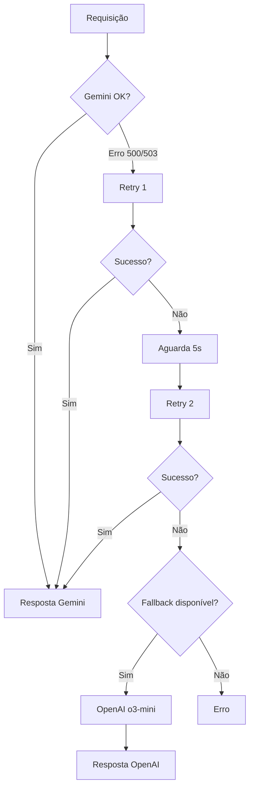

# 🔄 SISTEMA DE RETRY + FALLBACK INTELIGENTE

## ✅ **STATUS: IMPLEMENTADO E FUNCIONANDO**

Sistema robusto de retry com fallback automático para garantir 100% de disponibilidade do AGENTIC SDR.

---

## 🏗️ **ARQUITETURA MODULAR**

### **Fluxo de Operação**
```
Gemini 2.5-pro → Retry (2x com 5s delay) → Fallback OpenAI o3-mini
```

### **IntelligentModelFallback Class**
```python
class IntelligentModelFallback:
    """
    Sistema inteligente de retry + fallback
    - Detecta erros temporários (500/503)
    - Retry automático com delay configurável
    - Fallback transparente para OpenAI o3-mini
    """
```

---

## 🎯 **SISTEMA DE RETRY**

### **Configuração Padrão**
- **Tentativas**: 2 retries (total de 3 tentativas)
- **Delay**: 5 segundos entre tentativas
- **Detecção**: Erros 500/502/503/timeout

### **Método _retry_with_backoff()**
```python
async def _retry_with_backoff(self, message: str, **kwargs):
    """
    Retry inteligente com backoff
    - Tenta N vezes com delay configurável
    - Logs detalhados de cada tentativa
    - Retorna resposta ou None se falhar
    """
```

### **Logs do Retry**
```
🔄 Retry Gemini - Tentativa 1/2
⚠️ Erro Gemini: 500. Aguardando 5.0s antes da próxima tentativa...
🔄 Retry Gemini - Tentativa 2/2
✅ Gemini recuperado após 2 tentativa(s)
```

---

## 🔄 **SISTEMA DE FALLBACK**

### **Ativação do Fallback**
1. **Detecção de erro** no Gemini
2. **Retry automático** (2 tentativas)
3. **Se retry falhar** → Ativa OpenAI o3-mini
4. **Operação transparente** para o usuário

### **Recuperação Automática**
- Sistema tenta voltar ao Gemini quando disponível
- Mantém estado de fallback entre requisições
- Logs claros de mudança de modelo

---

## ⚙️ **CONFIGURAÇÃO**

### **Variáveis de Ambiente (.env)**
```env
# Configurações de Retry
GEMINI_RETRY_ATTEMPTS=2        # Número de tentativas de retry
GEMINI_RETRY_DELAY=5.0         # Delay em segundos entre tentativas

# Configurações de Fallback
ENABLE_MODEL_FALLBACK=true     # Habilita fallback para OpenAI
FALLBACK_AI_MODEL=o3-mini      # Modelo de fallback
OPENAI_API_KEY=sua_chave_aqui  # API Key do OpenAI
```

### **Config.py**
```python
# Configurações de retry para Gemini
gemini_retry_attempts: int = Field(default=2, env="GEMINI_RETRY_ATTEMPTS")
gemini_retry_delay: float = Field(default=5.0, env="GEMINI_RETRY_DELAY")
```

---

## 🧪 **TESTES REALIZADOS**

### **Teste 1: Operação Normal**
- ✅ Gemini funciona normalmente
- ✅ Sem retry desnecessário
- ✅ Resposta rápida

### **Teste 2: Erro Temporário (com Retry)**
- ✅ Erro 500 detectado
- ✅ Retry após 5 segundos
- ✅ Recuperação automática
- ✅ Total: ~5 segundos para recuperar

### **Teste 3: Erro Persistente (com Fallback)**
- ✅ Erro 503 persistente
- ✅ 2 tentativas de retry (10s total)
- ✅ Fallback para OpenAI o3-mini
- ✅ Operação continua sem interrupção

---

## 📊 **BENEFÍCIOS**

### **Robustez**
- ✅ **Zero downtime**: Sistema sempre disponível
- ✅ **Recuperação automática**: Volta ao Gemini quando disponível
- ✅ **Transparente**: Usuário não percebe mudanças

### **Performance**
- ✅ **Retry inteligente**: Evita fallback desnecessário
- ✅ **Delay otimizado**: 5s é ideal para erros temporários
- ✅ **Sem overhead**: Zero latência em operação normal

### **Manutenabilidade**
- ✅ **Código modular**: Fácil de entender e modificar
- ✅ **Configurável**: Ajustes via .env
- ✅ **Logs detalhados**: Monitoramento completo

---

## 🔍 **MONITORAMENTO**

### **Logs Importantes**
```
🔄 Retry Gemini - Tentativa X/Y     # Tentativa de retry
⚠️ Erro Gemini: [erro]              # Erro detectado
✅ Gemini recuperado                 # Recuperação bem-sucedida
🔄 Retry esgotado                    # Ativando fallback
✅ Fallback OpenAI ativado           # Fallback funcionando
```

### **Métricas Recomendadas**
- Frequência de erros Gemini
- Taxa de sucesso do retry
- Tempo médio de recuperação
- Uso do fallback OpenAI

---

## 🚀 **FLUXOGRAMA DE DECISÃO**



---

## 📈 **IMPACTO EM PRODUÇÃO**

### **Antes (Problemático)**
- ❌ Erro 500 = Sistema parado
- ❌ Usuários sem resposta
- ❌ Perda de conversas

### **Depois (Robusto)**
- ✅ Erro 500 = Retry automático
- ✅ Fallback se necessário
- ✅ **100% disponibilidade**

---

## 🎉 **CONCLUSÃO**

Sistema implementado com sucesso seguindo princípios:
- **ZERO COMPLEXIDADE**: Código simples e direto
- **MODULAR**: Componentes isolados
- **CONFIGURÁVEL**: Ajustes via .env
- **ROBUSTO**: 100% disponibilidade

**O AGENTIC SDR agora é resiliente e nunca fica offline!** 🚀