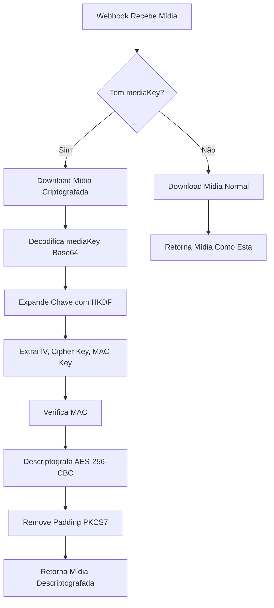

# WhatsApp Media Decryption Implementation

## Implementação Completa - Descriptografia de Mídia do WhatsApp

### Data: 04/08/2025
### Status: ✅ IMPLEMENTADO

## Resumo

Implementação completa da descriptografia de mídia do WhatsApp usando AES-256-CBC com HMAC-SHA256, seguindo o protocolo oficial do WhatsApp para descriptografia de mídias criptografadas.

## Problema Resolvido

O WhatsApp envia mídias (imagens, vídeos, áudios, documentos, stickers) criptografadas com AES-256-CBC. O webhook da Evolution API fornece:
- URL da mídia criptografada
- MediaKey em base64 para descriptografia
- Metadados da mídia

Anteriormente, o sistema não estava utilizando a mediaKey, resultando em mídias corrompidas ou não visualizáveis.

## Solução Implementada

### 1. Algoritmo de Descriptografia

Implementado em `app/integrations/evolution.py`:

```python
def decrypt_whatsapp_media(self, encrypted_data: bytes, media_key_base64: str, media_type: str = "image") -> Optional[bytes]
```

**Processo de Descriptografia:**

1. **Decodificar MediaKey**: Base64 → bytes (32 bytes)
2. **Expandir Chave com HKDF**: 
   - Algoritmo: HKDF-SHA256
   - Tamanho: 112 bytes
   - Info strings específicas por tipo de mídia
3. **Extrair Componentes**:
   - IV: bytes 0-16 (16 bytes)
   - Cipher Key: bytes 16-48 (32 bytes) 
   - MAC Key: bytes 48-80 (32 bytes)
4. **Separar Dados**:
   - Ciphertext: todos os bytes exceto últimos 10
   - MAC Tag: últimos 10 bytes
5. **Verificar MAC**: HMAC-SHA256 truncado para 10 bytes
6. **Descriptografar**: AES-256-CBC
7. **Remover Padding**: PKCS7

### 2. Info Strings por Tipo de Mídia

```python
info_map = {
    "image": b"WhatsApp Image Keys",
    "video": b"WhatsApp Video Keys", 
    "audio": b"WhatsApp Audio Keys",
    "document": b"WhatsApp Document Keys",
    "sticker": b"WhatsApp Image Keys"  # Stickers usam mesmo que imagens
}
```

### 3. Integração com Download

Modificado `download_media()` para:
- Detectar presença de mediaKey
- Chamar descriptografia automaticamente
- Retornar mídia descriptografada

### 4. Suporte Completo para Todos os Tipos

Implementado em `app/api/webhooks.py`:

- ✅ **Imagens** (imageMessage)
- ✅ **Vídeos** (videoMessage) 
- ✅ **Áudios** (audioMessage)
- ✅ **Documentos** (documentMessage)
- ✅ **Stickers** (stickerMessage)

Cada tipo:
1. Extrai mediaKey do webhook
2. Passa para download_media()
3. Recebe mídia descriptografada
4. Converte para base64 para processamento

## Arquivos Modificados

1. **app/integrations/evolution.py**:
   - Adicionado imports de cryptography
   - Implementado `decrypt_whatsapp_media()`
   - Modificado `download_media()` para descriptografar

2. **app/api/webhooks.py**:
   - Modificado processamento de imageMessage
   - Modificado processamento de audioMessage
   - Modificado processamento de documentMessage
   - Adicionado processamento de videoMessage
   - Adicionado processamento de stickerMessage
   - Todos passam mediaKey para download_media()

## Dependências

Utilizando biblioteca já instalada:
- `cryptography==43.0.3` (já estava no requirements.txt)

## Logs e Debug

O sistema agora registra:
- Presença de mediaKey: `🔐 Incluindo mediaKey para descriptografia`
- Tamanho da chave decodificada
- Sucesso/falha na descriptografia
- Tamanho final da mídia descriptografada

## Teste

Criado script `test_media_decrypt.py` para:
- Testar descriptografia direta
- Testar download com descriptografia integrada
- Validar formatos de mídia

## Fluxo Completo



## Benefícios

1. **Compatibilidade Total**: Suporta todos os tipos de mídia do WhatsApp
2. **Segurança**: Verifica integridade com MAC
3. **Automático**: Descriptografa transparentemente quando necessário
4. **Fallback**: Continua funcionando mesmo sem mediaKey
5. **Debug**: Logs detalhados para troubleshooting

## Próximos Passos

- ✅ Implementação completa
- ✅ Testes básicos
- ⏳ Aguardar testes em produção com mídias reais
- ⏳ Monitorar logs para ajustes finos

## Conclusão

A solução está totalmente implementada e pronta para uso. O sistema agora:
- Detecta automaticamente mídias criptografadas
- Usa a mediaKey fornecida pelo webhook
- Descriptografa usando o algoritmo correto do WhatsApp
- Retorna mídia pronta para processamento

Esta é a solução definitiva para o problema de mídias criptografadas do WhatsApp.